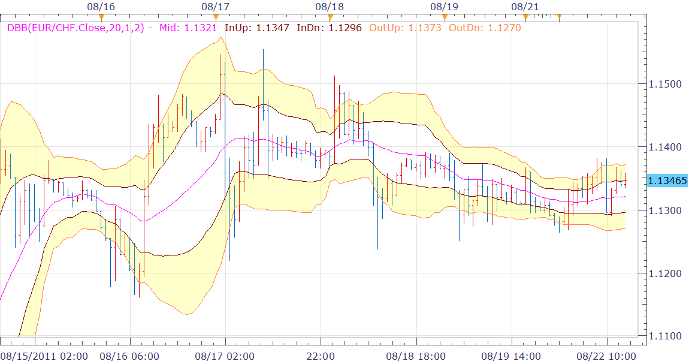

# Double Bollinger Band

> Source: https://fxcodebase.com/code/viewtopic.php?f=17&t=6008  
> Forum: 17 · Topic 6008 · 15 post(s)

---

## Double Bollinger Band

**Nikolay.Gekht** · Mon Aug 22, 2011 2:19 pm

Just a double Bollinger band indicator used in The Little Book of Currency Trading by Kathy Lien

Please see explanations how to use it
[http://www.investopedia.com/articles/fo ... z1VmdUeyAw](http://www.investopedia.com/articles/forex/08/turn-trade.asp#axzz1VmdUeyAw)

This indicator is equal to putting just two BB indicators on the same chart, but is a little bit less resource eating and can highlight the zone between inner and outer bands for easier interpretation

 

Download:
Double Bollinger Band

 [dbb.lua](files/14054/dbb.lua)

Triple Bollinger Bands

 [tbb.lua](files/14054/tbb.lua)

 [TBB with Alert.lua](files/14054/TBB%20with%20Alert.lua)

Dec 10, 2015: Compatibility issue Fix. _Alert helper is not longer needed.

The indicator was revised and updated

MT4/MQ4 version
[viewtopic.php?f=38&t=64446](https://fxcodebase.com/code/viewtopic.php?f=38&t=64446)

---

## Re: Double Bollinger Band

**bedayan** · Tue Nov 15, 2011 3:01 am

Is it possible for code this thing for triple bollinger band? I require triple bollinger band.

---

## Re: Double Bollinger Band

**Apprentice** · Tue Nov 15, 2011 3:29 am

While you wait, you can try Multiple Bollinger Bands.
[viewtopic.php?f=17&t=1319&p=5262&hilit=multiple+bullinger#p5262](https://fxcodebase.com/code/viewtopic.php?f=17&t=1319&p=5262&hilit=multiple+bullinger#p5262)

---

## Re: Double Bollinger Band

**Apprentice** · Tue Nov 15, 2011 5:07 am

Triple Bollinger Bands added.

---

## Re: Double Bollinger Band

**followNev** · Mon Mar 05, 2012 10:13 am

Hi,
I am using the DBB indicator and it works really well when I screen my ccy pairs.
Has anyone created an automated strategy for this that we can download ?

---

## Double Bollinger Band

**LauraZ** · Tue Mar 06, 2012 2:36 am

always in the market ssytem. signal, cross of middle band of bollinger band and MA

no need for stat analysis for this one its being used to make the cross points clearer for a wider arrayed trading systems

---

## Re: Double Bollinger Band

**Apprentice** · Tue Mar 06, 2012 4:22 am

Which algorithm do you want to use this strategy

---

## Re: Double Bollinger Band

**followNev** · Thu Mar 08, 2012 8:26 am

> **Apprentice wrote:**
> Which algorithm do you want to use this strategy

is it possible to create a new algo for this ?
I have an idea of how I'd like the algo to work, would I have to pay for the code ?

thanks

---

## Re: Double Bollinger Band

**Coondawg71** · Mon Nov 11, 2013 5:13 pm

Can we please add a request to the development que regarding the Triple Bollinger Band indicator.

I would like to see a Signal with Alert capacity upon each breach of Deviation Level.

For example, attached image highlights breach of 2.0 deviation.
Ideally, alert would send signal upon each breach of the triple bollinger band. like 1.0, 1.62, 2.0.

Thanks,

sjc

---

## Re: Double Bollinger Band

**Apprentice** · Tue Nov 12, 2013 4:16 am

TBB with Alert added.

---

## Re: Double Bollinger Band

**LordTwig** · Tue Nov 12, 2013 8:17 am

**Warning !!!**
Be careful clicking on any web 'links'.....

clicking on this link

> **Nikolay.Gekht wrote:**
> here: [http://globalmarkets.anyoption.com/4-ru](http://globalmarkets.anyoption.com/4-ru) ... ger-bands/

produced this response from antivirus...

Infection Blocked
URL:
[http://globalmarkets.anyoption.com/4-rules-for-using..](http://globalmarkets.anyoption.com/4-rules-for-using..).
Infection:
JS:HideMe-J [Trj]
Relax, your avast! just saved you from a virus.

---

## Re: Double Bollinger Band

**Apprentice** · Wed Nov 13, 2013 1:53 am

Link in question, removed.
If someone wants to take the risk, they can use the link from post yours.

---

## Re: Double Bollinger Band

**plkdtm** · Fri Feb 10, 2017 8:23 am

Is there any mq4 version of dbb indicator?

i found one indicator but we can't just fill space between 1st and 2nd band.

Thanks a lot

---

## Re: Double Bollinger Band

**Apprentice** · Sat Feb 11, 2017 4:21 am

Try this version.
[viewtopic.php?f=38&t=64446](https://fxcodebase.com/code/viewtopic.php?f=38&t=64446)

---

## Re: Double Bollinger Band

**plkdtm** · Mon Feb 13, 2017 9:46 am

thanks a lot it's perfect
