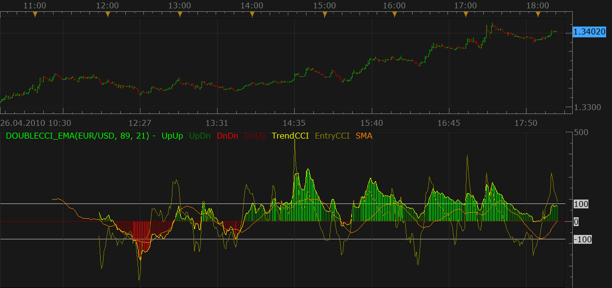

# Double CCI with EMA

> Source: https://fxcodebase.com/code/viewtopic.php?f=17&t=849  
> Forum: 17 · Topic 849 · 11 post(s)

---

## Double CCI with EMA

**Nikolay.Gekht** · Mon Apr 26, 2010 5:20 pm

This indicator is a port of the Jason Robinson's MT4 indicator, requested here: [viewtopic.php?f=27&t=785](https://fxcodebase.com/code/viewtopic.php?f=27&t=785).

The indicator shows two, short (entry) and long (trend) CCI indicators, and shows histogram which simplifies detection of the +/-100 levels for trend CCI.

Unfortunately, until the Marketscope get an ability to specify width of the lines, the indicator lines laying over the histogram looks not so good as I wish.

 

Download indicator:

 [DoubleCCI_EMA.lua](files/1519/DoubleCCI_EMA.lua)

DoubleCCI_EMA with Alert logic
Alert, when EntryCCI crosses under zero-line AND TrendCCI is already under zero line
Alert, when EntryCCI crosses over zero-line AND TrendCCI is already over zero line

 [DoubleCCI_EMA with Alert.lua](files/1519/DoubleCCI_EMA%20with%20Alert.lua)

The indicator was revised and updated

---

## Re: Double CCI with EMA

**moh2001** · Mon Apr 26, 2010 5:59 pm

thanks

---

## Re: Double CCI with EMA - Line width

**mosstee** · Tue Jan 04, 2011 9:20 am

Is it possible to be able to adjust the line width (entry, trend, sma) in this indicator?

---

## Re: Double CCI with EMA

**Blackcat2** · Tue Jan 04, 2011 7:54 pm

is it just me or this indi looks like woodie CCI? the website of the original author is no longer available. Can someone point out or tell me how to read the indicator? Rules for entry, exit, etc...

Thanks
BC

---

## Re: Double CCI with EMA

**TxChristopher** · Tue Jun 17, 2014 8:47 pm

I love this indicator, but I have the same complaint as everyone else. . . . . the TrendCCI the EntryCCI and the SMA all need to have adjustable line thicknesses. The indicator would be perfect then, as it is it is not so usable.

---

## Re: Double CCI with EMA

**Apprentice** · Wed Jun 18, 2014 4:47 am

Style Option Added.

---

## Re: Double CCI with EMA

**TxChristopher** · Wed Jun 18, 2014 9:29 am

Perfect!

---

## Re: Double CCI with EMA

**Apprentice** · Tue Jul 18, 2017 6:50 am

The indicator was revised and updated.

---

## Re: Double CCI with EMA

**Phamilton630** · Thu Nov 08, 2018 7:48 am

Please can a simple alert be added

Alert when EntryCCI crosses under zeroline AND TrendCCI is already under zeroline
Alert when EntryCCI crosses over zeroline AND TrendCCI is already over zeroline

---

## Re: Double CCI with EMA

**Apprentice** · Fri Nov 09, 2018 8:28 am

DoubleCCI_EMA with Alert.lua added.

---

## Re: Double CCI with EMA

**Phamilton630** · Mon Nov 12, 2018 7:20 am

Thank you very much
