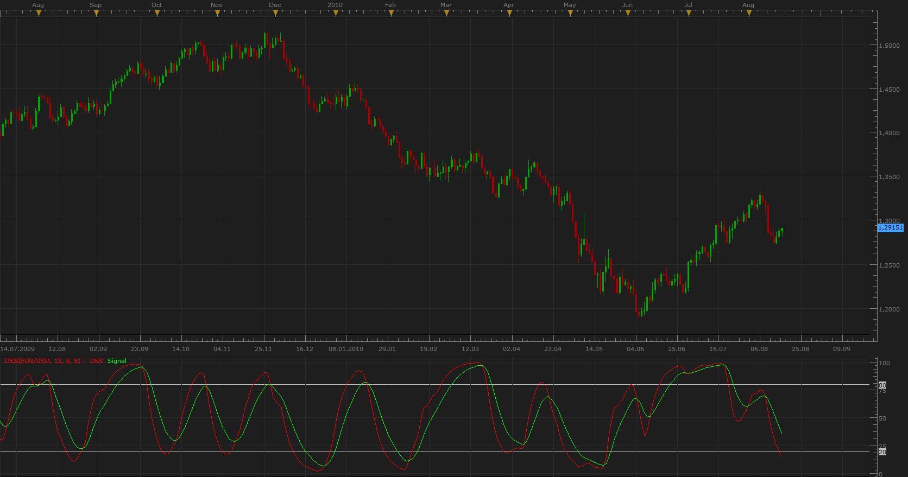
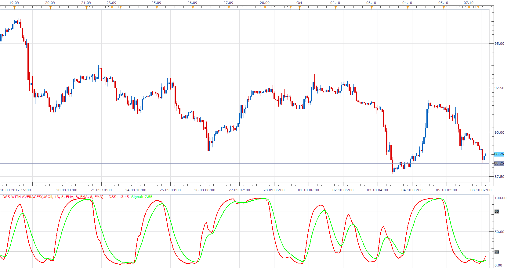

# Double Smoothed Stochastic (DSS)

> Source: https://fxcodebase.com/code/viewtopic.php?f=17&t=1855  
> Forum: 17 · Topic 1855 · 21 post(s)

---

## Double Smoothed Stochastic (DSS)

**Apprentice** · Wed Aug 18, 2010 7:49 am

DSS Formulas is similar to the that of stochastic indicator.

William Blau and Walter Bressert presented different version of the Double Smoothed Stochastics.

Above 80 is Overbought area.
Below 20 is oversold area.

 [DSS.lua](files/3708/DSS.lua)

 

 [DSS Colored.lua](files/3708/DSS%20Colored.lua)

 

 [DSS Overlay.lua](files/3708/DSS%20Overlay.lua)

---

## Re: Double Smoothed Stochastic (DSS)

**bluepip** · Sat Apr 23, 2011 4:18 am

Please create a strategy with the same parameters as: Stochastic Strategy ([viewtopic.php?f=31&t=2533](https://fxcodebase.com/code/viewtopic.php?f=31&t=2533)).

Thank you

---

## Re: Double Smoothed Stochastic (DSS)

**Apprentice** · Sun Apr 24, 2011 5:29 am

Requested can be found here.
[viewtopic.php?f=31&t=4010](https://fxcodebase.com/code/viewtopic.php?f=31&t=4010)

---

## Re: Double Smoothed Stochastic (DSS)

**mjf1288** · Sat Oct 06, 2012 9:33 pm

Would it be possible, and if so, would someone add the option to use different smoothing methods with the DSS like the averages indicator?

---

## Re: Double Smoothed Stochastic (DSS)

**Apprentice** · Mon Oct 08, 2012 4:08 am

 [DSS with Averages.lua](files/41603/DSS%20with%20Averages.lua)

---

## Re: Double Smoothed Stochastic (DSS)

**lucmat** · Mon Feb 25, 2013 2:48 pm

Hi Apprentice
Is it possible to make a DSS Bressert that sum 3 or 4 DSS Bressert?
In other words, I would like an indicator that output the sum of these DSS Bressert, for example:
OUTPUT:= DSS (200,50) + DSS(100, 25)/2 + DSS(50,12)/4
Is it possible?
Thanks

Lucmat

---

## Re: Double Smoothed Stochastic (DSS)

**Apprentice** · Wed Feb 27, 2013 3:45 pm

Try this version.
DSS Composite = (DSS(1)/100)*Percentage(1) + (DSS(2)/100)*Percentage(2) + (DSS(3)/100)*Percentage(3) + (DSS(4)/100)*Percentage(4) + (DSS(5)/100)*Percentage(5)

 [DSS Composite.lua](files/55370/DSS%20Composite.lua)

If you have not already installed, please install DSS with Averages.

---

## Re: Double Smoothed Stochastic (DSS)

**lucmat** · Thu Feb 28, 2013 9:50 am

Great work Apprentice!!!

Thanks

Lucmat

---

## Re: Double Smoothed Stochastic (DSS)

**mjf1288** · Wed Mar 20, 2013 1:10 pm

Would someone be able to modify the standard DSS to show it as an overlay on the chart? Thanks

---

## Re: Double Smoothed Stochastic (DSS)

**Apprentice** · Thu Mar 21, 2013 5:33 am

Your request is added to the development list.

---

## Re: Double Smoothed Stochastic (DSS)

**Alexander.Gettinger** · Tue Apr 30, 2013 4:49 pm

MQL4 version of Double Smoothed Stochastic: [viewtopic.php?f=38&t=36112](https://fxcodebase.com/code/viewtopic.php?f=38&t=36112)

---

## Re: Double Smoothed Stochastic (DSS)

**amazon1a** · Mon Jan 20, 2014 12:07 pm

Hi, Would it be possible to add line style options to this indicator similar to others? Thanks so much.

---

## Re: Double Smoothed Stochastic (DSS)

**Apprentice** · Tue Jan 21, 2014 3:53 am

Style Option Added.

---

## Re: Double Smoothed Stochastic (DSS)

**lucmat** · Fri Dec 19, 2014 4:42 am

Hello all and Apprentice,
is it possible to make a DSS of MACD?
I post here a version of this indicator for MT4.
Thanks

Lucmat

---

## Re: Double Smoothed Stochastic (DSS)

**Apprentice** · Fri Dec 19, 2014 6:30 am

Requested can be found here.
[viewtopic.php?f=17&t=61607](https://fxcodebase.com/code/viewtopic.php?f=17&t=61607)

---

## Re: Double Smoothed Stochastic (DSS)

**amazon1a** · Wed Jan 28, 2015 6:07 am

Hi Apprentice,

Love this indi!! Would it be possible to add color for the line in OB/OS territory?

Thanks, AG

---

## Re: Double Smoothed Stochastic (DSS)

**Apprentice** · Thu Jan 29, 2015 3:56 am

Various performance and algorithm improvements, OB / OS Zone introduced for DSS.lua & DSS with Averages.lua

---

## Re: Double Smoothed Stochastic (DSS)

**Apprentice** · Tue May 10, 2016 4:23 am

DSS Colored added.

---

## Re: Double Smoothed Stochastic (DSS)

**Apprentice** · Tue May 10, 2016 4:44 am

DSS Overlay added.

---

## Re: Double Smoothed Stochastic (DSS)

**scandisk** · Tue May 10, 2016 8:55 pm

Awesome thanks Apprentice for the colored DSS!!

---

## Re: Double Smoothed Stochastic (DSS)

**Apprentice** · Sun Jul 08, 2018 5:59 am

The indicator was revised and updated.
