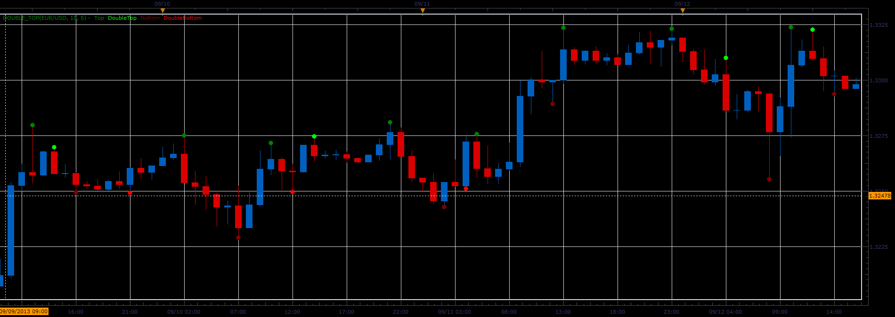
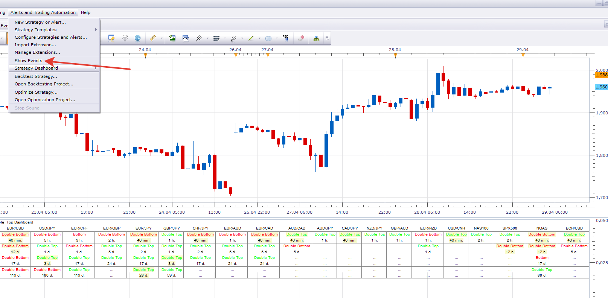
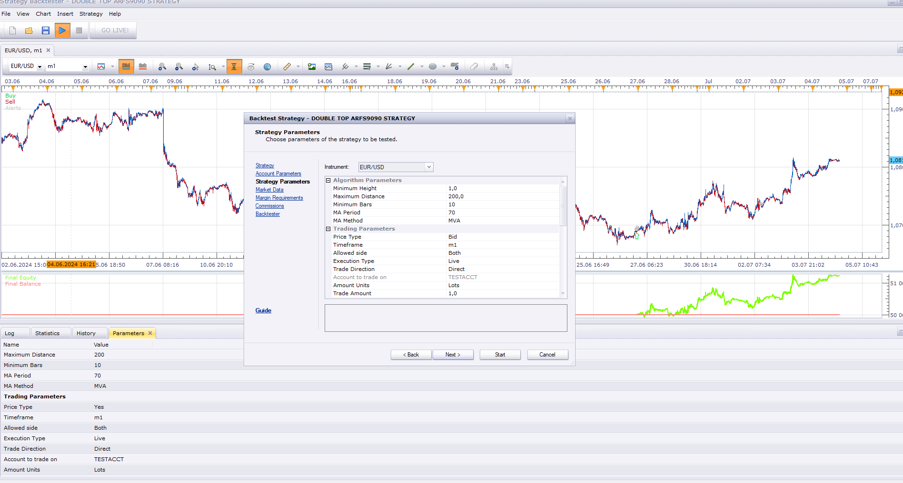

# Double top indicator

> Source: https://fxcodebase.com/code/viewtopic.php?f=17&t=59574  
> Forum: 17 · Topic 59574 · 79 post(s)

---

## Double top indicator

**Alexander.Gettinger** · Wed Sep 25, 2013 2:09 pm

The indicator finds single and double tops and bottoms.
In the indicator parameters are specified:
- minimum height/depth,
- the maximum distance between the tops/bottoms (for twin tops/bottoms),
- the minimum number of bars after the top/bottom.

 

Download:

 [Double_Top.lua](files/89684/Double_Top.lua)

Indicator-based strategy.
[https://fxcodebase.com/code/viewtopic.php?f=31&t=72414](https://fxcodebase.com/code/viewtopic.php?f=31&t=72414)

---

## Re: Double top indicator

**Alexander.Gettinger** · Wed Sep 25, 2013 2:12 pm

MQL4 version of Double top indicator: [viewtopic.php?f=38&t=59575](https://fxcodebase.com/code/viewtopic.php?f=38&t=59575).

---

## Re: Double top indicator

**Apprentice** · Mon Jun 12, 2017 6:25 am

The indicator was revised and updated.

---

## Re: Double top indicator

**hedging** · Sat Mar 14, 2020 5:19 pm

Hi Apprentice,

Does this indicator repaint? If yes, then to how many candles?

Thanks,
hedging

---

## Re: Double top indicator

**Apprentice** · Mon Mar 16, 2020 5:09 am

MinBars/MaxBars will define the repaint period.

---

## Re: Double top indicator

**papynou34** · Tue Mar 17, 2020 10:09 am

Hello,
Is it possible to add an option to draw line between top or bottom?
Thanks

---

## Re: Double top indicator

**Apprentice** · Tue Mar 17, 2020 11:32 am

Your request is added to the development list.
Development reference 885.

---

## Re: Double top indicator

**SANTOSH** · Fri Apr 17, 2020 6:58 am

> **Alexander.Gettinger wrote:**
> The indicator finds single and double tops and bottoms.
> In the indicator parameters are specified:
> - minimum height/depth,
> - the maximum distance between the tops/bottoms (for twin tops/bottoms),
> - the minimum number of bars after the top/bottom.
>
>
>
> Double_Top.PNG
>
>
>
> Download:
>
>
> Double_Top.lua
>
>
>
> The indicator was revised and updated

Dear All ,
Can you add the text alert and sound alert for all four types of dots ?
I mean text and sound alert for Top , bottom , double top and double bottom .

Regards ,
Santosh

---

## Re: Double top indicator

**Apprentice** · Sat Apr 18, 2020 5:46 am

Your request is added to the development list.
Development reference 1083.

---

## Re: Double top indicator

**Apprentice** · Sun Apr 19, 2020 7:39 am

[Double_Top.lua](files/132951/Double_Top.lua)

 [Double_Top Alert.lua](files/132951/Double_Top%20Alert.lua)

Try this version.

---

## Re: Double top indicator

**SANTOSH** · Mon Apr 20, 2020 11:49 am

> **Apprentice wrote:**
>
>
> Double_Top.lua
>
>
>
>
> Double_Top Alert.lua
>
>
> Try this version.

Dear Apprentice ,
Its only alerting Top alert , whereas rest all other types are not alerting .
Kindly fix the above.

Regards ,
Santosh Sahu .

---

## Re: Double top indicator

**Apprentice** · Mon Apr 20, 2020 7:42 pm

Fixed.

---

## Re: Double top indicator

**SANTOSH** · Tue Apr 21, 2020 1:47 pm

> **Apprentice wrote:**
>
>
> Double_Top.lua
>
>
>
>
> Double_Top Alert.lua
>
>
> Try this version.

Can a Strategy for this indicator be written for the same ?

---

## Re: Double top indicator

**SANTOSH** · Wed Apr 22, 2020 3:59 am

> **Apprentice wrote:**
> Fixed.

Dear Apprentice ,
Nice work .
The code seems working now for all the alerts now .

Here is small issue which i am still facing :

**When i Bool off the Double bottom and Double top alert in the Parameters section ,
still they are alerted as Bottom and Top .**

Any way to fix this ?

Regards ,
Santosh Sahu .

---

## Re: Double top indicator

**Apprentice** · Wed Apr 22, 2020 10:30 am

Your request is added to the development list.
Development reference 1104.

---

## Re: Double top indicator

**Apprentice** · Thu Apr 23, 2020 4:38 am

Because each double top/bottom is a top/bottom as well.

---

## Re: Double top indicator

**SANTOSH** · Thu Apr 23, 2020 1:08 pm

Dear Apprentice ,
Can you make this indicator as MTF MCP with DDE as an option ?

This way one dashboard can see the tops and bottoms in
multi-time frame and multi - currency pair ?

Regards ,
Santosh Sahu .

---

## Re: Double top indicator

**SANTOSH** · Fri Apr 24, 2020 7:44 am

> **Apprentice wrote:**
> Because each double top/bottom is a top/bottom as well.

So , you mean there is no way to as achieve the following -
Don't alert the double top / bottom as Top and bottom when in the parameters menu the bool is off to alert the double top and double bottom?

Regards ,
Santosh Sahu.

---

## Re: Double top indicator

**Apprentice** · Fri Apr 24, 2020 12:50 pm

Your request is added to the development list.
Development reference 1123.

---

## Re: Double top indicator

**Apprentice** · Mon Apr 27, 2020 4:46 am

[Double Top Dashboard.lua](files/133227/Double%20Top%20Dashboard.lua)

Try this version.

---

## Re: Double top indicator

**SANTOSH** · Mon Apr 27, 2020 5:46 am

> **Apprentice wrote:**
>
>
> The attachment **Double Top Dashboard.lua** is no longer available
>
>
> Try this version.

Dear Mario,
Once the alert comes , the dashboard becomes blank .
Attached image .

Regards ,
Santosh .

---

## Re: Double top indicator

**SANTOSH** · Mon Apr 27, 2020 8:31 am

Struggling with this below error .

---

## Re: Double top indicator

**Apprentice** · Mon Apr 27, 2020 2:46 pm

Your request is added to the development list.
Development reference 1159.

---

## Re: Double top indicator

**Apprentice** · Tue Apr 28, 2020 10:59 am

Try it now.

---

## Re: Double top indicator

**SANTOSH** · Tue Apr 28, 2020 12:01 pm

> **Apprentice wrote:**
> Try it now.

It makes a blank dashboard .
Can you post a picture of completely loaded dasboard for all time frames and All instruments ?

---

## Re: Double top indicator

**Apprentice** · Tue Apr 28, 2020 7:19 pm

Your request is added to the development list.
Development reference 1169.

---

## Re: Double top indicator

**Apprentice** · Thu Apr 30, 2020 4:38 am

Take a look at the log at the events tab. Does it have any errors?

---

## Re: Double top indicator

**Apprentice** · Thu Apr 30, 2020 5:30 am

Can you please re-download and re-install Double_Top Alert.lua?

---

## Re: Double top indicator

**SANTOSH** · Thu Apr 30, 2020 9:06 am

> **Apprentice wrote:**
>
>
> image.png
>
>
> Take a look at the log at the events tab. Does it have any errors?

Dea Mario,
Good work again .
Its woking now .

Can i request you for a strategy file for Double top Indicator ?

Regards,
Santosh Sahu.

---

## Re: Double top indicator

**Apprentice** · Thu Apr 30, 2020 11:46 am

Your request is added to the development list.
Development reference 1185.

---

## Re: Double top indicator

**SANTOSH** · Thu Apr 30, 2020 2:04 pm

Dear Apprentice ,
Can you do a small modification in the code .
Only alert a top as double top when both high are equal.
Same goes with the double bottom , when both low are equal .

Attached pic .

Regards ,
Santosh .

---

## Re: Double top indicator

**Apprentice** · Fri May 01, 2020 5:15 am

Your request is added to the development list.
Development reference 1190.

---

## Re: Double top indicator

**Apprentice** · Fri May 01, 2020 9:29 am

[Double_Top Alert Exact.lua](files/133432/Double_Top%20Alert%20Exact.lua)

Try this version.

---

## Re: Double top indicator

**SANTOSH** · Fri May 01, 2020 10:08 am

> **Apprentice wrote:**
>
>
> Double_Top Alert Exact.lua
>
>
> Try this version.

Working Good , great work again .
So can this exact version of double top can be seen in Double top Dashboard ?

---

## Re: Double top indicator

**Apprentice** · Sun May 03, 2020 4:36 am

Your request is added to the development list.
Development reference 1208.

---

## Re: Double top indicator

**Apprentice** · Mon May 04, 2020 6:53 am

[Double Top Exact Dashboard.lua](files/133503/Double%20Top%20Exact%20Dashboard.lua)

Try this version.

---

## Re: Double top indicator

**SANTOSH** · Mon May 04, 2020 7:33 am

> **Apprentice wrote:**
>
>
> The attachment **Double Top Exact Dashboard.lua** is no longer available
>
>
> Try this version.

Its reading blank again .

---

## Re: Double top indicator

**SANTOSH** · Mon May 04, 2020 6:53 pm

> **SANTOSH wrote:**
>
>
> > **Apprentice wrote:**
> >
> >
> > Double_Top.lua
> >
> >
> >
> >
> > Double_Top Alert.lua
> >
> >
> > Try this version.
>
>
>
>
> Can a Strategy for this indicator be written for the same ?

Still awaiting a strategy file !

---

## Re: Double top indicator

**Apprentice** · Tue May 05, 2020 5:05 am

Indicator based strategy.
[viewtopic.php?f=31&t=69799](https://fxcodebase.com/code/viewtopic.php?f=31&t=69799)

---

## Re: Double top indicator

**Apprentice** · Tue May 05, 2020 5:10 am

> Its reading blank again .

Take a look into the log. Do you have any errors?

---

## Re: Double top indicator

**SANTOSH** · Tue May 05, 2020 9:23 am

> **Apprentice wrote:**
>
>
> > Its reading blank again .
>
>
> Take a look into the log. Do you have any errors?

Its working now .
I have removed everything and re-installed everything.

---

## Re: Double top indicator

**SANTOSH** · Tue May 05, 2020 10:04 pm

> **Apprentice wrote:**
>
>
> Double_Top.lua
>
>
>
>
> Double_Top Alert.lua
>
>
> Try this version.

Dear Apprentice,
Can u find a way not to alert the double top and double bottom as also top and bottom respectively?

---

## Re: Double top indicator

**Apprentice** · Wed May 06, 2020 4:17 am

Your request is added to the development list.
Development reference 1235.

---

## Re: Double top indicator

**Apprentice** · Wed May 06, 2020 5:39 am

[Double_Top Alert.lua](files/133616/Double_Top%20Alert.lua)

Try this version.

---

## Re: Double top indicator

**SANTOSH** · Wed May 06, 2020 3:43 pm

> **Apprentice wrote:**
>
>
> Double_Top Alert.lua
>
>
> Try this version.

It worked.
Nice efforts.

---

## Re: Double top indicator

**SANTOSH** · Wed May 06, 2020 3:47 pm

> **SANTOSH wrote:**
>
>
> > **Apprentice wrote:**
> >
> >
> > Double Top Exact Dashboard.lua
> >
> >
> > Try this version.

Dear Apprentice,
The exact dashboard is only worth a see when inside the grid we only see Double bottom and Double top text and alerts and no top bottom and their alerts ?
Is it doable?

---

## Re: Double top indicator

**Apprentice** · Thu May 07, 2020 4:41 am

I'm not sure if I understand, can you explain.

---

## Re: Double top indicator

**SANTOSH** · Thu May 07, 2020 7:42 am

> **Apprentice wrote:**
> I'm not sure if I understand, can you explain.

To be precise ,
Just. Need the double top and double bottom alerts in the Exact dashboard.lua

---

## Re: Double top indicator

**SANTOSH** · Thu May 07, 2020 3:37 pm

> **Apprentice wrote:**
>
>
> Double Top Exact Dashboard.lua
>
>
> Try this version.

Currently when active signals comes and if recurrent sound is yes , it keeps on giving the sound alert , until its stopped again in the parameter menu .

Is there a way to stop the recurrent sound, without going in the parameter menu again ?

---

## Re: Double top indicator

**SANTOSH** · Fri May 08, 2020 4:58 am

> **Apprentice wrote:**
>
>
> The attachment **Double_Top Alert Exact.lua** is no longer available
>
>
> Try this version.

Dear Apprentice ,
Need two modifcations in the code .

First Modification :
Present code as the following :
Max. distance between peaks (in bars)
Can you add : **Min. distance between peaks (in bars) ?**

Second Modification :

Dont Alert a Double top ,
when there is a bottom in between top and double top .Attached Pic

The same goes for Double bottom .

---

## Re: Double top indicator

**Apprentice** · Fri May 08, 2020 5:16 am

Your request is added to the development list.
Development reference 1244.

---

## Re: Double top indicator

**SANTOSH** · Mon May 11, 2020 8:37 am

Any updates on this Apprentice?

---

## Re: Double top indicator

**Apprentice** · Wed May 13, 2020 4:32 am

[Double Top Exact Dashboard.lua](files/133877/Double%20Top%20Exact%20Dashboard.lua)

 [Double_Top Alert Exact.lua](files/133877/Double_Top%20Alert%20Exact.lua)

Try this version.

---

## Re: Double top indicator

**SANTOSH** · Wed May 13, 2020 11:06 am

> **Apprentice wrote:**
>
>
> Double Top Exact Dashboard.lua
>
>
>
>
> Double_Top Alert Exact.lua
>
>
> Try this version.

It's working as expected ..
Nice work as always.

---

## Re: Double top indicator

**SANTOSH** · Wed May 13, 2020 11:12 am

Dear Apprentice ,
Have a query.

Can the dashboard run directly rather
than always running it below any chart ?

Like create view or something like that ?

---

## Re: Double top indicator

**Apprentice** · Wed May 13, 2020 4:15 pm

Sure we can create a view.
You can change the position of the dashboard via parameters.

---

## Re: Double top indicator

**SANTOSH** · Thu May 14, 2020 3:42 am

Dear Apprentice,
Modification for the Double top Exact Dashboard :

1. **Double bottom Pass :**
When the current price is above the source.low of a Double bottom Dot ,
give a Pass text (shown in attached image ).

2. **Double Bottom Fail :**
When the current price is below the source.low of a Double bottom Dot ,
give a Pass text (shown in attached image ).

Same goes for **Double top Pass / Fail** , when current price is below / above the source.high of a Double top dot respectively.

---

## Re: Double top indicator

**Apprentice** · Thu May 14, 2020 4:05 am

Your request is added to the development list.
Development reference 1295.

---

## Re: Double top indicator

**SANTOSH** · Thu May 14, 2020 5:09 pm

Dear Apprentice ,
Is there a way you can find the neck line for the Double top and Double bottom??

Attached image for the neckline .

---

## Re: Double top indicator

**Apprentice** · Fri May 15, 2020 7:17 am

Find the last three fractals, the second in a row can donate your neckline level.

---

## Re: Double top indicator

**Apprentice** · Fri May 15, 2020 7:57 am

Task 1295

 [Double Top Exact Dashboard.lua](files/133970/Double%20Top%20Exact%20Dashboard.lua)

---

## Re: Double top indicator

**SANTOSH** · Fri May 15, 2020 8:33 am

> **Apprentice wrote:**
> Find the last three fractals, the second in a row can donate your neckline level.

Where can I get the last three fractals indicator ??

---

## Re: Double top indicator

**SANTOSH** · Fri May 15, 2020 8:33 am

> **Apprentice wrote:**
> Find the last three fractals, the second in a row can donate your neckline level.

Where can I get the last three fractals indicator ??

---

## Re: Double top indicator

**SANTOSH** · Fri May 15, 2020 9:42 am

> **Apprentice wrote:**
> Task 1295
>
>
> Double Top Exact Dashboard.lua

It's working great
Thanks Apprentice

---

## Re: Double top indicator

**SANTOSH** · Mon May 18, 2020 5:40 am

> **Apprentice wrote:**
>
>
> The attachment **Double Top Exact Dashboard.lua** is no longer available
>
>
>
>
> The attachment **Double Top Exact Dashboard.lua** is no longer available
>
>
> Try this version.

Dear Apprentice :

The tops and bottoms , if they are at the following then more precise :

1. TOP : It should always at the bull bar (open < close )
2. Bottom : It should always be at the bear bar (open > close )

Currently the code is not following the above .
Requesting you for the same .
Attached pic .

---

## Re: Double top indicator

**Apprentice** · Mon May 18, 2020 7:16 am

Your request is added to the development list.
Development reference 1315.

---

## Re: Double top indicator

**Apprentice** · Tue May 19, 2020 9:03 am

[Double_Top Alert Exact.lua](files/134083/Double_Top%20Alert%20Exact.lua)

Try this version.

---

## Re: Double top indicator

**SANTOSH** · Thu May 21, 2020 6:00 am

> **Apprentice wrote:**
>
>
> Double_Top Alert Exact.lua
>
>
> Try this version.

It's working as always as requested.
Good work .

---

## Re: Double top indicator

**SANTOSH** · Sat May 23, 2020 1:53 pm

Dear Apprentice,
If we increase the look back period , there are mostly chances there could be triple tops and bottoms,
Is there a way to alert them ?

---

## Re: Double top indicator

**Apprentice** · Mon May 25, 2020 5:34 am

You want to detect triple tops and bottoms?
How you define one?

---

## Re: Double top indicator

**SANTOSH** · Mon May 25, 2020 9:15 am

> **Apprentice wrote:**
> You want to detect triple tops and bottoms?
> How you define one?

Dear Apprentice ,
I have attached a picture of Triple Top .
The same logic goes for Triple Bottom .

---

## Re: Double top indicator

**SANTOSH** · Tue May 26, 2020 9:50 am

> **SANTOSH wrote:**
>
>
> > **Apprentice wrote:**
> > You want to detect triple tops and bottoms?
> > How you define one?
>
>
>
> Dear Apprentice ,
> I have attached a picture of Triple Top .
> The same logic goes for Triple Bottom .

Dear Apprentice,
Hope you are clear with the above definition?
Any queries with the definition, do let me know.!

---

## Re: Double top indicator

**arfs9090** · Thu Oct 28, 2021 3:25 am

Hey Apprentice

Can you add filters to the Double_Top.lua 1st posted 25Sept 2013 and create a strategy rules below

**Filters**
For Double Tops 2nd Double Top to retrace back between the wick high and the close if buyers candle and wick high and open if sellers candle

For Double Bottoms 2nd Double Bottom to retrace back between the wick low and the close if buyers candle and wick low and open if sellers candle

**Strategy Rules**
For Buys filter above and print a buyers candle % filled from open and use X-RSIOMA.lua ,RSI to cross above MA

For Sells filter above and print a sellers candle % filled from open and use X-RSIOMA.lua ,RSI to cross below MA

In parameter setting option for % candle filled from open
Thanks
Arfs

---

## Re: Double top indicator

**Apprentice** · Thu Oct 28, 2021 4:15 am

Your request is added to the development list.
Development reference 949.

---

## Re: Double top indicator

**arfs9090** · Mon Nov 22, 2021 1:59 am

Hey Apprentice & team
Any update with this request ?
Arf

---

## Re: Double top indicator

**Apprentice** · Fri Dec 31, 2021 12:02 pm

I don't understand that requirement. I need an example.

---

## Re: Double top indicator

**arfs9090** · Sun Jan 02, 2022 2:03 am

Hi Apprentice
I thinks Over complicated the task, can you code new indicator and strategy using the following filter & rules ma filter to define top/bottoms
Rules for double tops & double bottoms  

**Double Tops Sell**
1st top candle to close below ma 2nd top not close higher then 1st top and also to close below MA

**Double Bottom Buy**
1st bottom candle to close above ma, 2nd bottom not close lower then 1st bottom and also close above ma 

hope this is easy to understand
Arfs

---

## Re: Double top indicator

**arfs9090** · Tue Feb 08, 2022 6:53 am

Hi Guys
A there any update with request?
Arf

---

## Re: Double top indicator

**Apprentice** · Sat Jun 07, 2025 7:46 am

 [Double_Top_arfs9090_Strategy.lua](files/159520/Double_Top_arfs9090_Strategy.lua)
