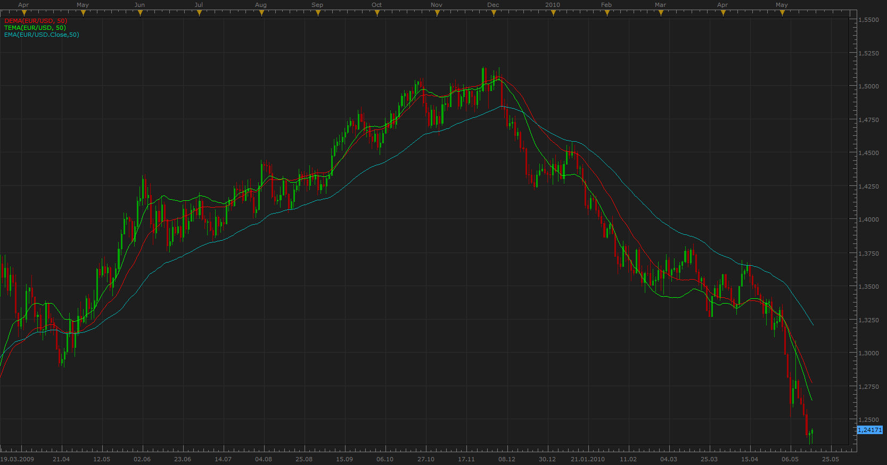
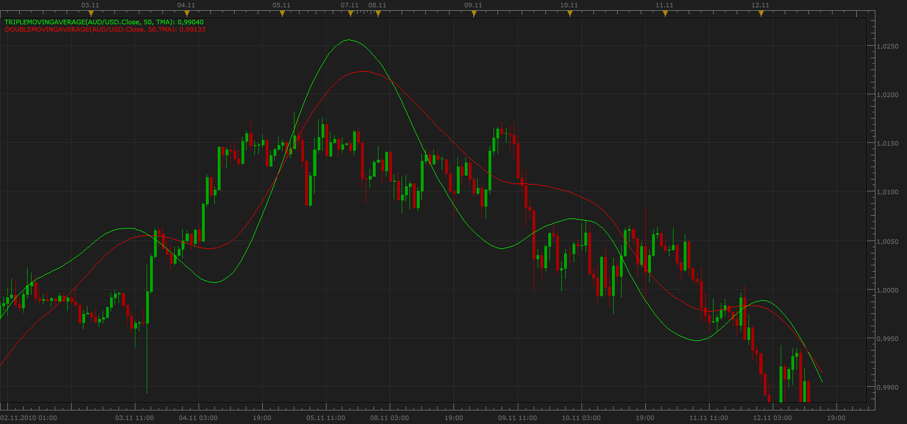
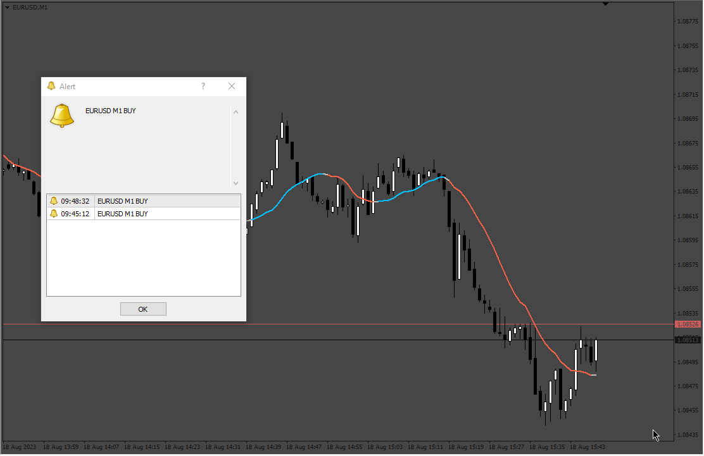

# Double & Triple Exponential Moving Average (DEMA & TEMA)

> Source: https://fxcodebase.com/code/viewtopic.php?f=17&t=1052  
> Forum: 17 · Topic 1052 · 25 post(s)

---

## Double & Triple Exponential Moving Average (DEMA & TEMA)

**Apprentice** · Tue May 18, 2010 6:42 am

*EMA,DEMA, TEMA*

Developed by Patrick Mulloy and introduced in the February 1994 issue of Technical Analysis of Stocks & Commodities magazine, this trend indicator.

As Mr. Mulloy explains in the article:
"Moving averages have a detrimental lag time that increases as the moving average length increases. The solution is a modified version of exponential smoothing with less lag time."

It's possible to use the Double & TripleExponential Moving Averages in the same way as the Simple Moving Average or Exponential Moving Average.

DEMA = EMA of EMA of Price
TEMA = EMA of EMA of EMA of Price

 [DEMA.lua](files/1984/DEMA.lua)

 [TEMA.lua](files/1984/TEMA.lua)

Update November 14

---

## Re: Double & Triple Exponential Moving Average (DEMA & TEMA)

**Apprentice** · Wed Jun 02, 2010 12:18 pm

This is an old version,
is not deleted, because of compatibility,
with indicators and strategies that use it

 [DEMA1.lua](files/2358/DEMA1.lua)

 [TEMA1.lua](files/2358/TEMA1.lua)

---

## Re: Double & Triple Exponential Moving Average (DEMA & TEMA)

**magicfx** · Sun Nov 14, 2010 5:03 am

Would be good if someone can add the option to change the solid line width to 2.

Quite difficult to see inf Marketscope with Line width 1.

---

## Re: Double & Triple Exponential Moving Average (DEMA & TEMA)

**Apprentice** · Sun Nov 14, 2010 6:12 am

Style Options Updated

---

## Re: Double & Triple Exponential Moving Average (DEMA & TEMA)

**Apprentice** · Sun Nov 14, 2010 6:34 am

This versions allow you to select type of moving average.
If you choose EMA Indkator is in every respect identical to DEMA or TEMA,
(depending on which indicator you use).

DEMA = EMA of EMA of Price
DMA = MA of MA of Price

 [DoubleMovingAverage.lua](files/6116/DoubleMovingAverage.lua)

 [TripleMovingAverage.lua](files/6116/TripleMovingAverage.lua)

---

## Re: Double & Triple Exponential Moving Average (DEMA & TEMA)

**mazdaq100** · Tue Jan 11, 2011 11:37 am

> **Apprentice wrote:**
>
>
> DoubleMovingAverage.png
>
>
>
> This versions allow you to select type of moving average.
> If you choose EMA Indkator is in every respect identical to DEMA or TEMA,
> (depending on which indicator you use).
>
> DEMA = EMA of EMA of Price
> DMA = MA of MA of Price
>
>
>
> DoubleMovingAverage.lua
>
>
>
>
> TripleMovingAverage.lua

Hi

Thanks for these. Is it possible to get these converted into Strategies please?

Thanks.

---

## Re: Double & Triple Exponential Moving Average (DEMA & TEMA)

**Apprentice** · Tue Jan 11, 2011 2:20 pm

Of course, Can you describe the strategy you want to describe.
For example, Price / CrossOver DEMA, DEMA / TEMA Crossover, a change in slope Signal.

---

## Re: Double & Triple Exponential Moving Average (DEMA & TEMA)

**Apprentice** · Fri Nov 25, 2011 6:14 pm

From: samsds
Could you help me ?
The application of Trading Station made some updates to the application,
but I'm seeing that the Indicator TEMA1 with the parameters 250 and 800 did not work, does not show the line on the screen and price, but parameter 100 and lower, show the line a price on the char

---

## Re: Double & Triple Exponential Moving Average (DEMA & TEMA)

**dwrench** · Mon Mar 19, 2012 10:27 am

Hello Apprentice,
I have been looking for an alert that would deliver a sound, txt message and/or pop-up telling me when two custom ema's cross or touch.
Do you already have one that is coded?
Thanks

---

## Re: Double & Triple Exponential Moving Average (DEMA & TEMA)

**Apprentice** · Tue Mar 20, 2012 2:30 am

I do not have anything like this, for now.

---

## Re: Double & Triple Exponential Moving Average (DEMA & TEMA)

**Alexander.Gettinger** · Tue Jun 19, 2012 5:36 pm

MQL4 version of this indicators: [viewtopic.php?f=38&t=20396](https://fxcodebase.com/code/viewtopic.php?f=38&t=20396)

---

## Re: Double & Triple Exponential Moving Average (DEMA & TEMA)

**dathom03** · Mon Jun 25, 2012 6:33 pm

Apprentice:

Has the triple moving average mentioned above ever been turned into a strategy? Parameters I would want for the strategy are as follows:
- Microlot account trading
- Lot management - # of lots to trade
- Direct or reverse
- Buy Only, Sell Only, Both option
- Stop/Start trading timeframes with Mandatory Close
- Entries/Exits:
Buy Entry- Fast MA cross/close above other 2 MA = Buy (Not Price but average)
Buy Exit - Fast MA between other 2 MAs and trending down
Sell Entry - Fast MA cross/close below other 2 MA = Sell (Not Price but average)
Sell Exit - Fast MA between other 2 MAs and trending up
- MA choices should include SMA,EMA, PPMA, Slope Direction line. others
- MA timeframe unique for each MA
- Typical alert options
- Typical money management options, i.e., TP, SL, Trail, etc.

Is it possible to accomplish the above? Please advise.

---

## Re: Double & Triple Exponential Moving Average (DEMA & TEMA)

**Apprentice** · Tue Jun 26, 2012 2:51 am

Just to be sure, Can you clarify.
You are using three moving averages.

---

## Re: Double & Triple Exponential Moving Average (DEMA & TEMA)

**dathom03** · Tue Jun 26, 2012 6:50 am

yes, based upon the TripleMovingAverage.lua as described in your nov. 14th 2010 post>

"Re: Double & Triple Exponential Moving Average (DEMA & TEMA)
by Apprentice » Sun Nov 14, 2010 7:34 am

This versions allow you to select type of moving average.
If you choose EMA Indkator is in every respect identical to DEMA or TEMA,
(depending on which indicator you use).

DEMA = EMA of EMA of Price
DMA = MA of MA of Price

 DoubleMovingAverage.lua
(2.68 KiB) Downloaded 317 times

 TripleMovingAverage.lua
(2.46 KiB) Downloaded 326 times

Apprentice
FXCodeBase: Confirmed User"

Thank you

---

## Re: Double & Triple Exponential Moving Average (DEMA & TEMA)

**dathom03** · Tue Jun 26, 2012 7:15 am

Further clarification, want 3 MAs all in one strategy using the TripleMovingAverage.lua calculation with variables/parameters described in initial request dated June 25. Similar to a 2 or 3 MA Cross Strategy. Important to have EMA, PPMA and Slope Direction Line as calculation method options. If you need further information/clarification, please let me know.

Thanks

---

## Re: Double & Triple Exponential Moving Average (DEMA & TEMA

**Apprentice** · Mon Jan 16, 2017 6:35 am

Indicator was revised and updated.

---

## Triple Exponential Moving Average (TEMA) TWO Colors

**Kilgharrah** · Mon Apr 03, 2017 5:31 am

Hi, it is possible to create a TEMA indicator (like the one in the image) with 2 colors. Attach file mq4 that apparently has the option changing the field Color_Mode to 1. Thanks.

---

## Re: Double & Triple Exponential Moving Average (DEMA & TEMA

**Apprentice** · Mon Feb 05, 2018 7:57 am

The Indicator was revised and updated.

---

## Re: Double & Triple Exponential Moving Average (DEMA & TEMA

**Paul W** · Mon Feb 01, 2021 11:19 am

Hello,

can you add a simple "Shift/Offset" to DEMA indicator

some might prefer to use TEMA

Thx

---

## Re: Double & Triple Exponential Moving Average (DEMA & TEMA

**Apprentice** · Thu Feb 04, 2021 7:37 am

Your request is added to the development list.
Development reference 143.

---

## Re: Double & Triple Exponential Moving Average (DEMA & TEMA

**Apprentice** · Sat Feb 06, 2021 10:47 am

You can use [viewtopic.php?f=17&t=63122](https://fxcodebase.com/code/viewtopic.php?f=17&t=63122)

---

## Re: Double & Triple Exponential Moving Average (DEMA & TEMA

**Paul W** · Tue Feb 09, 2021 9:01 am

Hello,

took a look at "**You can use [viewtopic.php?f=17&t=63122](https://fxcodebase.com/code/viewtopic.php?f=17&t=63122)**" ... and unfortunately neither supports Tick-Charts

The DEMA needs to support Tick-Charts for the intended scalping Strategy

Thx

---

## Re: Double & Triple Exponential Moving Average (DEMA & TEMA

**Apprentice** · Thu Feb 11, 2021 4:44 am

Tick version added.
[viewtopic.php?f=17&t=63122](https://fxcodebase.com/code/viewtopic.php?f=17&t=63122)

---

## Re: Triple Exponential Moving Average (TEMA) TWO Colors

**egg999** · Wed Aug 16, 2023 12:45 pm

> **Kilgharrah wrote:**
> Hi, it is possible to create a TEMA indicator (like the one in the image) with 2 colors. Attach file mq4 that apparently has the option changing the field Color_Mode to 1. Thanks.

Could you please add message/box alert into this indicator in mq4 format?
Thank you.

 [AllAverages_v3.1.mq4](files/152067/AllAverages_v3.1.mq4)

---

## Re: Double & Triple Exponential Moving Average (DEMA & TEMA

**Apprentice** · Fri Aug 18, 2023 12:55 pm

 [AllAverages_v3.1_alerts.mq4](files/152144/AllAverages_v3.1_alerts.mq4)
