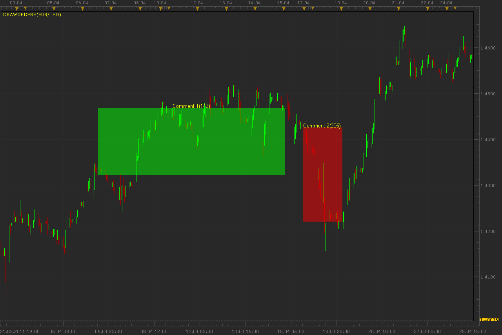

# Draw from text file

> Source: https://fxcodebase.com/code/viewtopic.php?f=17&t=4108  
> Forum: 17 · Topic 4108 · 2 post(s)

---

## Draw from text file

**Alexander.Gettinger** · Wed May 04, 2011 2:25 am

Indicator may draw orders from external text file to chart. This can be useful for analysis of the trading.

 

For successful working the indicator must be keep format of the text file.

Download indicator:

 [DrawOrders.lua](files/10297/DrawOrders.lua)

Download sample of text file:

 [orders.txt](files/10297/orders.txt)

The indicator was revised and updated

---

## Re: Draw from text file

**Apprentice** · Sun Mar 12, 2017 5:48 pm

Indicator was revised and updated.
