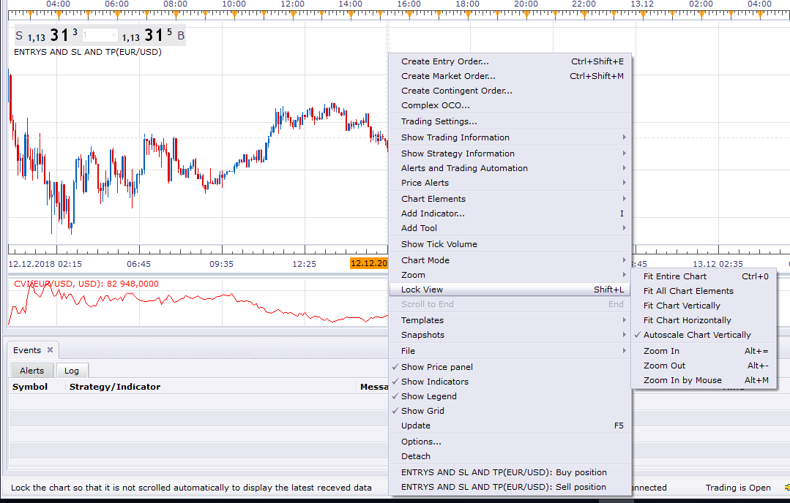
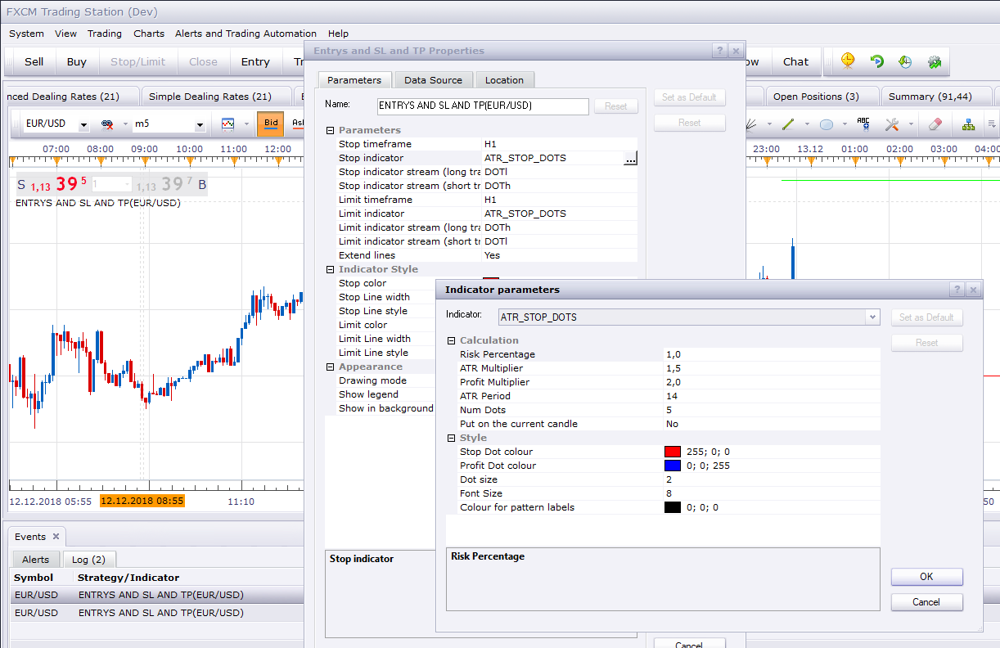

# Draw on chart for Entrys and SL and TP

> Source: https://fxcodebase.com/code/viewtopic.php?f=17&t=67150  
> Forum: 17 · Topic 67150 · 2 post(s)

---

## Draw on chart for Entrys and SL and TP

**Apprentice** · Wed Dec 12, 2018 9:58 am

 

Based on request.
[viewtopic.php?f=27&t=67131](https://fxcodebase.com/code/viewtopic.php?f=27&t=67131)
We made a more universal solution. The user can add
"positions" via a context menu. Indicator takes the clicked bar as a
reference for the position start. Stop/limit are highly customizable
too. The user can choose any indicator and its stream as a stop/limit
source.

 [Entrys and SL and TP.lua](files/122731/Entrys%20and%20SL%20and%20TP.lua)

---

## Re: Draw on chart for Entrys and SL and TP

**bruno2017** · Wed Dec 12, 2018 12:49 pm

Hello
what is the use mode of this indicator?
