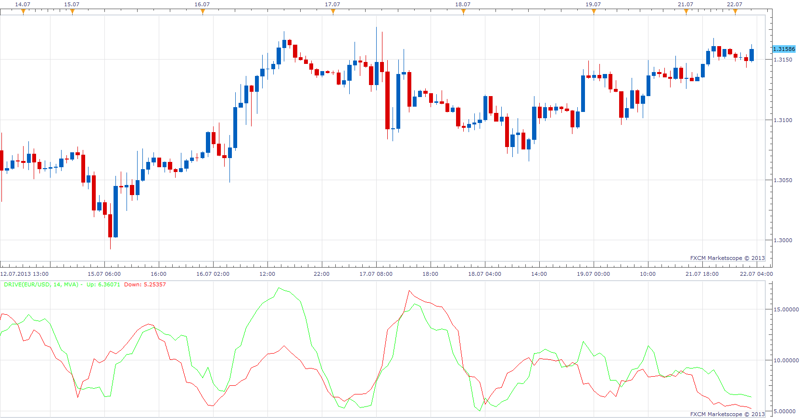

# Drive

> Source: https://fxcodebase.com/code/viewtopic.php?f=17&t=54880  
> Forum: 17 · Topic 54880 · 3 post(s)

---

## Drive

**Apprentice** · Mon Jul 22, 2013 3:08 am

Up (Green) = ((High - Open) + (Close - Low))/2, averaged for the selected period;
Down (Red) = ((Open - Low) + (High - Close))/2, averaged for the selected period.

 [Drive.lua](files/82467/Drive.lua)

---

## Re: Drive

**Alexander.Gettinger** · Thu Aug 29, 2013 11:00 am

MQL4 version of Drive oscillator: [http://www.fxcodebase.com/code/viewtopi ... 38&t=59350](http://www.fxcodebase.com/code/viewtopic.php?f=38&t=59350).

---

## Re: Drive

**Apprentice** · Wed Oct 03, 2018 5:40 am

The indicator was revised and updated.
