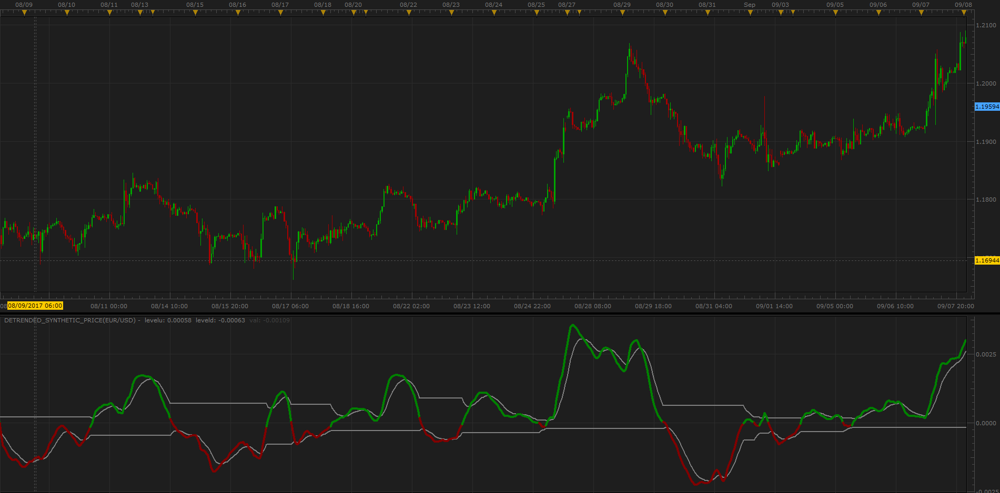

# DSP oscillator

> Source: https://fxcodebase.com/code/viewtopic.php?f=17&t=65075  
> Forum: 17 · Topic 65075 · 3 post(s)

---

## DSP oscillator

**Alexander.Gettinger** · Mon Sep 11, 2017 1:21 pm

Based on request: [viewtopic.php?f=27&t=65066](https://fxcodebase.com/code/viewtopic.php?f=27&t=65066).

 

Download:

 [Detrended_Synthetic_Price.lua](files/114800/Detrended_Synthetic_Price.lua)

---

## Re: DSP oscillator

**bartwas1** · Tue Sep 12, 2017 1:56 am

Thank you for fulfilling my request so fast Alexander.

---

## Re: DSP oscillator

**Apprentice** · Mon Jul 09, 2018 5:19 am

The Indicator was revised and updated.
