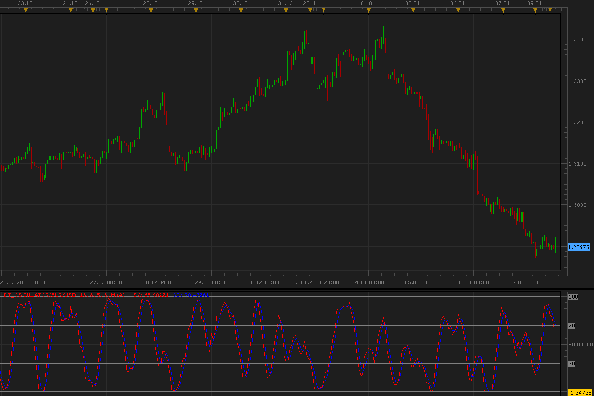
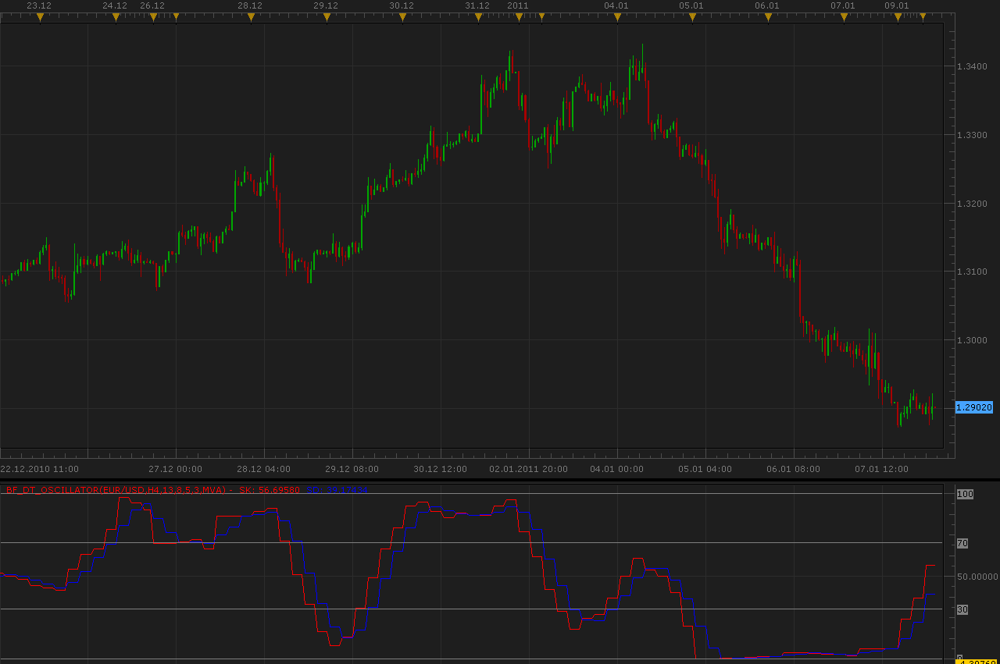

# DT Oscillator

> Source: https://fxcodebase.com/code/viewtopic.php?f=17&t=3127  
> Forum: 17 · Topic 3127 · 7 post(s)

---

## DT Oscillator

**Alexander.Gettinger** · Mon Jan 10, 2011 4:04 am

This oscillator is written on Robert Miner's book "High Probability Trading Strategies".
Source code: [http://www.forexfactory.com/showthread.php?t=204444](http://www.forexfactory.com/showthread.php?t=204444)

 

Download oscillator:

 [DT_Oscillator.lua](files/7301/DT_Oscillator.lua)

For this oscillator must be installed Averages indicator ([viewtopic.php?f=17&t=2430](https://fxcodebase.com/code/viewtopic.php?f=17&t=2430)).

The indicator was revised and updated

---

## Re: DT Oscillator

**Alexander.Gettinger** · Mon Jan 10, 2011 4:05 am

Bigger timeframe version of this oscillator.

 

Download:

 [BF_DT_Oscillator.lua](files/7302/BF_DT_Oscillator.lua)

---

## Re: DT Oscillator

**andymen** · Tue Jan 11, 2011 9:54 am

Thanks a lot. Quick and great job
Could you please to add an adjusting of levels OB and OS to this indicator? I've changed this manualy in source code but it could be handy to change this in the indicator window.

Regards

---

## Re: DT Oscillator

**Japander** · Sat Jan 29, 2011 11:21 am

Hey Alexander, i really appriciate your work

I added the custom OS/OB Level, andymen asked for

---

## Re: DT Oscillator

**Japander** · Sat Jan 29, 2011 6:41 pm

Hey Alexander,

i really appreciate your work

I just added andymens suggestion of changeable OS/OB Level.

 [BF_DT_Oscillator.lua](files/7797/BF_DT_Oscillator.lua)

 [DT_Oscillator.lua](files/7797/DT_Oscillator.lua)

---

## Re: DT Oscillator

**Faalaakh** · Mon Feb 28, 2011 6:08 am

Hi,
for the visual purposes, would it be possible to have an add-on, which would show up and down arrows whenever where is a crossover at oversold or overbought zone?

---

## Re: DT Oscillator

**Apprentice** · Fri Feb 17, 2017 10:44 am

Indicator was revised and updated.
