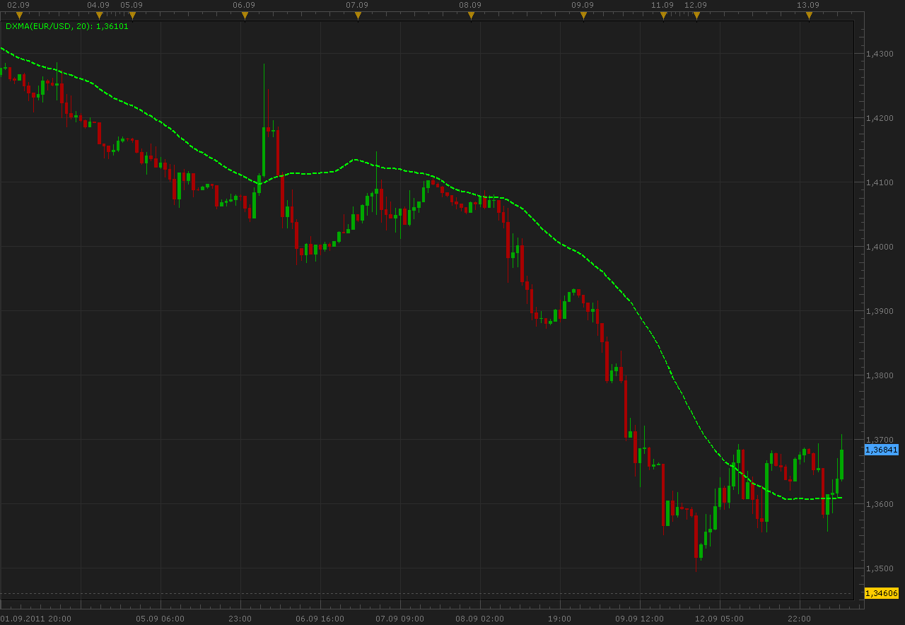

# DXMA

> Source: https://fxcodebase.com/code/viewtopic.php?f=17&t=6512  
> Forum: 17 · Topic 6512 · 2 post(s)

---

## DXMA

**Alexander.Gettinger** · Tue Sep 13, 2011 6:53 am

This indicator is a ported MQL5 indicator from [http://www.mql5.com/ru/code/190](http://www.mql5.com/ru/code/190) (in Russian).

Formulas:
DXMA[i]=Averages(C) in the range from i-Period to i, where
C[i]=(h-l)*ydi*0.01+l.
h and l is a maximum and minimum prices in the range from i-Period to i,
ydi=(DMI+)-(DMI-)+50.

 

Download:

 [DXMA.lua](files/14877/DXMA.lua)

The indicator was revised and updated

---

## Re: DXMA

**Apprentice** · Thu Mar 16, 2017 2:25 pm

Indicator was revised and updated.
