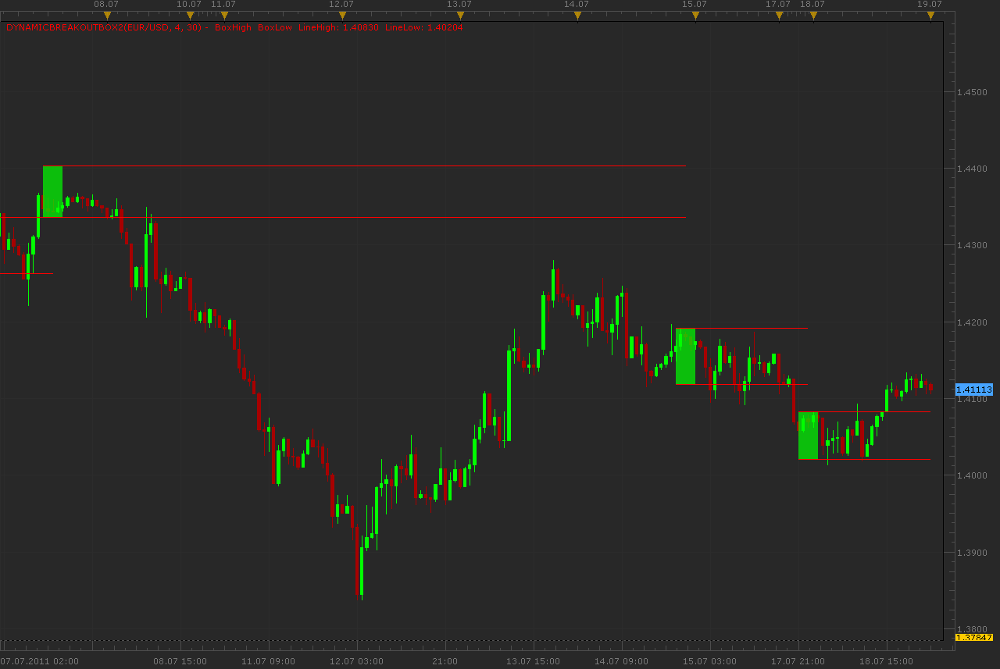

# Dynamic Breakout Box

> Source: https://fxcodebase.com/code/viewtopic.php?f=17&t=5269  
> Forum: 17 · Topic 5269 · 8 post(s)

---

## Dynamic Breakout Box

**Alexander.Gettinger** · Mon Jul 18, 2011 11:47 pm

This indicator is a ported MQL4 indicator from request [viewtopic.php?f=27&t=5064](https://fxcodebase.com/code/viewtopic.php?f=27&t=5064).

 

Download:

 [DynamicBreakoutBox.lua](files/12826/DynamicBreakoutBox.lua)

---

## Re: Dynamic Breakout Box

**cdepasquale** · Thu Apr 25, 2013 2:53 pm

It is possible to have the source for a strategy based on this indicator?

I just need basic functionalities of placing order on the Box breakout. I will use it just as a sample to include some additional futures. I am new with LUA programming...

Thank you very much for your support.

---

## Re: Dynamic Breakout Box

**Apprentice** · Fri Apr 26, 2013 11:12 am

Indicators alone can not give orders.
Here you can find all the necessary resources.
SDK software package, extensive help, examples.
[http://fxcodebase.com/documentation.php](https://fxcodebase.com/documentation.php)
If you need help, send me a private message.

---

## Re: Dynamic Breakout Box

**ddmwUK** · Tue Jun 02, 2015 4:47 pm

Hi.

Is it possible to add an Alert to this signal, so that I receive an e-mail each time this signal draws a box around a consolidation area?

Thanks in advance for your help.

---

## Re: Dynamic Breakout Box

**Apprentice** · Sun Jun 07, 2015 4:01 am

Your request is added to the development list.

---

## Re: Dynamic Breakout Box

**Chicagobull** · Mon Jul 18, 2016 11:11 pm

Hello,
Where can I find information about the Dynamic Breakout Box indicator and its application in a trading strategy? I am looking for things like what causes the boxes to form, what time frames are applicable and general use of the indicator in a trading strategy. If I am posting in wrong place please redirect and I will repost. Thank you.

---

## Re: Dynamic Breakout Box

**Apprentice** · Tue Jul 19, 2016 5:58 am

Indicator was converted from mq4.
Try MT4 forums. (sqDynamicBreakoutBox.mq4)

---

## Re: Dynamic Breakout Box

**Apprentice** · Wed Sep 19, 2018 8:50 am

The indicator was revised and updated.
