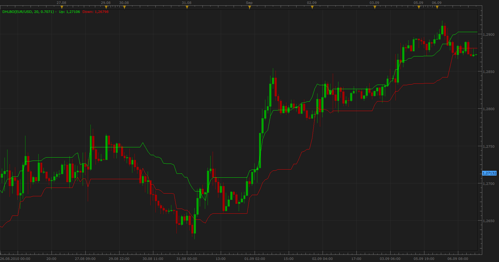
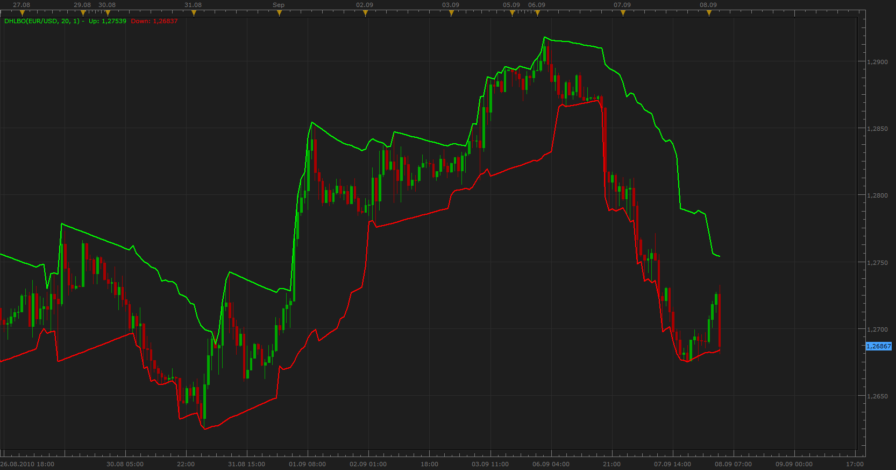

# Dynamic High/Low Band Overlay

> Source: https://fxcodebase.com/code/viewtopic.php?f=17&t=2094  
> Forum: 17 · Topic 2094 · 4 post(s)

---

## Dynamic High/Low Band Overlay

**Apprentice** · Wed Sep 08, 2010 8:00 am

Written on request.

High Peak = ((highest[Y](High))*X - (lowest[Y](Low))*X)+lowest[Y](low)

Low Peak = highest[Y](high)- ((highest[Y](High))*X-(lowest[Y](Low))*X)

Basically creates the two bands (overlayed on the price chart) to show me different highs/lows from Y periods back, reduced by a certain number (X) which goes from 0 to 1 in incremental steps of 0.001.

 [DHLBO.lua](files/4306/DHLBO.lua)

The indicator was revised and updated

---

## Re: Dynamic High/Low Band Overlay

**Apprentice** · Wed Sep 08, 2010 8:06 am

This version finds the minimum and maximum for a defined period.
And from that moment for each past period narrows the width of the channel for a defined percentage.

 [DHLPBO.lua](files/4307/DHLPBO.lua)

---

## Re: Dynamic High/Low Band Overlay

**Alexander.Gettinger** · Thu Jan 08, 2015 4:46 pm

MQL4 version of Dynamic High/Low Band Overlay: [viewtopic.php?f=38&t=61686](https://fxcodebase.com/code/viewtopic.php?f=38&t=61686).

---

## Re: Dynamic High/Low Band Overlay

**Apprentice** · Thu Aug 03, 2017 5:50 am

The indicator was revised and updated.
