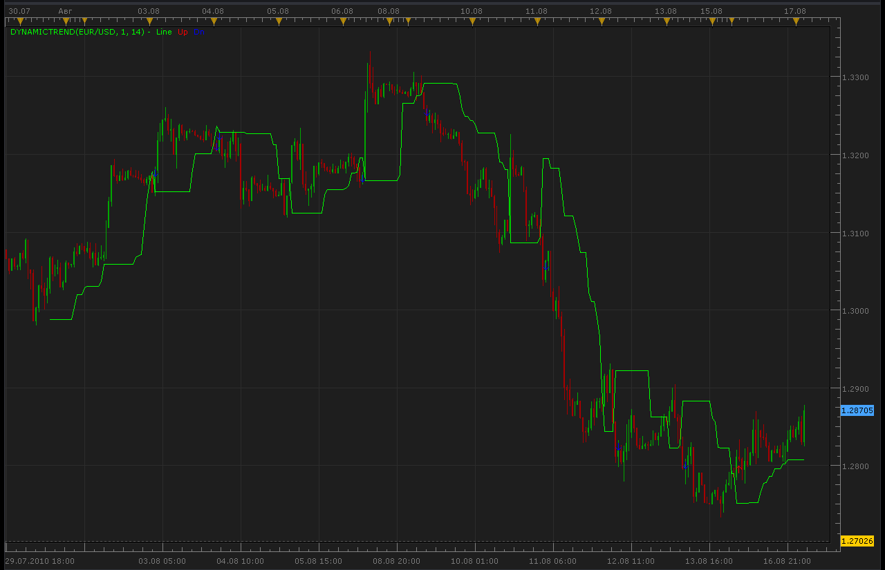

# Dynamic Trend Indicator

> Source: https://fxcodebase.com/code/viewtopic.php?f=17&t=1839  
> Forum: 17 · Topic 1839 · 8 post(s)

---

## Dynamic Trend Indicator

**Alexander.Gettinger** · Tue Aug 17, 2010 2:51 am

[viewtopic.php?f=27&t=1693](https://fxcodebase.com/code/viewtopic.php?f=27&t=1693)

 

Code: [Select all](https://fxcodebase.com/code/)
`function Init()
    indicator:name("Dynamic Trend Indicator");
    indicator:description("Dynamic Trend Indicator");
    indicator:requiredSource(core.Bar);
    indicator:type(core.Indicator);
   
    indicator.parameters:addInteger("Percent", "Percent", "Percent", 1);
    indicator.parameters:addInteger("MaxPeriod", "MaxPeriod", "MaxPeriod", 14);

    indicator.parameters:addColor("clrLine", "Color of line", "Color of line", core.rgb(0, 255, 0));
    indicator.parameters:addColor("clrUP", "UP color", "UP color", core.rgb(255, 0, 0));
    indicator.parameters:addColor("clrDN", "DN color", "DN color", core.rgb(0, 0, 255));
end

local first;
local source = nil;
local Percent;
local MaxPeriod;

function Prepare()
    source = instance.source;
    Percent=instance.parameters.Percent;
    MaxPeriod=instance.parameters.MaxPeriod;
    first = source:first()+2;
    local name = profile:id() .. "(" .. source:name() .. ", " .. instance.parameters.Percent .. ", " .. instance.parameters.MaxPeriod .. ")";
    instance:name(name);
    LineBuff = instance:addStream("Line", core.Line, name .. ".Line", "Line", instance.parameters.clrLine, first);
    buffUp = instance:createTextOutput ("Up", "Up", "Wingdings", 10, core.H_Center, core.V_Center, instance.parameters.clrUP, first);
    buffDn = instance:createTextOutput ("Dn", "Dn", "Wingdings", 10, core.H_Center, core.V_Center, instance.parameters.clrDN, first);
end

function Update(period, mode)
    if (period>first+MaxPeriod) then
     if source.close[period]<LineBuff[period-1] then
      LineBuff[period]=core.max(source.close,core.rangeTo(period-1,MaxPeriod))-Percent*source:pipSize();
     else
      LineBuff[period]=core.min(source.close,core.rangeTo(period-1,MaxPeriod))+Percent*source:pipSize();
     end
     if source.close[period-3]>LineBuff[period-2] and source.close[period-2]<LineBuff[period-3] then
      buffUp:set(period, source.low[period]-10*source:pipSize(), "\225", "");
     end
     if source.close[period-2]<LineBuff[period-1] and source.close[period-2]>LineBuff[period-3] then
      buffDn:set(period, source.high[period]-10*source:pipSize(), "\226", "");
     end
    end
end`

 [DynamicTrend.lua](files/3662/DynamicTrend.lua)

---

## Re: Dynamic Trend Indicator

**Hybrid** · Tue Aug 17, 2010 11:55 am

Thank you for your work on this Indicator, Alexander.

Quick question:

Is this version a translation of the code I provided in my request, or the link to the trade-profit website?

---

## Re: Dynamic Trend Indicator

**Alexander.Gettinger** · Wed Aug 18, 2010 8:33 pm

This is a translation of the MT4 code.

---

## Re: Dynamic Trend Indicator

**bonnevie** · Sun Sep 19, 2010 7:25 pm

Alexander,

Is it possible to get a MTF version, so we can choose to have the indi show trend for a different TF than the chart it's on?

Thanks in advance,
bonnevie

---

## Re: Dynamic Trend Indicator

**Apprentice** · Mon Sep 20, 2010 1:26 am

Added to development cue.

---

## Re: Dynamic Trend Indicator

**Apprentice** · Mon Sep 20, 2010 5:38 am

Requested and the indicator can be found here.
[viewtopic.php?f=17&t=2223](https://fxcodebase.com/code/viewtopic.php?f=17&t=2223)

---

## Re: Dynamic Trend Indicator

**Apprentice** · Fri Jan 20, 2017 6:53 am

Indicator was revised and updated.

---

## Re: Dynamic Trend Indicator

**Apprentice** · Mon Feb 05, 2018 8:19 am

The Indicator was revised and updated.
