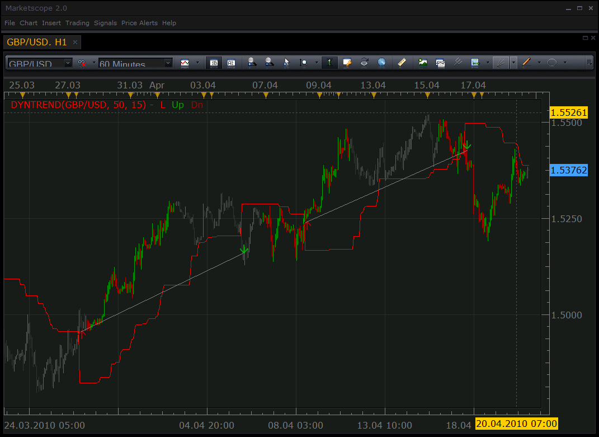

# Dynamic trend

> Source: https://fxcodebase.com/code/viewtopic.php?f=17&t=717  
> Forum: 17 · Topic 717 · 6 post(s)

---

## Dynamic trend

**Nikolay.Gekht** · Tue Apr 20, 2010 5:04 pm

The indicator is a port of [Scriptor's](http://www.mql4.com/users/Scriptor) [MT4's indicator](http://codebase.mql4.com/2090).

The indicator provides signals for sell and buy when the signal line crosses the price line. The indicator gives a good results on the H1+ charts and when the market is in trend. It is almost useless on smaller timeframes (especially at M15 and shorter).

 

Download:

 [DYNTREND.lua](files/1302/DYNTREND.lua)

The indicator was revised and updated

---

## Re: Dynamic trend

**sirpsycho11** · Sun Mar 20, 2011 9:32 pm

Hi there. Would it be possible to get an audible alert when a signal is generated? Also, I was wondering if the signals repaint? It doesn't look like they do but I want to double check.

Great indicator!!

---

## Re: Dynamic trend

**Apprentice** · Mon Mar 21, 2011 2:07 am

Your request has been added to developmental cue.

---

## Re: Dynamic trend

**Apprentice** · Mon Mar 21, 2011 2:18 pm

A simple version of this strategy is already written.
You can find it here.
[viewtopic.php?f=31&t=3316&p=7898&hilit=Dynamic+Trend#p7898](https://fxcodebase.com/code/viewtopic.php?f=31&t=3316&p=7898&hilit=Dynamic+Trend#p7898)

---

## Re: Dynamic trend

**elmcceen** · Tue May 17, 2011 3:17 pm

Can anybody tell why entry signals often appears a long time after the visual cross is done?
This is the biggest problem of this indi. It would be a lot profitable. I testet the visual entries and it could make money Could the signals be changed to the visual cross of price to indi?

---

## Re: Dynamic trend

**Apprentice** · Sun Mar 12, 2017 5:59 pm

Indicator was revised and updated.
