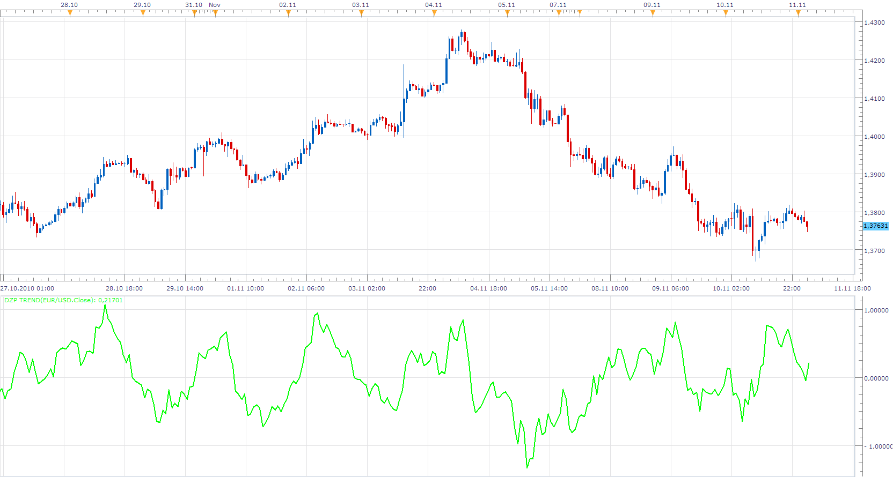

# DZP Trend

> Source: https://fxcodebase.com/code/viewtopic.php?f=17&t=2654  
> Forum: 17 · Topic 2654 · 3 post(s)

---

## DZP Trend

**Apprentice** · Wed Nov 10, 2010 9:13 am

This indicator has been written based on user request.
A:=(CLOSE-REF(CLOSE,M))/REF(CLOSE,M);
B:=(EMA(CLOSE,N)-REF(EMA(CLOSE,N),M))/REF(EMA(CLOSE,N),M);
DZP:(A-B)*100;

 [DZP Trend.lua](files/5990/DZP%20Trend.lua)

---

## Re: DZP Trend

**Alexander.Gettinger** · Mon Dec 22, 2014 10:50 am

MQL4 version of DZP Trend oscillator: [viewtopic.php?f=38&t=61631](https://fxcodebase.com/code/viewtopic.php?f=38&t=61631).

---

## Re: DZP Trend

**Apprentice** · Sun Oct 07, 2018 9:03 am

The indicator was revised and updated.
