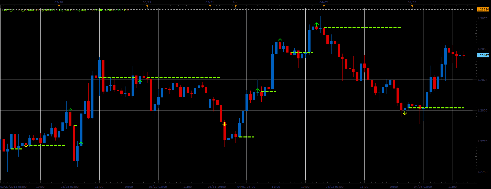

# Easy Trend Visualizer indicator

> Source: https://fxcodebase.com/code/viewtopic.php?f=17&t=34072  
> Forum: 17 · Topic 34072 · 3 post(s)

---

## Easy Trend Visualizer indicator

**Alexander.Gettinger** · Wed Apr 03, 2013 3:40 pm

This indicator is a ported MQL5 indicators from [http://www.mql5.com/en/code/1604](http://www.mql5.com/en/code/1604)

 

Download:

 [Easy_Trend_Visualizer.lua](files/57912/Easy_Trend_Visualizer.lua)

The indicator was revised and updated

---

## Re: Easy Trend Visualizer indicator

**Alexander.Gettinger** · Wed Apr 10, 2013 4:22 pm

MQL4 version of this indicator: [viewtopic.php?f=38&t=34368](https://fxcodebase.com/code/viewtopic.php?f=38&t=34368)

---

## Re: Easy Trend Visualizer indicator

**Apprentice** · Thu May 11, 2017 1:51 pm

Indicator was revised and updated.
