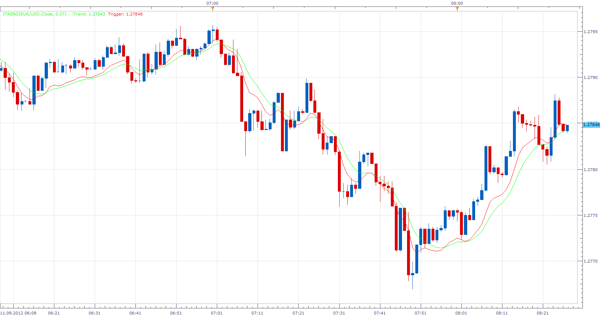

# Ehler Instantaneous Trend Line (iTREND)

> Source: https://fxcodebase.com/code/viewtopic.php?f=17&t=23276  
> Forum: 17 · Topic 23276 · 7 post(s)

---

## Ehler Instantaneous Trend Line (iTREND)

**Apprentice** · Tue Sep 11, 2012 7:26 am

Indicator is known as Ehler Instantaneous Trend Line or simple Instantaneous Trend Line.

 [iTREND.lua](files/40087/iTREND.lua)

 

 [iTREND Channel.lua](files/40087/iTREND%20Channel.lua)

MT4/MQ4 version
[viewtopic.php?f=38&t=59635&p=89927&hilit=iTREND#p89927](https://fxcodebase.com/code/viewtopic.php?f=38&t=59635&p=89927&hilit=iTREND#p89927)

The indicator was revised and updated

---

## Re: Ehler Instantaneous Trend Line (iTREND)

**Hailkayy** · Tue Sep 11, 2012 1:31 pm

Much traders can get stuck Ranging trading.
This is of great help, keep up.

---

## Re: Ehler Instantaneous Trend Line (iTREND)

**badar527** · Wed Nov 07, 2012 5:57 am

hi,

great site indeed,i must say

i need this indicator for mt4 , hope you guys help me too

Thanks

---

## Re: Ehler Instantaneous Trend Line (iTREND)

**Apprentice** · Thu Nov 08, 2012 6:49 am

Your request is added to the development list.

---

## Re: Ehler Instantaneous Trend Line (iTREND)

**Himalaya** · Tue May 14, 2013 10:13 pm

Apprentice,

Would it be possible to add bands/channels that could be set to "(x) pips" or "(x) percent" from the 'trend line'?

Hvala

Himalaya

---

## Re: Ehler Instantaneous Trend Line (iTREND)

**Apprentice** · Wed May 15, 2013 3:51 am

iTREND Channel indicator added.

---

## Re: Ehler Instantaneous Trend Line (iTREND)

**Apprentice** · Tue May 23, 2017 10:20 am

Indicator was revised and updated.
