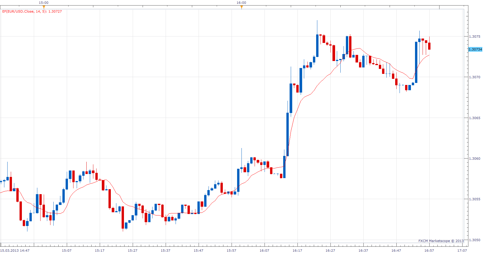

# Ehlers Filter

> Source: https://fxcodebase.com/code/viewtopic.php?f=17&t=33433  
> Forum: 17 · Topic 33433 · 4 post(s)

---

## Ehlers Filter

**Apprentice** · Sun Mar 17, 2013 6:58 am

 [EF.lua](files/56737/EF.lua)

The indicator was revised and updated

---

## Re: Ehlers Filter

**Apprentice** · Fri Oct 04, 2013 4:11 am

[NEF.lua](files/89835/NEF.lua)

As described in the April 2001 article of S & C magazine.
Support for Distance Coefficient algorithm added.

---

## Re: Ehlers Filter

**Alexander.Gettinger** · Fri Sep 12, 2014 3:40 pm

MQL4 version of indicators: [viewtopic.php?f=38&t=61132](https://fxcodebase.com/code/viewtopic.php?f=38&t=61132).

---

## Re: Ehlers Filter

**Apprentice** · Thu Jun 29, 2017 5:41 am

The indicator was revised and updated.
