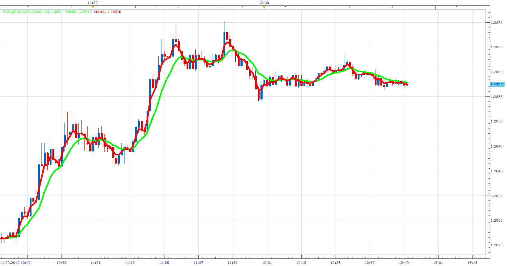

# Ehlers MESA Adaptive Moving Average (MAMA)

> Source: https://fxcodebase.com/code/viewtopic.php?f=17&t=23283  
> Forum: 17 · Topic 23283 · 8 post(s)

---

## Ehlers MESA Adaptive Moving Average (MAMA)

**Apprentice** · Tue Sep 11, 2012 11:46 am

Basis for MESA Adaptive Moving Average (MAMA) is Rate of change of phase measured by the Hilbert Transform Discriminator.

 [MAMA.lua](files/40098/MAMA.lua)

 

Arrows represent, FAMA / MAMA relation.
Color represents MAMA Slope.

 [MTF MCP MESA Adaptive Moving Average.lua](files/40098/MTF%20MCP%20MESA%20Adaptive%20Moving%20Average.lua)

MAMACD is available here.
[viewtopic.php?f=17&t=64239](https://fxcodebase.com/code/viewtopic.php?f=17&t=64239)

---

## Re: Ehlers MESA Adaptive Moving Average (MAMA)

**Coondawg71** · Mon Jan 20, 2014 6:15 am

Can we please request a strategy with signal alerts for this Indicator.

Buy: cross and close of Fama value above Mama value.
Sell: cross and close of Fama value below Mama value.

thanks!

sjc

---

## Re: Ehlers MESA Adaptive Moving Average (MAMA)

**Apprentice** · Tue Jan 21, 2014 3:41 am

Your request is added to the development list.

---

## Re: Ehlers MESA Adaptive Moving Average (MAMA)

**moomoofx** · Thu Jan 30, 2014 9:00 am

I implemented this but I reversed your entry conditions. You know MAMA (the red line) is the fast one right?

Strategy is on: [viewtopic.php?f=31&t=60262](https://fxcodebase.com/code/viewtopic.php?f=31&t=60262)

Cheers,
MooMooFX

---

## Re: Ehlers MESA Adaptive Moving Average (MAMA)

**Coondawg71** · Thu Jan 30, 2014 9:50 am

Thank you very much for fixing my mistake.

Thanks,

sjc

---

## Re: Ehlers MESA Adaptive Moving Average (MAMA)

**Coondawg71** · Sun Feb 16, 2014 10:22 am

Can we please request a MTF MCP Mesa List.

List only needs to be able to show relation of Mama and Fama values with green up arrows or down red arrows in respect to Mama value being above or below Fama.

Thanks!

sjc

---

## Re: Ehlers MESA Adaptive Moving Average (MAMA)

**Apprentice** · Mon Feb 17, 2014 4:12 am

MTF MCP MESA Adaptive Moving Average Added.

---

## Re: Ehlers MESA Adaptive Moving Average (MAMA)

**Apprentice** · Tue May 08, 2018 5:25 am

The indicator was revised and updated.
