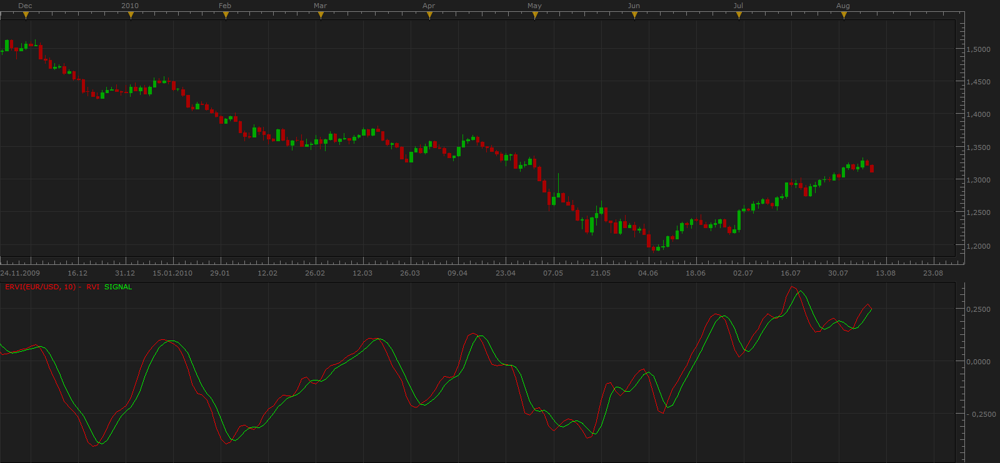
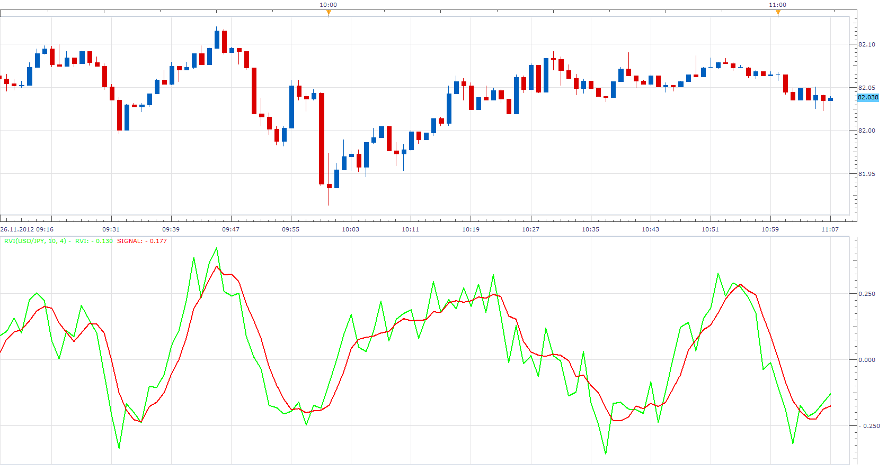
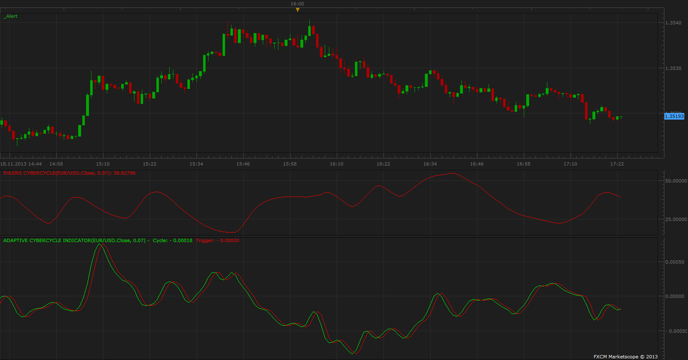

# Ehlers RVI oscillator

> Source: https://fxcodebase.com/code/viewtopic.php?f=17&t=1735  
> Forum: 17 · Topic 1735 · 17 post(s)

---

## Ehlers RVI oscillator

**Apprentice** · Tue Aug 10, 2010 9:14 am

Value1 = ((Close - Open) + 2*(Close[1] - Open[1]) + 2*(Close[2] - Open[2]) + (Close[3] - Open[3]))/6;
Value2 = ((High - Low) + 2*(High[1] - Low[1]) + 2*(High[2] - Low[2]) + (High[3] - Low[3]))/6;

 Num = Sum(Value1, Frame);
Denom = Sum(Value2, Frame);

RVI = Num / Denom;
RVISig = (RVI + 2*RVI[1] + 2*RVI[2] + RVI[3])/6;

 [ERVI.lua](files/3476/ERVI.lua)

The indicator was revised and updated

---

## Re: Ehlers RVI oscillator

**jefftrader** · Tue Aug 10, 2010 2:01 pm

i have downloaded it and installed and it works perfectly.

thanks so much for your support and timeliness.

i appreciate it more than i can say...........

---

## Re: Ehlers RVI oscillator

**pipsqueak** · Sun Nov 25, 2012 8:41 pm

Is this perhaps. the "Relative Vigor Index"?

---

## Re: Ehlers RVI oscillator

**Apprentice** · Mon Nov 26, 2012 4:36 am

That they are one and the same.

Code: [Select all](https://fxcodebase.com/code/)
`{****************************************************
         Relative Vigor Index (RVI)
         Copyright (c) 2001   MESA Software
*****************************************************}
Inputs:   Length(10);

Vars:   Num(0),
   Denom(0),
   count(0),
   RVI(0),
   RVISig(0);

Value1 = ((Close - Open) + 2*(Close[1] - Open[1]) + 2*(Close[2] - Open[2]) + (Close[3] - Open[3]))/6;
Value2 = ((High - Low) + 2*(High[1] - Low[1]) + 2*(High[2] - Low[2]) + (High[3] - Low[3]))/6;
Num = 0;
Denom = 0;
For count = 0 to Length -1 begin
   Num = Num + Value1[count];
   Denom = Denom + Value2[count];
End;
If Denom <> 0 then RVI = Num / Denom;

RVISig = (RVI + 2*RVI[1] + 2*RVI[2] + RVI[3])/6;

Plot1(RVI, "RVI");
Plot2(RVISig, "Sig");`

Although I have found a different formula.
Will implement both, for comparison.

RVI = (CLOSE - OPEN) / (HIGH - LOW)
The Relative Vigor Index (RVI) oscillator is smoothed by the 10-period simple moving average. A signal line is also formed as a 4-period moving average on the oscillator values.

---

## Re: Ehlers RVI oscillator

**Apprentice** · Mon Nov 26, 2012 5:02 am

RVI = (CLOSE - OPEN) / (HIGH - LOW)
The Relative Vigor Index (RVI) oscillator is smoothed by the 10-period simple moving average. ć
A signal line is also formed as a 4-period moving average on the oscillator values.

 [RVI.lua](files/46497/RVI.lua)

---

## Re: Ehlers RVI oscillator

**Coondawg71** · Wed May 15, 2013 11:34 pm

Adaptive Relative Vigor Index.

Can we please request this indicator converted to Lua. Full code posted on this link, last indicator listed on the page.

Thanks,

sjc

[http://www.mql5.com/en/articles/288](http://www.mql5.com/en/articles/288)

---

## Re: Ehlers RVI oscillator

**Apprentice** · Fri May 17, 2013 4:58 am

Your request is added to the development list.

---

## Re: Ehlers RVI oscillator

**Patrick Sweet** · Sat Nov 16, 2013 4:44 pm

can this code be used?

Code: [Select all](https://fxcodebase.com/code/)
`//+------------------------------------------------------------------+
//|                                                 Adaptive RVI.mq5 |
//|                        Based on RVI by MetaQuotes Software Corp. |
//|                        Copyright 2009, MetaQuotes Software Corp. |
//|                                              http://www.mql5.com |
//+------------------------------------------------------------------+
#property copyright   "2009, MetaQuotes Software Corp."
#property copyright   "2011, Adaptive version Investeo.pl"
#property link        "http://www.mql5.com"
#property description "Adaptive Relative Vigor Index"
//--- indicator settings
#property indicator_separate_window
#property indicator_buffers 2
#property indicator_plots   2
#property indicator_type1   DRAW_LINE
#property indicator_type2   DRAW_LINE
#property indicator_color1  Green
#property indicator_color2  Red
#property indicator_label1  "AdaptiveRVI"
#property indicator_label2  "Signal"

#define Price(i) ((high[i]+low[i])/2.0)

//--- input parameters
input int InpRVIPeriod=10; // Initial RVI Period
//--- indicator buffers
double    ExtRVIBuffer[];
double    ExtSignalBuffer[];
//---
int hCyclePeriod;
input double InpAlpha=0.07; // alpha for Cycle Period
int AdaptiveRVIPeriod;

#define TRIANGLE_PERIOD  3
#define AVERAGE_PERIOD   (TRIANGLE_PERIOD*2)
//+------------------------------------------------------------------+
//| Custom indicator initialization function                         |
//+------------------------------------------------------------------+
int OnInit()
  {
//--- indicator buffers mapping
   SetIndexBuffer(0,ExtRVIBuffer,INDICATOR_DATA);
   SetIndexBuffer(1,ExtSignalBuffer,INDICATOR_DATA);
   IndicatorSetInteger(INDICATOR_DIGITS,3);
   hCyclePeriod=iCustom(NULL,0,"CyclePeriod",InpAlpha);
   if(hCyclePeriod==INVALID_HANDLE)
     {
      Print("CyclePeriod indicator not available!");
      return(-1);
     }
   
//--- sets first bar from what index will be drawn
   PlotIndexSetInteger(0,PLOT_DRAW_BEGIN,(InpRVIPeriod-1)+TRIANGLE_PERIOD);
   PlotIndexSetInteger(1,PLOT_DRAW_BEGIN,(InpRVIPeriod-1)+AVERAGE_PERIOD);
//--- name for DataWindow and indicator subwindow label
   IndicatorSetString(INDICATOR_SHORTNAME,"AdaptiveRVI");
   PlotIndexSetString(0,PLOT_LABEL,"AdaptiveRVI");
   PlotIndexSetString(1,PLOT_LABEL,"Signal");
//--- initialization done
  return 0;
  }
//+------------------------------------------------------------------+
//| Relative Vigor Index                                             |
//+------------------------------------------------------------------+
int OnCalculate(const int rates_total,const int prev_calculated,
                const datetime &Time[],
                const double &Open[],
                const double &High[],
                const double &Low[],
                const double &Close[],
                const long &TickVolume[],
                const long &Volume[],
                const int &Spread[])
  {
   int    i,j,nLimit;
   double dValueUp,dValueDown,dNum,dDeNum;
   double CyclePeriod[4];
   int copied;
   
   copied=CopyBuffer(hCyclePeriod,0,0,4,CyclePeriod);

         if(copied<=0)
           {
            Print("FAILURE: Could not get values from CyclePeriod indicator.");
            return -1;
           }
   AdaptiveRVIPeriod = int(floor((4*CyclePeriod[0]+3*CyclePeriod[1]+2*CyclePeriod[2]+CyclePeriod[3])/20.0));
//--- check for bars count
   if(rates_total<=AdaptiveRVIPeriod+AVERAGE_PERIOD+2) return(0); // exit with zero result
//--- check for possible errors
   if(prev_calculated<0) return(0); // exit with zero result
//--- last counted bar will be recounted
   nLimit=AdaptiveRVIPeriod+2;
   if(prev_calculated>AdaptiveRVIPeriod+TRIANGLE_PERIOD+2)
      nLimit=prev_calculated-1;
//--- set empty value for uncalculated bars
   if(prev_calculated==0)
     {
      for(i=0;i<AdaptiveRVIPeriod+TRIANGLE_PERIOD;i++) ExtRVIBuffer[i]=0.0;
      for(i=0;i<AdaptiveRVIPeriod+AVERAGE_PERIOD;i++)  ExtSignalBuffer[i]=0.0;
     }
//--- RVI counted in the 1-st buffer
   for(i=nLimit;i<rates_total && !IsStopped();i++)
     {
      copied=CopyBuffer(hCyclePeriod,0,rates_total-i-1,4,CyclePeriod);

         if(copied<=0)
           {
            Print("FAILURE: Could not get values from CyclePeriod indicator.");
            return -1;
           }
      AdaptiveRVIPeriod = int(floor((4*CyclePeriod[0]+3*CyclePeriod[1]+2*CyclePeriod[2]+CyclePeriod[3])/20.0));
      dNum=0.0;
      dDeNum=0.0;
      for(j=i;j>MathMax(i-AdaptiveRVIPeriod, 3);j--)
        {
         //Print("rates_total="+IntegerToString(rates_total)+" nLimit="+IntegerToString(nLimit)+
         //      " AdaptiveRVIPeriod="+IntegerToString(AdaptiveRVIPeriod)+" j="+IntegerToString(j));
         dValueUp=Close[j]-Open[j]+2*(Close[j-1]-Open[j-1])+2*(Close[j-2]-Open[j-2])+Close[j-3]-Open[j-3];
         dValueDown=High[j]-Low[j]+2*(High[j-1]-Low[j-1])+2*(High[j-2]-Low[j-2])+High[j-3]-Low[j-3];
         dNum+=dValueUp;
         dDeNum+=dValueDown;
        }
      if(dDeNum!=0.0)
         ExtRVIBuffer[i]=dNum/dDeNum;
      else
         ExtRVIBuffer[i]=dNum;
     }
//--- signal line counted in the 2-nd buffer
   nLimit=AdaptiveRVIPeriod+TRIANGLE_PERIOD+2;
   if(prev_calculated>AdaptiveRVIPeriod+AVERAGE_PERIOD+2)
      nLimit=prev_calculated-1;
   for(i=nLimit;i<rates_total && !IsStopped();i++)
    ExtSignalBuffer[i]=(ExtRVIBuffer[i]+2*ExtRVIBuffer[i-1]+2*ExtRVIBuffer[i-2]+ExtRVIBuffer[i-3])/AVERAGE_PERIOD;

//--- OnCalculate done. Return new prev_calculated.
   return(rates_total);
  }
//+------------------------------------------------------------------+`

---

## Re: Ehlers RVI oscillator

**Apprentice** · Sun Nov 17, 2013 3:19 am

Can you privide required CyclePeriod Indicator?

---

## Re: Ehlers RVI oscillator

**Patrick Sweet** · Mon Nov 18, 2013 8:39 am

I think this is it...

We extracted the Dominant Cycle measurement from CyclePeriod indicator and apply it to RVI period. The "Length" variable is computed as a four bar weighted moving average of the period......

_________________________________________________

copied=CopyBuffer(hCyclePeriod,0,0,4,CyclePeriod);

if(copied<=0)
 {
 Print("FAILURE: Could not get values from CyclePeriod indicator.");
 return -1;
 }
AdaptiveRVIPeriod = int(floor((4*CyclePeriod[0]+3*CyclePeriod[1]+2*CyclePeriod[2]+CyclePeriod[3])/20.0));

____________________________________________________________

---

## Re: Ehlers RVI oscillator

**Patrick Sweet** · Mon Nov 18, 2013 8:48 am

If the above is not complete..... and we need the adaptive CyberCycle then here it comes.....
with a note on Ehlers alpha.....

Expotential moving alpha is related to the length of a simple moving average by the equation alpha, in the Adaptive Cyber Cycle indicator Mr. Ehlers used the Dominant Cycle period as the length in computation of alpha1 coefficient.

________________________

Code: [Select all](https://fxcodebase.com/code/)
`#property description "Adaptive CyberCycle indicator - described by John F. Ehlers"
#property description "in \"Cybernetic Analysis for Stocks and Futures\""
#property description "This indicator is available for free download."

#property indicator_buffers 2
#property indicator_plots 2
#property indicator_width1 1
#property indicator_width2 1
#property indicator_type1   DRAW_LINE
#property indicator_type2   DRAW_LINE
#property indicator_color1  Green
#property indicator_color2  Red
#property indicator_label1  "Cycle"
#property indicator_label2  "Trigger Line"

#define Price(i) ((high[i]+low[i])/2.0)

double Smooth[];
double Cycle[];
double Trigger[];

int hCyclePeriod;
 
input double InpAlpha=0.07; // alpha for Cycle Period
//+------------------------------------------------------------------+
//| Custom indicator initialization function                         |
//+------------------------------------------------------------------+
int OnInit()
  {
//--- indicator buffers mapping
   ArraySetAsSeries(Cycle,true);
   ArraySetAsSeries(Trigger,true);
   ArraySetAsSeries(Smooth,true);

   SetIndexBuffer(0,Cycle,INDICATOR_DATA);
   SetIndexBuffer(1,Trigger,INDICATOR_DATA);

   PlotIndexSetDouble(0,PLOT_EMPTY_VALUE,0.0);
   PlotIndexSetDouble(1,PLOT_EMPTY_VALUE,0.0);

   hCyclePeriod=iCustom(NULL,0,"CyclePeriod",InpAlpha);
   if(hCyclePeriod==INVALID_HANDLE)
     {
      Print("CyclePeriod indicator not available!");
      return(-1);
     }
   return(0);
  }
//+------------------------------------------------------------------+
//| Custom indicator iteration function                              |
//+------------------------------------------------------------------+
int OnCalculate(const int rates_total,
                const int prev_calculated,
                const datetime &time[],
                const double &open[],
                const double &high[],
                const double &low[],
                const double &close[],
                const long &tick_volume[],
                const long &volume[],
                const int &spread[])
  {
//---   
   long tickCnt[1];
   int i;
   int ticks=CopyTickVolume(Symbol(), 0, 0, 1, tickCnt);
   if(ticks!=1) return(rates_total);
   double CyclePeriod[1],alpha1;

   Comment(tickCnt[0]);

   if(prev_calculated==0 || tickCnt[0]==1)
     {
      //--- last counted bar will be recounted
      int nLimit=rates_total-prev_calculated-1; // start index for calculations

      ArraySetAsSeries(high,true);
      ArraySetAsSeries(low,true);

      ArrayResize(Smooth,Bars(_Symbol,_Period));
      ArrayResize(Cycle,Bars(_Symbol,_Period));
     
      if(nLimit>rates_total-4) // adjust for last bars
         nLimit=rates_total-4;

      for(i=nLimit;i>=0 && !IsStopped();i--)
        {
         Smooth[i]=(Price(i)+2*Price(i+1)+2*Price(i+2)+Price(i+3))/6.0;
         int copied=CopyBuffer(hCyclePeriod,0,i,1,CyclePeriod);

         if(copied<=0)
           {
            Print("FAILURE: Could not get values from CyclePeriod indicator.");
            return -1;
           }
         alpha1 = 2.0/(CyclePeriod[0]+1.0);
         //Print(alpha1);
         //Print(CyclePeriod[0]);
         if(i>=0)
           {
            Cycle[i]=(1.0-0.5*alpha1) *(1.0-0.5*alpha1) *(Smooth[i]-2.0*Smooth[i+1]+Smooth[i+2])
                     +2.0*(1.0-alpha1)*Cycle[i+1]-(1.0-alpha1)*(1.0-alpha1)*Cycle[i+2];

            //Print("Smooth["+IntegerToString(i)+"]="+DoubleToString(Smooth[i])+" Cycle["+IntegerToString(i)+"]="+DoubleToString(Cycle[i]));
           }
         else
           {
            Cycle[i]=(Price(i)-2.0*Price(i+1)+Price(i+2))/4.0;
           }

         //Print(__FILE__+__FUNCTION__+" received values: ",rCnt);
         Trigger[i]=Cycle[i+1];
        }
     }
//--- return value of prev_calculated for next call
   return(rates_total);
  }
//+------------------------------------------------------------------+`

---

## Re: Ehlers RVI oscillator

**Apprentice** · Mon Nov 18, 2013 9:06 am

I need CyclePeriod indicator code.
Its output is the basis for the proper functioning of the "Adaptive CyberCycle indicator

---

## Re: Ehlers RVI oscillator

**Apprentice** · Mon Nov 18, 2013 11:30 am

This is what I could find on the internet.
There are several versions out there.

 [Ehlers CyberCycle.lua](files/90898/Ehlers%20CyberCycle.lua)

 [Adaptive CyberCycle indicator.lua](files/90898/Adaptive%20CyberCycle%20indicator.lua)

---

## Re: Ehlers RVI oscillator

**Patrick Sweet** · Mon Nov 18, 2013 3:21 pm

hi,
Here comes the cyber cycle indicator.....is that what you got or is this what you need?

Cyber Cycle indicator
The Cyber Cycle indicator is a high-pass filter taken from "Сybernetic analysis for stocks and futures". This filter leaves only the cycle mode component from timeseries.
Additionaly two-bar and three-bar cycle components are extracted from the result by smoothing it with a finite impulse response low pass filter.

Code: [Select all](https://fxcodebase.com/code/)
`#property description "CyberCycle indicator - described by John F. Ehlers"
#property description "in \"Cybernetic Analysis for Stocks and Futures\""
#property description "This indicator is available for free download."

#property indicator_buffers 2
#property indicator_plots 2
#property indicator_width1 1
#property indicator_width2 1
#property indicator_type1   DRAW_LINE
#property indicator_type2   DRAW_LINE
#property indicator_color1  Green
#property indicator_color2  Red
#property indicator_label1  "Cycle"
#property indicator_label2  "Trigger Line"

#define Price(i) ((high[i]+low[i])/2.0)

double Smooth[];
double Cycle[];
double Trigger[];

input double InpAlpha=0.07; // alpha
//+------------------------------------------------------------------+
//| Custom indicator initialization function                         |
//+------------------------------------------------------------------+
int OnInit()
  {
//--- indicator buffers mapping
   ArraySetAsSeries(Cycle,true);
   ArraySetAsSeries(Trigger,true);
   ArraySetAsSeries(Smooth,true);

   SetIndexBuffer(0,Cycle,INDICATOR_DATA);
   SetIndexBuffer(1,Trigger,INDICATOR_DATA);

   PlotIndexSetDouble(0,PLOT_EMPTY_VALUE,0.0);
   PlotIndexSetDouble(1,PLOT_EMPTY_VALUE,0.0);

   return(0);
  }
//+------------------------------------------------------------------+
//| Custom indicator iteration function                              |
//+------------------------------------------------------------------+
int OnCalculate(const int rates_total,
                const int prev_calculated,
                const datetime &time[],
                const double &open[],
                const double &high[],
                const double &low[],
                const double &close[],
                const long &tick_volume[],
                const long &volume[],
                const int &spread[])
  {
//---   
   long tickCnt[1];
   int i;
   int ticks=CopyTickVolume(Symbol(), 0, 0, 1, tickCnt);
   if(ticks!=1) return(rates_total);

   Comment(tickCnt[0]);

   if(prev_calculated==0 || tickCnt[0]==1)
     {
      //--- last counted bar will be recounted
      int nLimit=rates_total-prev_calculated-1; // start index for calculations

      ArraySetAsSeries(high,true);
      ArraySetAsSeries(low,true);

      ArrayResize(Smooth,Bars(_Symbol,_Period));
      ArrayResize(Cycle,Bars(_Symbol,_Period));
     
      if(nLimit>rates_total-4) // adjust for last bars
         nLimit=rates_total-4;

      for(i=nLimit;i>=0 && !IsStopped();i--)
        {
         Smooth[i]=(Price(i)+2*Price(i+1)+2*Price(i+2)+Price(i+3))/6.0;

         if(i<rates_total-5)
           {
            Cycle[i]=(1.0-0.5*InpAlpha) *(1.0-0.5*InpAlpha) *(Smooth[i]-2.0*Smooth[i+1]+Smooth[i+2])
                     +2.0*(1.0-InpAlpha)*Cycle[i+1]-(1.0-InpAlpha)*(1.0-InpAlpha)*Cycle[i+2];
           }
         else
           {
            Cycle[i]=(Price(i)-2.0*Price(i+1)+Price(i+2))/4.0;
           }

         //Print(__FILE__+__FUNCTION__+" received values: ",rCnt);
         Trigger[i]=Cycle[i+1];
        }
     }
//--- return value of prev_calculated for next call
   return(rates_total);
  }
//+------------------------------------------------------------------+`

---

## Re: Ehlers RVI oscillator

**Patrick Sweet** · Tue Nov 19, 2013 3:04 am

Thank you A!
Much appreciated!!!

P

---

## Re: Ehlers RVI oscillator

**Alexander.Gettinger** · Wed Jun 04, 2014 5:29 pm

MQL4 version of Ehlers RVI oscillator: [viewtopic.php?f=38&t=60771](https://fxcodebase.com/code/viewtopic.php?f=38&t=60771).

---

## Re: Ehlers RVI oscillator

**Apprentice** · Mon Jun 19, 2017 8:20 am

The indicator was revised and updated.
