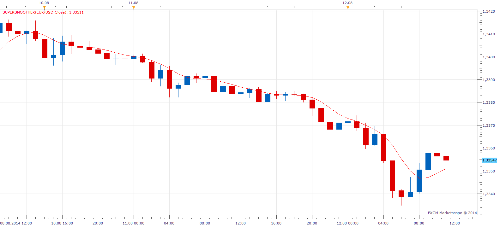

# Ehlers SuperSmoother

> Source: https://fxcodebase.com/code/viewtopic.php?f=17&t=61032  
> Forum: 17 · Topic 61032 · 9 post(s)

---

## Ehlers SuperSmoother

**Apprentice** · Tue Aug 12, 2014 10:17 am

Based on the request
[viewtopic.php?f=27&t=61031](https://fxcodebase.com/code/viewtopic.php?f=27&t=61031)

U can read more on this series in January 2014 issue of Stocks & Commodities magazine TRADERS’ TIPS.

 [SuperSmoother.lua](files/95342/SuperSmoother.lua)

---

## Ehlers Roofing Filter

**Apprentice** · Wed Aug 13, 2014 11:47 am

 [Roofing Filter.lua](files/95365/Roofing%20Filter.lua)

---

## Ehlers My Stochastic

**Apprentice** · Wed Aug 13, 2014 12:57 pm

 [My Stochastic.lua](files/95368/My%20Stochastic.lua)

---

## Re: Ehlers SuperSmoother

**mulligan** · Thu Oct 02, 2014 8:51 am

This is a fantastic indicator. Thank you for coding it for TradeStation. I would like to request a strategy or alert with show, sound and recurrent sound. Buy and sell based simply on up or down movement of the indicator. I use your slope indicator color overlay to see up and down color changes. Many may not know of it and prefer the style option of color up and color down. Thanks again for all you do.

---

## Re: Ehlers SuperSmoother

**Apprentice** · Sat Oct 04, 2014 2:39 am

Can you specify for which of the three indicators above, you're interested.
Ehlers SuperSmoother?

---

## Re: Ehlers SuperSmoother

**mulligan** · Sat Oct 04, 2014 7:16 am

Yes, I'm interested in SuperSmoother. Thanks

---

## Re: Ehlers SuperSmoother

**Apprentice** · Sun Oct 05, 2014 1:24 am

Requested can be found here.
[viewtopic.php?f=31&t=61298](https://fxcodebase.com/code/viewtopic.php?f=31&t=61298)

---

## Re: Ehlers SuperSmoother

**Alexander.Gettinger** · Wed Apr 29, 2015 1:23 pm

MQL4 version of Ehlers super smoother: [viewtopic.php?f=38&t=62162](https://fxcodebase.com/code/viewtopic.php?f=38&t=62162).

---

## Re: Ehlers SuperSmoother

**Apprentice** · Wed Oct 03, 2018 5:43 am

The indicator was revised and updated.
