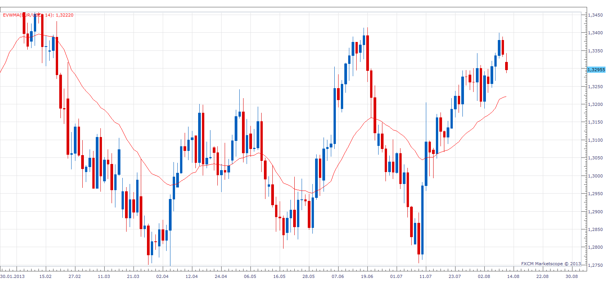

# Elastic Volume Weighted Moving Average

> Source: https://fxcodebase.com/code/viewtopic.php?f=17&t=58939  
> Forum: 17 · Topic 58939 · 3 post(s)

---

## Elastic Volume Weighted Moving Average

**Apprentice** · Mon Aug 12, 2013 5:29 am

Total =Sum(volume, Period);

EVWMA = ((Total-volume)*EVWMA[-1]+ volume[period]*close)/Total;

 [EVWMA.lua](files/88329/EVWMA.lua)

One Note.
For forex, it is impossible to know, total number or "shares"
In this calculation, I use the sum of last N period Volume.

---

## Re: Elastic Volume Weighted Moving Average

**Alexander.Gettinger** · Thu Aug 29, 2013 10:53 am

MQL4 version of indicator: [http://www.fxcodebase.com/code/viewtopi ... 38&t=59348](http://www.fxcodebase.com/code/viewtopic.php?f=38&t=59348).

---

## Re: Elastic Volume Weighted Moving Average

**Apprentice** · Thu Dec 15, 2022 4:24 pm

Based on the source.
[https://www.prorealcode.com/prorealtime ... ilo-bands/](https://www.prorealcode.com/prorealtime-indicators/elastic-weighted-moving-average-hilo-bands/)

 [EVWMA HiLo Bands.lua](files/148689/EVWMA%20HiLo%20Bands.lua)
