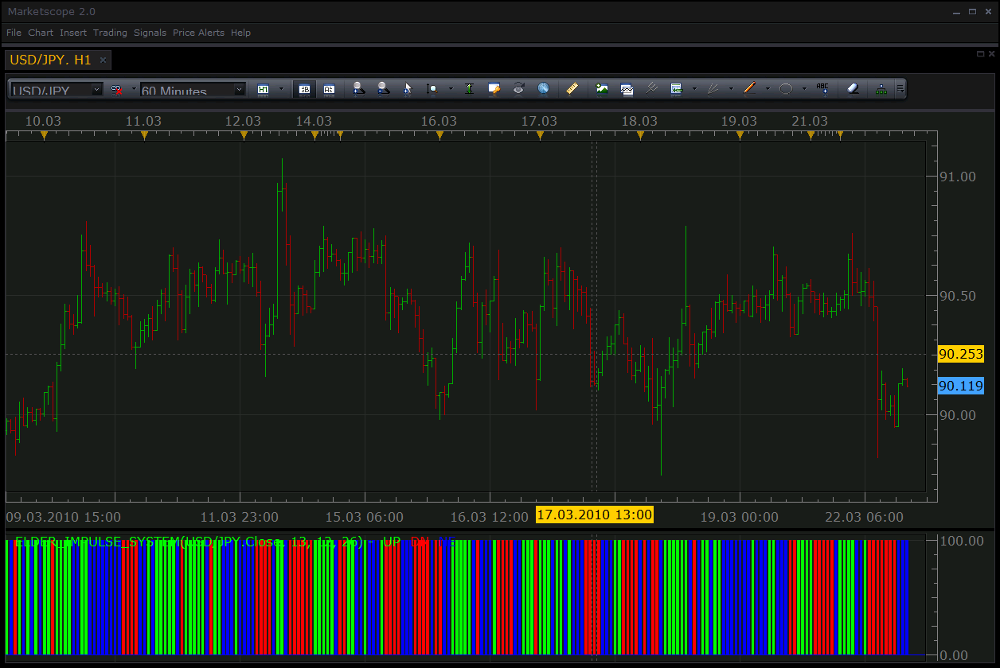
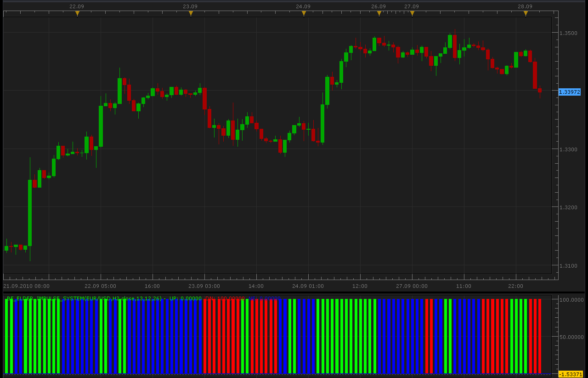
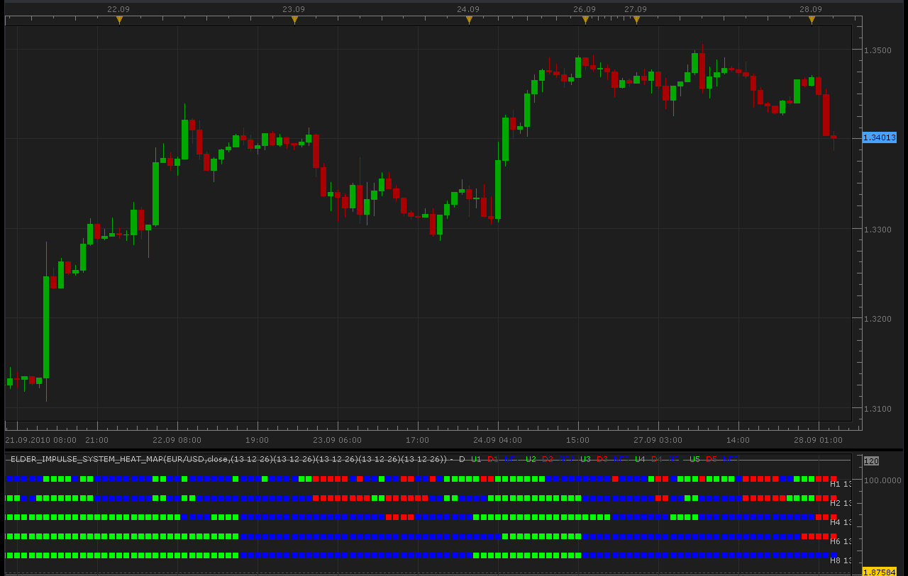
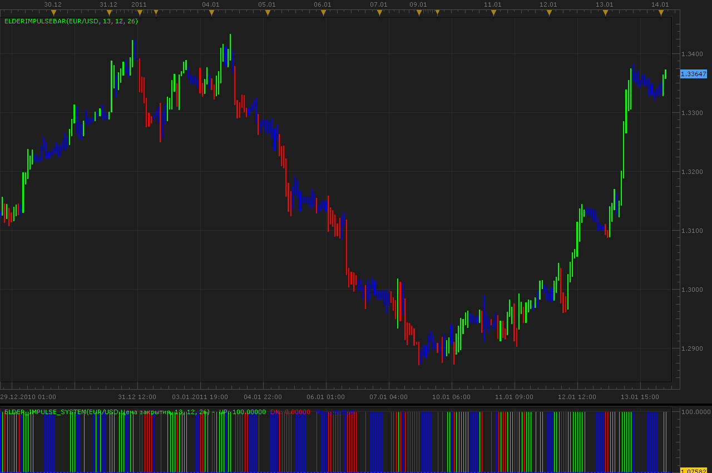
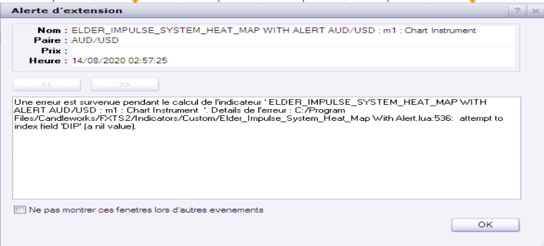
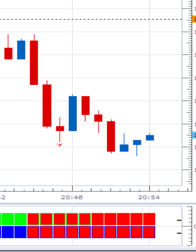
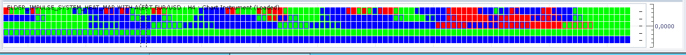

# Elder Impulse System

> Source: https://fxcodebase.com/code/viewtopic.php?f=17&t=993  
> Forum: 17 · Topic 993 · 53 post(s)

---

## Elder Impulse System

**Nikolay.Gekht** · Sun May 09, 2010 6:28 pm

**Note** Please take [the optimized version of these indicators, especially heat map!](https://fxcodebase.com/code/viewtopic.php?f=30&t=6541)

Please, read more about Elder Impulse system here: [http://stockstudent.blogspot.com/2008/0 ... ystem.html](https://stockstudent.blogspot.com/2008/03/impulse-system.html)

 

Download:

 [Elder_Impulse_System.lua](files/1848/Elder_Impulse_System.lua)

 [EIS.lua](files/1848/EIS.lua)

[See also the signal](https://fxcodebase.com/code/viewtopic.php?f=29&t=995).

Note: the implementation is a port of the MT4's indicator which uses modified a slightly version of the MACD formula.

---

## Re: Elder Impulse System

**Hybrid** · Fri May 14, 2010 4:53 pm

Thank you for the Oscillator.

Can a bigger time frame version be done, please?

---

## Re: Elder Impulse System

**Alexander.Gettinger** · Tue Sep 28, 2010 2:30 am

Bigger timeframe Elder Impulse System:

 

Code: [Select all](https://fxcodebase.com/code/)
`function Init()
    indicator:name("Bigger timeframe Elder Impulse System");
    indicator:description("");
    indicator:requiredSource(core.Bar);
    indicator:type(core.Oscillator);

    indicator.parameters:addGroup("Calculation");
    indicator.parameters:addString("BS", "Time frame to calculate indicator", "", "D1");
    indicator.parameters:setFlag("BS", core.FLAG_PERIODS);
    indicator.parameters:addInteger("EMA", "EMA periods for study", "", 13, 1, 100);
    indicator.parameters:addInteger("MACDF", "MACD periods fast", "", 12, 1, 100);
    indicator.parameters:addInteger("MACDS", "MACD periods slow", "", 26, 1, 100);
    indicator.parameters:addString("Price", "Price", "", "close");
    indicator.parameters:addStringAlternative("Price", "open", "", "open");
    indicator.parameters:addStringAlternative("Price", "close", "", "close");
    indicator.parameters:addStringAlternative("Price", "high", "", "high");
    indicator.parameters:addStringAlternative("Price", "low", "", "low");
    indicator.parameters:addStringAlternative("Price", "typical", "", "typical");
    indicator.parameters:addStringAlternative("Price", "median", "", "median");
    indicator.parameters:addStringAlternative("Price", "weighted", "", "weighted");
   
    indicator.parameters:addGroup("Display");
    indicator.parameters:addColor("UP_color", "Color of up signal", "", core.rgb(0, 255, 0));
    indicator.parameters:addColor("DOWN_color", "Color of down signal", "", core.rgb(255, 0, 0));
    indicator.parameters:addColor("NE_color", "Color of neutral signal", "", core.rgb(0, 0, 255));
end

local source;                   -- the source
local bf_data = nil;          -- the high/low data
local EMA;
local MACDF;
local MACDS;
local BS;
local bf_length;                 -- length of the bigger frame in seconds
local dates;                    -- candle dates
local host;
local day_offset;
local week_offset;
local extent;
local Ind;
local PriceType;

function Prepare()
    source = instance.source;
    host = core.host;

    day_offset = host:execute("getTradingDayOffset");
    week_offset = host:execute("getTradingWeekOffset");

    BS = instance.parameters.BS;
    EMA = instance.parameters.EMA;
    MACDF = instance.parameters.MACDF;
    MACDS = instance.parameters.MACDS;
    PriceType=instance.parameters.Price;
    extent = EMA*2;

    local s, e, s1, e1;

    s, e = core.getcandle(source:barSize(), core.now(), 0, 0);
    s1, e1 = core.getcandle(BS, core.now(), 0, 0);
    assert ((e - s) <= (e1 - s1), "The chosen time frame must be bigger than the chart time frame!");
    bf_length = math.floor((e1 - s1) * 86400 + 0.5);

    local name = profile:id() .. "(" .. source:name() .. "," .. BS ..",".. PriceType .."," .. EMA .. "," .. MACDF .. "," .. MACDS .. ")";
    instance:name(name);
    UP = instance:addStream("UP", core.Bar, name .. "UP", "UP", instance.parameters.UP_color, 0);
    DOWN = instance:addStream("DN", core.Bar, name .. "DN", "DN", instance.parameters.DOWN_color, 0);
    NE = instance:addStream("NE", core.Bar, name .. "NE", "NE", instance.parameters.NE_color, 0);

end

local loading = false;
local loadingFrom, loadingTo;
local pday = nil;

-- the function which is called to calculate the period
function Update(period, mode)
    -- get date and time of the hi/lo candle in the reference data
    local bf_candle;
    bf_candle = core.getcandle(BS, source:date(period), day_offset, week_offset);

    -- if data for the specific candle are still loading
    -- then do nothing
    if loading and bf_candle >= loadingFrom and (loadingTo == 0 or bf_candle <= loadingTo) then
        return ;
    end

    -- if the period is before the source start
    -- the do nothing
    if period < source:first() then
        return ;
    end

    -- if data is not loaded yet at all
    -- load the data
    if bf_data == nil then
        -- there is no data at all, load initial data
        local to, t;
        local from;

        if (source:isAlive()) then
            -- if the source is subscribed for updates
            -- then subscribe the current collection as well
            to = 0;
        else
            -- else load up to the last currently available date
            t, to = core.getcandle(BS, source:date(period), day_offset, week_offset);
        end

        from = core.getcandle(BS, source:date(source:first()), day_offset, week_offset);
        UP:setBookmark(1, period);
        -- shift so the bigger frame data is able to provide us with the stoch data at the first period
        from = math.floor(from * 86400 - (bf_length * extent) + 0.5) / 86400;
        local nontrading, nontradingend;
        nontrading, nontradingend = core.isnontrading(from, day_offset);
        if nontrading then
            -- if it is non-trading, shift for two days to skip the non-trading periods
            from = math.floor((from - 2) * 86400 - (bf_length * extent) + 0.5) / 86400;
        end
        loading = true;
        loadingFrom = from;
        loadingTo = to;
        bf_data = host:execute("getHistory", 1, source:instrument(), BS, loadingFrom, to, source:isBid());
        if PriceType=="open" then
         Ind = core.indicators:create("ELDER_IMPULSE_SYSTEM", bf_data.open, EMA, MACDF, MACDS);
        elseif PriceType=="close" then
         Ind = core.indicators:create("ELDER_IMPULSE_SYSTEM", bf_data.close, EMA, MACDF, MACDS);
        elseif PriceType=="high" then
         Ind = core.indicators:create("ELDER_IMPULSE_SYSTEM", bf_data.high, EMA, MACDF, MACDS);
        elseif PriceType=="low" then
         Ind = core.indicators:create("ELDER_IMPULSE_SYSTEM", bf_data.low, EMA, MACDF, MACDS);
        elseif PriceType=="typical" then
         Ind = core.indicators:create("ELDER_IMPULSE_SYSTEM", bf_data.typical, EMA, MACDF, MACDS);
        elseif PriceType=="median" then
         Ind = core.indicators:create("ELDER_IMPULSE_SYSTEM", bf_data.median, EMA, MACDF, MACDS);
        else
         Ind = core.indicators:create("ELDER_IMPULSE_SYSTEM", bf_data.weighted, EMA, MACDF, MACDS);
        end
        return ;
    end

    -- check whether the requested candle is before
    -- the reference collection start
    if (bf_candle < bf_data:date(0)) then
        UP:setBookmark(1, period);
        if loading then
            return ;
        end
        -- shift so the bigger frame data is able to provide us with the stoch data at the first period
        from = math.floor(bf_candle * 86400 - (bf_length * extent) + 0.5) / 86400;
        local nontrading, nontradingend;
        nontrading, nontradingend = core.isnontrading(from, day_offset);
        if nontrading then
            -- if it is non-trading, shift for two days to skip the non-trading periods
            from = math.floor((from - 2) * 86400 - (bf_length * extent) + 0.5) / 86400;
        end
        loading = true;
        loadingFrom = from;
        loadingTo = bf_data:date(0);
        host:execute("extendHistory", 1, bf_data, loadingFrom, loadingTo);
        return ;
    end

    -- check whether the requested candle is after
    -- the reference collection end
    if (not(source:isAlive()) and bf_candle > bf_data:date(bf_data:size() - 1)) then
        UP:setBookmark(1, period);
        if loading then
            return ;
        end
        loading = true;
        loadingFrom = bf_data:date(bf_data:size() - 1);
        loadingTo = bf_candle;
        host:execute("extendHistory", 1, bf_data, loadingFrom, loadingTo);
        return ;
    end

    Ind:update(mode);
    local p;
    p = findDateFast(bf_data, bf_candle, true);
    if p == -1 then
        return ;
    end
    if Ind:getStream(0):hasData(p) then
        UP[period] = Ind:getStream(0)[p];
    end
    if Ind:getStream(1):hasData(p) then
        DOWN[period] = Ind:getStream(1)[p];
    end
    if Ind:getStream(2):hasData(p) then
        NE[period] = Ind:getStream(2)[p];
    end
end

-- the function is called when the async operation is finished
function AsyncOperationFinished(cookie)
    local period;

    pday = nil;
    period = UP:getBookmark(1);

    if (period < 0) then
        period = 0;
    end
    loading = false;
    instance:updateFrom(period);
end

function findDateFast(stream, date, precise)
    local datesec = nil;
    local periodsec = nil;
    local min, max, mid;

    datesec = math.floor(date * 86400 + 0.5)

    min = 0;
    max = stream:size() - 1;

    while true do
        mid = math.floor((min + max) / 2);
        periodsec = math.floor(stream:date(mid) * 86400 + 0.5);
        if datesec == periodsec then
            return mid;
        elseif datesec > periodsec then
            min = mid + 1;
        else
            max = mid - 1;
        end
        if min > max then
            if precise then
                return -1;
            else
                return min - 1;
            end
        end
    end
end`

---

## Re: Elder Impulse System

**Alexander.Gettinger** · Tue Sep 28, 2010 2:31 am

Multitimeframe Elder Impulse System Heat Map:

 

Code: [Select all](https://fxcodebase.com/code/)
`function AddMvaParam(id, frame, EMA, MACDF, MACDS)
    indicator.parameters:addString("B" .. id, "Time frame for avegage " .. id, "", frame);
    indicator.parameters:setFlag("B" .. id, core.FLAG_PERIODS);
    indicator.parameters:addInteger("EMA" .. id, "EMA " .. id .. "EMA ", "", EMA);
    indicator.parameters:addInteger("MACDF" .. id, "MACDF " .. id .. "MACDF ", "", MACDF);
    indicator.parameters:addInteger("MACDS" .. id, "MACDS " .. id .. "MACDS ", "", MACDS);
end

function Init()
    indicator:name("Multitimeframe Elder Impulse System Heat Map");
    indicator:description("");
    indicator:requiredSource(core.Bar);
    indicator:type(core.Oscillator);

    indicator.parameters:addGroup("Calculation");
    AddMvaParam(1, "H1", 13, 12, 26);
    AddMvaParam(2, "H2", 13, 12, 26);
    AddMvaParam(3, "H4", 13, 12, 26);
    AddMvaParam(4, "H6", 13, 12, 26);
    AddMvaParam(5, "H8", 13, 12, 26);
   
    indicator.parameters:addString("Price", "Price", "", "close");
    indicator.parameters:addStringAlternative("Price", "open", "", "open");
    indicator.parameters:addStringAlternative("Price", "close", "", "close");
    indicator.parameters:addStringAlternative("Price", "high", "", "high");
    indicator.parameters:addStringAlternative("Price", "low", "", "low");
    indicator.parameters:addStringAlternative("Price", "typical", "", "typical");
    indicator.parameters:addStringAlternative("Price", "median", "", "median");
    indicator.parameters:addStringAlternative("Price", "weighted", "", "weighted");
   
    indicator.parameters:addGroup("Display");
    indicator.parameters:addColor("clrUP", "Up color", "", core.rgb(0, 255, 0));
    indicator.parameters:addColor("clrDN", "Down color", "", core.rgb(255, 0, 0));
    indicator.parameters:addColor("clrNE", "Neutral color", "", core.rgb(0, 0, 255));
    indicator.parameters:addColor("clrLBL", "Label color", "", core.COLOR_LABEL);
end

-- list of streams
local streams = {}
-- the indicator source
local source;
local day_offset, week_offset;
local dummy;
local host;
local U = {};
local D = {};
local NE = {};
local L = {};
local Ind = nil;
local PriceType;

function Prepare()
    source = instance.source;
    host = core.host;
    PriceType=instance.parameters.Price;

    day_offset = host:execute("getTradingDayOffset");
    week_offset = host:execute("getTradingWeekOffset");

    CheckBarSize(1);
    CheckBarSize(2);
    CheckBarSize(3);
    CheckBarSize(4);
    CheckBarSize(5);

    local i;
    local name = profile:id() .. "(" .. source:name() .. ",".. PriceType .. ",";
    for i = 1, 5, 1 do
        name = name .. "(" ..
                       instance.parameters:getInteger("EMA" .. i) .. " " .. instance.parameters:getInteger("MACDF" .. i) .. " " .. instance.parameters:getInteger("MACDS" .. i) .. ")";
        L[i] = instance.parameters:getString("B" .. i) .. " " .. instance.parameters:getString("EMA" .. i).. " " .. instance.parameters:getString("MACDF" .. i).. " " .. instance.parameters:getString("MACDS" .. i) .. ")";
    end
    name = name .. ")";
    instance:name(name);
    dummy = instance:addStream("D", core.Line, name .. ".D", "D", instance.parameters.clrLBL, 20);
    dummy:addLevel(0);
    dummy:addLevel(120);
    for i = 1, 5, 1 do
        U[i] = instance:createTextOutput ("U" .. i, "U" .. i, "Wingdings", 10, core.H_Center, core.V_Center, instance.parameters.clrUP, 0);
        D[i] = instance:createTextOutput ("D" .. i, "D" .. i, "Wingdings", 10, core.H_Center, core.V_Center, instance.parameters.clrDN, 0);
        NE[i] = instance:createTextOutput ("NE" .. i, "NE" .. i, "Wingdings", 10, core.H_Center, core.V_Center, instance.parameters.clrNE, 0);
    end
end

function CheckBarSize(id)
    local s, e, s1, e1;
    s, e = core.getcandle(source:barSize(), core.now(), 0, 0);
    s1, e1 = core.getcandle(instance.parameters:getString("B" .. id), core.now(), 0, 0);
    assert ((e - s) <= (e1 - s1), "The chosen time frame must be equal to or bigger than the chart time frame!");
end

function Update(period, mode)
    local i, p, loading;
    -- request for data and create MVA's if they do not exist yet.
    if Ind == nil then
        Ind = {};
        for i = 1, 5, 1 do
            stream = registerStream(i, instance.parameters:getString("B" .. i), instance.parameters:getInteger("EMA" .. i));
            Ind[i] = core.indicators:create("ELDER_IMPULSE_SYSTEM", getPriceStream(stream), instance.parameters:getInteger("EMA" .. i), instance.parameters:getInteger("MACDF" .. i), instance.parameters:getInteger("MACDS" .. i));
        end
    end

    for i = 1, 5, 1 do
        p, loading = getPeriod(i, period);
        if p ~= -1 then
            Ind[i]:update(mode);
            if Ind[i].UP:hasData(p) or Ind[i].DN:hasData(p) or Ind[i].NE:hasData(p) then
             if Ind[i].UP[p]==100 then
              U[i]:set(period, (6 - i) * 20, "\110");
             elseif Ind[i].DN[p]==100 then
              D[i]:set(period, (6 - i) * 20, "\110");
             elseif Ind[i].NE[p]==100 then
              NE[i]:set(period, (6 - i) * 20, "\110");
             end
            end
        end
    end

    if period == source:size() - 1 then
        for i = 1, 5, 1 do
            host:execute("drawLabel", i, source:date(period), (6 - i) * 20, L[i]);
        end
    end
end

function getPriceStream(stream)
    local s = instance.parameters.S;
    return stream;
end

function getPrice(source_)
  if PriceType=="open" then
   return source_.open;
  elseif PriceType=="close" then
   return source_.close;
  elseif PriceType=="high" then
   return source_.high;
  elseif PriceType=="low" then
   return source_.low;
  elseif PriceType=="typical" then
   return source_.typical;
  elseif PriceType=="median" then
   return source_.median;
  elseif PriceType=="weighted" then
   return source_.weighted;
  end
end

-- register stream
-- @param barSize       Stream's bar size
-- @param extent        The size of the required exten
-- @return the stream reference
function registerStream(id, barSize, extent)
    local stream = {};
    local s1, e1, length;
    local from, to;

    s1, e1 = core.getcandle(barSize, core.now(), 0, 0);
    length = math.floor((e1 - s1) * 86400 + 0.5);

    -- the size of the source
    if barSize == source:barSize() then
        stream.data = getPrice(source);
        stream.barSize = barSize;
        stream.external = false;
        stream.length = length;
        stream.loading = false;
        stream.extent = extent;
        stream.loading = false;
    else
        stream.data = nil;
        stream.barSize = barSize;
        stream.external = true;
        stream.length = length;
        stream.loading = false;
        stream.extent = extent;
        local from, dataFrom
        from, dataFrom = getFrom(barSize, length, extent);
        if (source:isAlive()) then
            to = 0;
        else
            t, to = core.getcandle(barSize, source:date(source:size() - 1), day_offset, week_offset);
        end
        stream.loading = true;
        stream.loadingFrom = from;
        stream.dataFrom = dataFrom;
        stream.data = getPrice(host:execute("getHistory", id, source:instrument(), barSize, from, to, source:isBid()));
        setBookmark(0);
    end
    streams[id] = stream;
    return stream.data;
end

function getPeriod(id, period)
    local stream = streams[id];
    assert(stream ~= nil, "Stream is not registered");
    local candle, from, dataFrom, to;
    if stream.external then
        candle = core.getcandle(stream.barSize, source:date(period), day_offset, week_offset);
        if candle < stream.dataFrom then
            setBookmark(period);
            if stream.loading then
                return -1, true;
            end
            from, dataFrom = getFrom(stream.barSize, stream.length, stream.extent);
            stream.loading = true;
            stream.loadingFrom = from;
            stream.dataFrom = dataFrom;
            host:execute("extendHistory", id, stream.data, from, stream.data:date(0));
            return -1, true;
        end

        if (not(source:isAlive()) and candle > stream.data:date(stream.data:size() - 1)) then
            setBookmark(period);
            if stream.loading then
                return -1, true;
            end
            stream.loading = true;
            from = bf_data:date(bf_data:size() - 1);
            to = candle;
            host:execute("extendHistory", id, stream.data, from, to);
        end

        local p;
        p = findDateFast(stream.data, candle, true);
        return p, stream.loading;
    else
        return period;
    end
end

function setBookmark(period)
    local bm;
    bm = dummy:getBookmark(1);
    if bm < 0 then
        bm = period;
    else
        bm = math.min(period, bm);
    end
    dummy:setBookmark(1, bm);

end

-- get the from date for the stream using bar size and extent and taking the non-trading periods
-- into account
function getFrom(barSize, length, extent)
    local from, loadFrom;
    local nontrading, nontradingend;

    from = core.getcandle(barSize, source:date(source:first()), day_offset, week_offset);
    loadFrom = math.floor(from * 86400 - length * extent + 0.5) / 86400;
    nontrading, nontradingend = core.isnontrading(from, day_offset);
    if nontrading then
        -- if it is non-trading, shift for two days to skip the non-trading periods
        loadFrom = math.floor((loadFrom - 2) * 86400 - length * extent + 0.5) / 86400;
    end
    return loadFrom, from;
end

-- the function is called when the async operation is finished
function AsyncOperationFinished(cookie)
    local period;
    local stream = streams[cookie];
    if stream == nil then
        return ;
    end
    stream.loading = false;
    period = dummy:getBookmark(1);
    if (period < 0) then
        period = 0;
    end
    loading = false;
    instance:updateFrom(period);
end

-- find the date in the stream using binary search algo.
function findDateFast(stream, date, precise)
    local datesec = nil;
    local periodsec = nil;
    local min, max, mid;

    datesec = math.floor(date * 86400 + 0.5)

    min = 0;
    max = stream:size() - 1;

    if max < 1 then
        return -1;
    end

    while true do
        mid = math.floor((min + max) / 2);
        periodsec = math.floor(stream:date(mid) * 86400 + 0.5);
        if datesec == periodsec then
            return mid;
        elseif datesec > periodsec then
            min = mid + 1;
        else
            max = mid - 1;
        end
        if min > max then
            if precise then
                return -1;
            else
                return min - 1;
            end
        end
    end
end`

 [Elder_Impulse_System_Heat_Map.lua](files/4846/Elder_Impulse_System_Heat_Map.lua)

 [Elder_Impulse_System_Heat_Map With Alert.lua](files/4846/Elder_Impulse_System_Heat_Map%20With%20Alert.lua)

If fime frames, flagged as "Alert", reach the "Alert Trigger Level", the alert will be given.

---

## Re: Elder Impulse System

**Pride80** · Mon Oct 04, 2010 12:29 pm

Thank you very much, these are great tools

---

## Re: Elder Impulse System

**Jigit Jigit** · Tue Oct 05, 2010 12:23 pm

Now guys that's exactly what I've been looking for.
Thanks a million.

Do you think it would be possible to add one more timeframe?
I trade using 15min timeframe but I would like to see what is going on at the same time on 15min, 30min, 60min, 2hrs, 3hrs and 4hrs charts.

I've tried to modified your code, but as I am no programmer it was pure guessing. Can someone check it for me (or better still do the whole thing over again just with 6 timeframes), please?

Cheers

Code: [Select all](https://fxcodebase.com/code/)
`function AddMvaParam(id, frame, EMA, MACDF, MACDS)
    indicator.parameters:addString("B" .. id, "Time frame for avegage " .. id, "", frame);
    indicator.parameters:setFlag("B" .. id, core.FLAG_PERIODS);
    indicator.parameters:addInteger("EMA" .. id, "EMA " .. id .. "EMA ", "", EMA);
    indicator.parameters:addInteger("MACDF" .. id, "MACDF " .. id .. "MACDF ", "", MACDF);
    indicator.parameters:addInteger("MACDS" .. id, "MACDS " .. id .. "MACDS ", "", MACDS);
end

function Init()
    indicator:name("Multitimeframe Elder Impulse System Heat Map");
    indicator:description("");
    indicator:requiredSource(core.Bar);
    indicator:type(core.Oscillator);

    indicator.parameters:addGroup("Calculation");
    AddMvaParam(1, "H1", 13, 12, 26);
    AddMvaParam(2, "H2", 13, 12, 26);
    AddMvaParam(3, "H4", 13, 12, 26);
    AddMvaParam(4, "H6", 13, 12, 26);
    AddMvaParam(5, "H8", 13, 12, 26);
    AddMvaParam(6, "H10", 13, 12, 26);
   
    indicator.parameters:addString("Price", "Price", "", "close");
    indicator.parameters:addStringAlternative("Price", "open", "", "open");
    indicator.parameters:addStringAlternative("Price", "close", "", "close");
    indicator.parameters:addStringAlternative("Price", "high", "", "high");
    indicator.parameters:addStringAlternative("Price", "low", "", "low");
    indicator.parameters:addStringAlternative("Price", "typical", "", "typical");
    indicator.parameters:addStringAlternative("Price", "median", "", "median");
    indicator.parameters:addStringAlternative("Price", "weighted", "", "weighted");
   
    indicator.parameters:addGroup("Display");
    indicator.parameters:addColor("clrUP", "Up color", "", core.rgb(0, 255, 0));
    indicator.parameters:addColor("clrDN", "Down color", "", core.rgb(255, 0, 0));
    indicator.parameters:addColor("clrNE", "Neutral color", "", core.rgb(0, 0, 255));
    indicator.parameters:addColor("clrLBL", "Label color", "", core.COLOR_LABEL);
end

-- list of streams
local streams = {}
-- the indicator source
local source;
local day_offset, week_offset;
local dummy;
local host;
local U = {};
local D = {};
local NE = {};
local L = {};
local Ind = nil;
local PriceType;

function Prepare()
    source = instance.source;
    host = core.host;
    PriceType=instance.parameters.Price;

    day_offset = host:execute("getTradingDayOffset");
    week_offset = host:execute("getTradingWeekOffset");

    CheckBarSize(1);
    CheckBarSize(2);
    CheckBarSize(3);
    CheckBarSize(4);
    CheckBarSize(5);
    CheckBarSize(5);

    local i;
    local name = profile:id() .. "(" .. source:name() .. ",".. PriceType .. ",";
    for i = 1, 6, 1 do
        name = name .. "(" ..
                       instance.parameters:getInteger("EMA" .. i) .. " " .. instance.parameters:getInteger("MACDF" .. i) .. " " .. instance.parameters:getInteger("MACDS" .. i) .. ")";
        L[i] = instance.parameters:getString("B" .. i) .. " " .. instance.parameters:getString("EMA" .. i).. " " .. instance.parameters:getString("MACDF" .. i).. " " .. instance.parameters:getString("MACDS" .. i) .. ")";
    end
    name = name .. ")";
    instance:name(name);
    dummy = instance:addStream("D", core.Line, name .. ".D", "D", instance.parameters.clrLBL, 20);
    dummy:addLevel(0);
    dummy:addLevel(120);
    for i = 1, 6, 1 do
        U[i] = instance:createTextOutput ("U" .. i, "U" .. i, "Wingdings", 10, core.H_Center, core.V_Center, instance.parameters.clrUP, 0);
        D[i] = instance:createTextOutput ("D" .. i, "D" .. i, "Wingdings", 10, core.H_Center, core.V_Center, instance.parameters.clrDN, 0);
        NE[i] = instance:createTextOutput ("NE" .. i, "NE" .. i, "Wingdings", 10, core.H_Center, core.V_Center, instance.parameters.clrNE, 0);
    end
end

function CheckBarSize(id)
    local s, e, s1, e1;
    s, e = core.getcandle(source:barSize(), core.now(), 0, 0);
    s1, e1 = core.getcandle(instance.parameters:getString("B" .. id), core.now(), 0, 0);
    assert ((e - s) <= (e1 - s1), "The chosen time frame must be equal to or bigger than the chart time frame!");
end

function Update(period, mode)
    local i, p, loading;
    -- request for data and create MVA's if they do not exist yet.
    if Ind == nil then
        Ind = {};
        for i = 1, 6, 1 do
            stream = registerStream(i, instance.parameters:getString("B" .. i), instance.parameters:getInteger("EMA" .. i));
            Ind[i] = core.indicators:create("ELDER_IMPULSE_SYSTEM", getPriceStream(stream), instance.parameters:getInteger("EMA" .. i), instance.parameters:getInteger("MACDF" .. i), instance.parameters:getInteger("MACDS" .. i));
        end
    end

    for i = 1, 6, 1 do
        p, loading = getPeriod(i, period);
        if p ~= -1 then
            Ind[i]:update(mode);
            if Ind[i].UP:hasData(p) or Ind[i].DN:hasData(p) or Ind[i].NE:hasData(p) then
             if Ind[i].UP[p]==100 then
              U[i]:set(period, (6 - i) * 20, "\110");
             elseif Ind[i].DN[p]==100 then
              D[i]:set(period, (6 - i) * 20, "\110");
             elseif Ind[i].NE[p]==100 then
              NE[i]:set(period, (6 - i) * 20, "\110");
             end
            end
        end
    end

    if period == source:size() - 1 then
        for i = 1, 6, 1 do
            host:execute("drawLabel", i, source:date(period), (6 - i) * 20, L[i]);
        end
    end
end

function getPriceStream(stream)
    local s = instance.parameters.S;
    return stream;
end

function getPrice(source_)
  if PriceType=="open" then
   return source_.open;
  elseif PriceType=="close" then
   return source_.close;
  elseif PriceType=="high" then
   return source_.high;
  elseif PriceType=="low" then
   return source_.low;
  elseif PriceType=="typical" then
   return source_.typical;
  elseif PriceType=="median" then
   return source_.median;
  elseif PriceType=="weighted" then
   return source_.weighted;
  end
end

-- register stream
-- @param barSize       Stream's bar size
-- @param extent        The size of the required exten
-- @return the stream reference
function registerStream(id, barSize, extent)
    local stream = {};
    local s1, e1, length;
    local from, to;

    s1, e1 = core.getcandle(barSize, core.now(), 0, 0);
    length = math.floor((e1 - s1) * 86400 + 0.5);

    -- the size of the source
    if barSize == source:barSize() then
        stream.data = getPrice(source);
        stream.barSize = barSize;
        stream.external = false;
        stream.length = length;
        stream.loading = false;
        stream.extent = extent;
        stream.loading = false;
    else
        stream.data = nil;
        stream.barSize = barSize;
        stream.external = true;
        stream.length = length;
        stream.loading = false;
        stream.extent = extent;
        local from, dataFrom
        from, dataFrom = getFrom(barSize, length, extent);
        if (source:isAlive()) then
            to = 0;
        else
            t, to = core.getcandle(barSize, source:date(source:size() - 1), day_offset, week_offset);
        end
        stream.loading = true;
        stream.loadingFrom = from;
        stream.dataFrom = dataFrom;
        stream.data = getPrice(host:execute("getHistory", id, source:instrument(), barSize, from, to, source:isBid()));
        setBookmark(0);
    end
    streams[id] = stream;
    return stream.data;
end

function getPeriod(id, period)
    local stream = streams[id];
    assert(stream ~= nil, "Stream is not registered");
    local candle, from, dataFrom, to;
    if stream.external then
        candle = core.getcandle(stream.barSize, source:date(period), day_offset, week_offset);
        if candle < stream.dataFrom then
            setBookmark(period);
            if stream.loading then
                return -1, true;
            end
            from, dataFrom = getFrom(stream.barSize, stream.length, stream.extent);
            stream.loading = true;
            stream.loadingFrom = from;
            stream.dataFrom = dataFrom;
            host:execute("extendHistory", id, stream.data, from, stream.data:date(0));
            return -1, true;
        end

        if (not(source:isAlive()) and candle > stream.data:date(stream.data:size() - 1)) then
            setBookmark(period);
            if stream.loading then
                return -1, true;
            end
            stream.loading = true;
            from = bf_data:date(bf_data:size() - 1);
            to = candle;
            host:execute("extendHistory", id, stream.data, from, to);
        end

        local p;
        p = findDateFast(stream.data, candle, true);
        return p, stream.loading;
    else
        return period;
    end
end

function setBookmark(period)
    local bm;
    bm = dummy:getBookmark(1);
    if bm < 0 then
        bm = period;
    else
        bm = math.min(period, bm);
    end
    dummy:setBookmark(1, bm);

end

-- get the from date for the stream using bar size and extent and taking the non-trading periods
-- into account
function getFrom(barSize, length, extent)
    local from, loadFrom;
    local nontrading, nontradingend;

    from = core.getcandle(barSize, source:date(source:first()), day_offset, week_offset);
    loadFrom = math.floor(from * 86400 - length * extent + 0.5) / 86400;
    nontrading, nontradingend = core.isnontrading(from, day_offset);
    if nontrading then
        -- if it is non-trading, shift for two days to skip the non-trading periods
        loadFrom = math.floor((loadFrom - 2) * 86400 - length * extent + 0.5) / 86400;
    end
    return loadFrom, from;
end

-- the function is called when the async operation is finished
function AsyncOperationFinished(cookie)
    local period;
    local stream = streams[cookie];
    if stream == nil then
        return ;
    end
    stream.loading = false;
    period = dummy:getBookmark(1);
    if (period < 0) then
        period = 0;
    end
    loading = false;
    instance:updateFrom(period);
end

-- find the date in the stream using binary search algo.
function findDateFast(stream, date, precise)
    local datesec = nil;
    local periodsec = nil;
    local min, max, mid;

    datesec = math.floor(date * 86400 + 0.5)

    min = 0;
    max = stream:size() - 1;

    if max < 1 then
        return -1;
    end

    while true do
        mid = math.floor((min + max) / 2);
        periodsec = math.floor(stream:date(mid) * 86400 + 0.5);
        if datesec == periodsec then
            return mid;
        elseif datesec > periodsec then
            min = mid + 1;
        else
            max = mid - 1;
        end
        if min > max then
            if precise then
                return -1;
            else
                return min - 1;
            end
        end
    end
end`

---

## Re: Elder Impulse System

**Apprentice** · Tue Oct 05, 2010 2:02 pm

Something like this.

 [MTF.lua](files/5030/MTF.lua)

While developing this indicator, I found a bug in the original indicator.
This version inherited this problem.

---

## Re: Elder Impulse System

**Jigit Jigit** · Wed Oct 06, 2010 12:49 am

Thanks a million Apprentice.
You're the man.

---

## Re: Elder Impulse System

**Jigit Jigit** · Wed Oct 06, 2010 1:23 am

Oh, just one more thing.
The label makes the indicator somewhat illegible (ever so slightly).
Can you, please, let me know how to remove the label
or move it so that it is above and more to the side of the little squares?

Cheers

---

## Re: Elder Impulse System

**Alexander.Gettinger** · Thu Oct 07, 2010 3:26 pm

Update for Multitimeframe Elder Impulse System Heat Map.

Code: [Select all](https://fxcodebase.com/code/)
`function AddMvaParam(id, frame, EMA, MACDF, MACDS)
    indicator.parameters:addString("B" .. id, "Time frame for avegage " .. id, "", frame);
    indicator.parameters:setFlag("B" .. id, core.FLAG_PERIODS);
    indicator.parameters:addInteger("EMA" .. id, "EMA " .. id .. "EMA ", "", EMA);
    indicator.parameters:addInteger("MACDF" .. id, "MACDF " .. id .. "MACDF ", "", MACDF);
    indicator.parameters:addInteger("MACDS" .. id, "MACDS " .. id .. "MACDS ", "", MACDS);
end

function Init()
    indicator:name("Multitimeframe Elder Impulse System Heat Map");
    indicator:description("");
    indicator:requiredSource(core.Bar);
    indicator:type(core.Oscillator);

    indicator.parameters:addGroup("Calculation");
    AddMvaParam(1, "H1", 13, 12, 26);
    AddMvaParam(2, "H2", 13, 12, 26);
    AddMvaParam(3, "H4", 13, 12, 26);
    AddMvaParam(4, "H6", 13, 12, 26);
    AddMvaParam(5, "H8", 13, 12, 26);
   
    indicator.parameters:addString("Price", "Price", "", "close");
    indicator.parameters:addStringAlternative("Price", "open", "", "open");
    indicator.parameters:addStringAlternative("Price", "close", "", "close");
    indicator.parameters:addStringAlternative("Price", "high", "", "high");
    indicator.parameters:addStringAlternative("Price", "low", "", "low");
    indicator.parameters:addStringAlternative("Price", "typical", "", "typical");
    indicator.parameters:addStringAlternative("Price", "median", "", "median");
    indicator.parameters:addStringAlternative("Price", "weighted", "", "weighted");
   
    indicator.parameters:addGroup("Display");
    indicator.parameters:addColor("clrUP", "Up color", "", core.rgb(0, 255, 0));
    indicator.parameters:addColor("clrDN", "Down color", "", core.rgb(255, 0, 0));
    indicator.parameters:addColor("clrNE", "Neutral color", "", core.rgb(0, 0, 255));
    indicator.parameters:addColor("clrLBL", "Label color", "", core.COLOR_LABEL);
end

-- list of streams
local streams = {}
-- the indicator source
local source;
local day_offset, week_offset;
local dummy;
local host;
local U = {};
local D = {};
local NE = {};
local L = {};
local Ind = nil;
local PriceType;

function Prepare()
    source = instance.source;
    host = core.host;
    PriceType=instance.parameters.Price;

    day_offset = host:execute("getTradingDayOffset");
    week_offset = host:execute("getTradingWeekOffset");

    CheckBarSize(1);
    CheckBarSize(2);
    CheckBarSize(3);
    CheckBarSize(4);
    CheckBarSize(5);

    local i;
    local name = profile:id() .. "(" .. source:name() .. ",".. PriceType .. ",";
    for i = 1, 5, 1 do
        name = name .. "(" ..
                       instance.parameters:getInteger("EMA" .. i) .. " " .. instance.parameters:getInteger("MACDF" .. i) .. " " .. instance.parameters:getInteger("MACDS" .. i) .. ")";
        L[i] = instance.parameters:getString("B" .. i) .. " " .. instance.parameters:getString("EMA" .. i).. " " .. instance.parameters:getString("MACDF" .. i).. " " .. instance.parameters:getString("MACDS" .. i) .. ")";
    end
    name = name .. ")";
    instance:name(name);
    dummy = instance:addStream("D", core.Line, name .. ".D", "D", instance.parameters.clrLBL, 20);
    dummy:addLevel(0);
    dummy:addLevel(120);
    for i = 1, 5, 1 do
        U[i] = instance:createTextOutput ("U" .. i, "U" .. i, "Wingdings", 10, core.H_Center, core.V_Center, instance.parameters.clrUP, 0);
        D[i] = instance:createTextOutput ("D" .. i, "D" .. i, "Wingdings", 10, core.H_Center, core.V_Center, instance.parameters.clrDN, 0);
        NE[i] = instance:createTextOutput ("NE" .. i, "NE" .. i, "Wingdings", 10, core.H_Center, core.V_Center, instance.parameters.clrNE, 0);
    end
end

function CheckBarSize(id)
    local s, e, s1, e1;
    s, e = core.getcandle(source:barSize(), core.now(), 0, 0);
    s1, e1 = core.getcandle(instance.parameters:getString("B" .. id), core.now(), 0, 0);
    assert ((e - s) <= (e1 - s1), "The chosen time frame must be equal to or bigger than the chart time frame!");
end

function Update(period, mode)
    local i, p, loading;
    -- request for data and create MVA's if they do not exist yet.
    if Ind == nil then
        Ind = {};
        for i = 1, 5, 1 do
            stream = registerStream(i, instance.parameters:getString("B" .. i), instance.parameters:getInteger("EMA" .. i));
            Ind[i] = core.indicators:create("ELDER_IMPULSE_SYSTEM", getPrice(getPriceStream(stream)), instance.parameters:getInteger("EMA" .. i), instance.parameters:getInteger("MACDF" .. i), instance.parameters:getInteger("MACDS" .. i));
        end
    end

    for i = 1, 5, 1 do
        p, loading = getPeriod(i, period);
        if p ~= -1 then
            Ind[i]:update(mode);
            if Ind[i].UP:hasData(p) or Ind[i].DN:hasData(p) or Ind[i].NE:hasData(p) then
             if Ind[i].UP[p]==100 then
              U[i]:set(period, (6 - i) * 20, "\110");
             elseif Ind[i].DN[p]==100 then
              D[i]:set(period, (6 - i) * 20, "\110");
             elseif Ind[i].NE[p]==100 then
              NE[i]:set(period, (6 - i) * 20, "\110");
             end
            end
        end
    end

    if period == source:size() - 1 then
        for i = 1, 5, 1 do
            host:execute("drawLabel", i, source:date(period), (6 - i) * 20, L[i]);
        end
    end
end

function getPriceStream(stream)
    local s = instance.parameters.S;
    return stream;
end

function getPrice(source_)
  if PriceType=="open" then
   return source_.open;
  elseif PriceType=="close" then
   return source_.close;
  elseif PriceType=="high" then
   return source_.high;
  elseif PriceType=="low" then
   return source_.low;
  elseif PriceType=="typical" then
   return source_.typical;
  elseif PriceType=="median" then
   return source_.median;
  elseif PriceType=="weighted" then
   return source_.weighted;
  end
end

-- register stream
-- @param barSize       Stream's bar size
-- @param extent        The size of the required exten
-- @return the stream reference
function registerStream(id, barSize, extent)
    local stream = {};
    local s1, e1, length;
    local from, to;

    s1, e1 = core.getcandle(barSize, core.now(), 0, 0);
    length = math.floor((e1 - s1) * 86400 + 0.5);

    -- the size of the source
    if barSize == source:barSize() then
        stream.data = source;
        stream.barSize = barSize;
        stream.external = false;
        stream.length = length;
        stream.loading = false;
        stream.extent = extent;
        stream.loading = false;
    else
        stream.data = nil;
        stream.barSize = barSize;
        stream.external = true;
        stream.length = length;
        stream.loading = false;
        stream.extent = extent;
        local from, dataFrom
        from, dataFrom = getFrom(barSize, length, extent);
        if (source:isAlive()) then
            to = 0;
        else
            t, to = core.getcandle(barSize, source:date(source:size() - 1), day_offset, week_offset);
        end
        stream.loading = true;
        stream.loadingFrom = from;
        stream.dataFrom = dataFrom;
        stream.data = host:execute("getHistory", id, source:instrument(), barSize, from, to, source:isBid());
        setBookmark(0);
    end
    streams[id] = stream;
    return stream.data;
end

function getPeriod(id, period)
    local stream = streams[id];
    assert(stream ~= nil, "Stream is not registered");
    local candle, from, dataFrom, to;
    if stream.external then
        candle = core.getcandle(stream.barSize, source:date(period), day_offset, week_offset);
        if candle < stream.dataFrom then
            setBookmark(period);
            if stream.loading then
                return -1, true;
            end
            from, dataFrom = getFrom(stream.barSize, stream.length, stream.extent);
            stream.loading = true;
            stream.loadingFrom = from;
            stream.dataFrom = dataFrom;
            host:execute("extendHistory", id, stream.data, from, stream.data:date(0));
            return -1, true;
        end

        if (not(source:isAlive()) and candle > stream.data:date(stream.data:size() - 1)) then
            setBookmark(period);
            if stream.loading then
                return -1, true;
            end
            stream.loading = true;
            from = bf_data:date(bf_data:size() - 1);
            to = candle;
            host:execute("extendHistory", id, stream.data, from, to);
        end

        local p;
        p = findDateFast(stream.data, candle, true);
        return p, stream.loading;
    else
        return period;
    end
end

function setBookmark(period)
    local bm;
    bm = dummy:getBookmark(1);
    if bm < 0 then
        bm = period;
    else
        bm = math.min(period, bm);
    end
    dummy:setBookmark(1, bm);

end

-- get the from date for the stream using bar size and extent and taking the non-trading periods
-- into account
function getFrom(barSize, length, extent)
    local from, loadFrom;
    local nontrading, nontradingend;

    from = core.getcandle(barSize, source:date(source:first()), day_offset, week_offset);
    loadFrom = math.floor(from * 86400 - length * extent + 0.5) / 86400;
    nontrading, nontradingend = core.isnontrading(from, day_offset);
    if nontrading then
        -- if it is non-trading, shift for two days to skip the non-trading periods
        loadFrom = math.floor((loadFrom - 2) * 86400 - length * extent + 0.5) / 86400;
    end
    return loadFrom, from;
end

-- the function is called when the async operation is finished
function AsyncOperationFinished(cookie)
    local period;
    local stream = streams[cookie];
    if stream == nil then
        return ;
    end
    stream.loading = false;
    period = dummy:getBookmark(1);
    if (period < 0) then
        period = 0;
    end
    loading = false;
    instance:updateFrom(period);
end

-- find the date in the stream using binary search algo.
function findDateFast(stream, date, precise)
    local datesec = nil;
    local periodsec = nil;
    local min, max, mid;

    datesec = math.floor(date * 86400 + 0.5)

    min = 0;
    max = stream:size() - 1;

    if max < 1 then
        return -1;
    end

    while true do
        mid = math.floor((min + max) / 2);
        periodsec = math.floor(stream:date(mid) * 86400 + 0.5);
        if datesec == periodsec then
            return mid;
        elseif datesec > periodsec then
            min = mid + 1;
        else
            max = mid - 1;
        end
        if min > max then
            if precise then
                return -1;
            else
                return min - 1;
            end
        end
    end
end`

---

## Re: Elder Impulse System

**Alexander.Gettinger** · Fri Jan 14, 2011 2:15 am

This indicator paints candles in accordance with Elder Impulse System.

 

Download:

 [ElderImpulseBar.lua](files/7453/ElderImpulseBar.lua)

 [EIS.lua](files/7453/EIS.lua)

---

## Re: Elder Impulse System

**christhesquid** · Sun Jan 16, 2011 9:14 pm

Is it possible to remove the time frame labels in the bottom right hand corner of the heat map?

Thanks!
Chris

---

## Re: Elder Impulse System

**compulsive** · Sun Feb 20, 2011 10:44 pm

Is it possible that you could remove the labels on the HEAT and place them all the way to the right and they stay there even when zooming in or better yet just have the option where the trader can select NO and no label.

---

## Re: Elder Impulse System

**compulsive** · Wed Feb 23, 2011 8:28 am

Hey Guys,

I have notice that the HEAT map does not update accurately in real time. I notice that when switching from BID to ASK and back to BID at times it will give different colors and this is done withing seconds. Why is that?

---

## Re: Elder Impulse System

**christhesquid** · Mon Feb 28, 2011 7:45 pm

Hey guys,

I submitted a request in the request section to have someone look at helping us out with tweaks to the heat map.

Chris

---

## Re: Elder Impulse System

**Apprentice** · Tue Mar 01, 2011 4:18 am

Your request has been recorded.
I hope that soon we will have time to finish it.

---

## Re: Elder Impulse System

**luciana** · Thu Aug 04, 2011 2:19 pm

Hi, I cannot load the MTFindicator, I did manage though, to download the original version (the sytem). I get this message:
An error occurred during the calculation of the indicator 'ELDER_IMPULSE_SYSTEM_HEAT_MAP'. The error details: [string "Elder_Impulse_System_Heat_Map.lua"]:99: The indicator with id ELDER_IMPULSE_SYSTEM is not found.

Thank you.

---

## Re: Elder Impulse System

**sunshine** · Fri Aug 05, 2011 2:22 am

Please make sure that you've installed the Elder_Impulse_System.lua indicator which is attached to the top post in this thread.

---

## Re: Elder Impulse System

**luciana** · Fri Aug 05, 2011 1:39 pm

thank you.

---

## Re: Elder Impulse System

**muneebkhan** · Thu Aug 25, 2011 4:30 pm

I am trading live using this fabulous indicator. Is it possible to attach an alert to this i.e send email when H1, H4 and D1 all line up in the same direction (green or red) ?

---

## Re: Elder Impulse System

**Apprentice** · Thu Aug 25, 2011 6:03 pm

Your Request has been added to our database.

---

## Re: Elder Impulse System

**Bebbspoke** · Mon Aug 29, 2011 1:51 am

Hi All, whilst attempting to manually back check this superb indicator I received this error: -

An error occurred during the calculation of the indicator 'ELDER_IMPULSE_SYSTEM_HEAT_MAP'. The error details: [string "Elder_Impulse_System_Heat_Map.lua"]:209: Failed to load historical data..

Plz could someone fix asap? Thank you. Bebbspoke

---

## Re: Elder Impulse System

**Nikolay.Gekht** · Mon Sep 26, 2011 9:52 am

**Note**: To use this indicator on [Trading Station 2011-III beta](https://fxcodebase.com/code/viewtopic.php?f=30&t=6490) or upcoming release, please take [the optimized version of these indicators, especially heat map!](https://fxcodebase.com/code/viewtopic.php?f=30&t=6541)

---

## Re: Elder Impulse System

**elciencia** · Sun Oct 16, 2011 7:41 am

Hi,

I want to add 3 new periods times (m4, m12 and m26) in Elder impul System Multiframe. Is this posible?

Thanks.

---

## Re: Elder Impulse System

**Apprentice** · Sun Oct 16, 2011 8:15 am

Unfortunately, non-standard time frames are not supported.

---

## Re: Elder Impulse System

**Bebbspoke** · Thu Oct 27, 2011 7:08 am

Hi - I'm posting this statement wherever - hopefully to make people aware that there are some extremely dubious results coming from TS3.

Using the "correct" versions of the Elder Impulse System in the respective versions of TS: -

Main (candle) graphs of TS2 & TS3 are in full agreement but having installed the correct versions of the Elder Impuse System Heatmap it appears that (at least for the EIS Heatmap) that the indicator graphics of TS3 are running one candle timing period ahead of those as shown on TS2

There is a SERIOUS problem here... indicator behaviour is difficult enough to follow - we do not need random time shifts thrown in as well!!!

Sincerely, Bebbspoke

---

## Re: Elder Impulse System

**lino2011** · Sat Oct 29, 2011 10:27 am

What is the forex instrument and time frame that it works better?

---

## Re: Elder Impulse System

**Bebbspoke** · Sat Oct 29, 2011 12:10 pm

Hi Lino - you're new to this - be VERY careful... TS3 is still very much in beta version.
It is essential to ensure that you are running the correct version of the EIS that corresponds with TS3. The ONLY EIS Heat Map variant that PART works properly on TS3 is the most recent as posted 2810/2011 by Vasiliy Strelnikobebbspokev but this will ONLY display correctly if the Heat Map is in "bar" display mode. The system works for any symbol.
Cheers, Bebbspoke

---

## Re: Elder Impulse System

**bomberone3** · Sat Oct 29, 2011 5:49 pm

I use TS2 what is the last right version to download?
Is this the heat map?

---

## Re: Elder Impulse System

**Nikolay.Gekht** · Mon Oct 31, 2011 2:45 pm

> **bomberone3 wrote:**
> I use TS2 what is the last right version to download?
> Is this the heat map?

TS2 downloaded from the site of your broker is the last right version for using indicators published in this post.

Bebbspoke mentioned the version from this post: [http://fxcodebase.com/code/viewtopic.php?f=30&t=6541](https://fxcodebase.com/code/viewtopic.php?f=30&t=6541) which is created for upcoming new TS2 version.

---

## Re: Elder Impulse System

**LuckyPanda** · Mon Nov 07, 2011 2:45 am

Hi, thanks for the signal. In TS or Strategy Trader, is there anyway to make an alert with a popup or sound when all time frames line up? I tried using backtest function but doens't seem to work. It might need to be a strategy to create an alert. Thanks!

---

## Re: Elder Impulse System

**nookie** · Tue Nov 08, 2011 8:21 am

Hello,

I tried the ElderImpulseBar on the new beta version of TSII but its not working properly, nothing is showing up, any idea what can be the cause of this ?

This is the error it gives:

An error occurred during the calculation of the indicator 'ELDERIMPULSEBAR'. The error details: [string "ElderImpulseBar.lua"]:78: attempt to index field 'UP' (a nil value).

---

## Re: Elder Impulse System

**Apprentice** · Tue Nov 08, 2011 1:22 pm

Fixed.

---

## Re: Elder Impulse System

**LuckyPanda** · Tue Nov 08, 2011 6:17 pm

> **Apprentice wrote:**
> Fixed.

I downloaded the ElderImpulseBar.lua but still gives an error.
Is there anyway to get a popup alert when the time frames change? Thanks.

---

## Re: Elder Impulse System

**Apprentice** · Tue Nov 08, 2011 6:48 pm

I tested it and I could not repeat this error.
Plese re-download, install the indicator.
Close yourt TS.

---

## Re: Elder Impulse System

**mhejek** · Sat Apr 02, 2016 5:28 am

could we can get this for mt4?

---

## Re: Elder Impulse System

**Apprentice** · Tue Apr 05, 2016 6:28 am

MT4 version can be found here.
[viewtopic.php?f=38&t=63345](https://fxcodebase.com/code/viewtopic.php?f=38&t=63345)

---

## Re: Elder Impulse System

**mhejek** · Wed Apr 06, 2016 10:05 am

> **Apprentice wrote:**
> MT4 version can be found here.
> [viewtopic.php?f=38&t=63345](https://fxcodebase.com/code/viewtopic.php?f=38&t=63345)

i mean the MTF one

---

## Re: Elder Impulse System

**Apprentice** · Wed Apr 06, 2016 10:59 am

You mean the Heat Map?

---

## Re: Elder Impulse System

**jimmylai** · Wed Jul 12, 2017 8:00 pm

Hi,

May I ask to add the alert in the MultiTimeFrame Impulse system heat map based on the following conditions?

Condition : 3 (No of color change parameter) out of 5 impulse colour have been changed in their corresponding time frame. (Here I use H1, H2, H4, H6, H8 as the example)

Example:
At time 4:00
Impulse Color for H1 = GREEN
Impulse Color for H2 = GREEN
Impulse Color for H4 = GREEN
Impulse Color for H6 = BLUE
Impulse Color for H8 = RED

At time 5:00
Impulse Color for H1 = RED (change from GREEN to RED)
Impulse Color for H2 = RED (change from GREEN to RED)
Impulse Color for H4 = RED (change from GREEN to RED)
Impulse Color for H6 = RED (change from BLUE TO RED)
Impulse Color for H8 = RED (No change)

In the above example, no of color change is four and therefore meet the above condition. Alert will be made in this case.

It will be great if the no of color change parameter can be adjust by user as well. i.e. if this parameter configure to four, then it will make the alert if the no of color change at the same time is more than four.

---

## Re: Elder Impulse System

**Apprentice** · Sun Aug 06, 2017 5:09 am

Your request is added to the development list, Under Id Number 3837
 If someone is interested to do this task, please contact me.

---

## Re: Elder Impulse System

**Apprentice** · Sun Aug 06, 2017 7:05 am

Try Elder_Impulse_System_Heat_Map With Alert.lua

---

## Re: Elder Impulse System

**Alexander.Gettinger** · Mon Jan 28, 2019 8:28 pm

> **muneebkhan wrote:**
> I am trading live using this fabulous indicator. Is it possible to attach an alert to this i.e send email when H1, H4 and D1 all line up in the same direction (green or red) ?

Please try this strategy:

 [Elder_Impulse_System_Strategy.lua](files/123574/Elder_Impulse_System_Strategy.lua)

You will need to install Elder_Impulse_System.lua

---

## Re: Elder Impulse System

**Avignon** · Thu Jul 09, 2020 6:58 am

Nothing.

---

## Re: Elder Impulse System

**Apprentice** · Thu Jul 09, 2020 7:49 am

Do you have ELDER_IMPULSE_SYSTEM indicator installed?

---

## Re: Elder Impulse System

**Apprentice** · Wed Jul 15, 2020 9:43 am

Backtest with Elder_Impulse_System.lua installed.
[download/file.php?id=656](https://fxcodebase.com/code/download/file.php?id=656)

---

## Re: Elder Impulse System

**Avignon** · Thu Aug 13, 2020 3:55 pm

I not understand. EIS.lua is installed.

Thanks.

---

## Re: Elder Impulse System

**Apprentice** · Fri Aug 14, 2020 5:29 am

[Elder_Impulse_System_Heat_Map With Alert.lua](files/136856/Elder_Impulse_System_Heat_Map%20With%20Alert.lua)

Fixed.

---

## Re: Elder Impulse System

**Avignon** · Fri Aug 14, 2020 4:01 pm

I tested: it's perfect, I don't have the error message anymore and I have the signal.

On the other hand, as soon as the 2 UTs converged, I had an avalanche of signals in the same minute at each change of state.

 

 

*Screenshot of my mailbox.*

---

## Re: Elder Impulse System

**Avignon** · Sun May 09, 2021 4:51 pm

> **Alexander.Gettinger wrote:**
> Multitimeframe Elder Impulse System Heat Map:
>
> [Elder_Impulse_System_Heat_Map With Alert.lua](https://fxcodebase.com/code/download/file.php?id=18794)

Is it possible to shift a little to the left?

 

Thank you.

---

## Re: Elder Impulse System

**Apprentice** · Tue May 11, 2021 3:16 am

For what purpose?
If we do this, will no longer be synchronous with the candle chart.

---

## Re: Elder Impulse System

**Avignon** · Wed May 12, 2021 2:03 am

Yes, I suspected the answer after I asked the question.

It would need to be like MT4/MT5, a feature to be able to shift the chart to see the time unit.

Currently I have to shift by hand.

I asked, you never know, a solution, a trick.

---

## Re: Elder Impulse System

**Apprentice** · Wed May 12, 2021 4:49 am

Do not have one.
