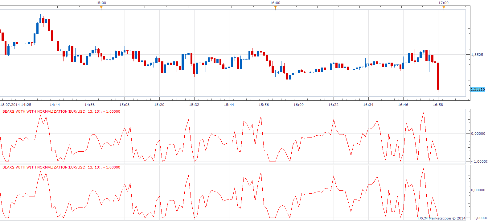

# Elder-Rays (Bulls & Bears Power)

> Source: https://fxcodebase.com/code/viewtopic.php?f=17&t=1376  
> Forum: 17 · Topic 1376 · 21 post(s)

---

## Elder-Rays (Bulls & Bears Power)

**Apprentice** · Sat Jun 19, 2010 11:09 am


*Bulls and Bears*

Developed by Dr. Alexander Elder and described in his book “Trading for a Living”.

Consists of three components Bear Power, Bull Power, and a 13-periods exponential moving average.

13-day exponential moving average (EMA) indicate the market consensus of value.
Bull Power measures the ability of buyers to drive prices above the consensus of value.
Bear Power reflects the ability of sellers to drive prices below the average consensus of value.

Use exponential moving average’s slope to determine the market trend direction.

Bull Power = High[period] - EMA [period]
Bear power = Low[period] - EMA [period]

Long
In Uptrend, Bear Power is negative, but rising

Short
In Downtrend, Bull Power is positive, but declining

 [Bulls.lua](files/2648/Bulls.lua)

 [Bears.lua](files/2648/Bears.lua)

 



*Normalization*

 [Bulls With Normalization.lua](files/2648/Bulls%20With%20Normalization.lua)

 [Bears With Normalization.lua](files/2648/Bears%20With%20Normalization.lua)

---

## Re: Elder-Rays (Bulls & Bears Power)

**Blackcat2** · Sat Jun 19, 2010 10:40 pm

System that uses this indicator can be found at
[http://www.forexfactory.com/showthread.php?t=239951](http://www.forexfactory.com/showthread.php?t=239951)

---

## Re: Elder-Rays (Bulls & Bears Power)

**cruiser** · Fri Feb 03, 2012 9:52 pm

please,can we have a strategy for this indicator.These are the conditions:

1.when bear bars are negative and bull bars are positive,no trade executed.
2.when bear bar goes positive and then back to negative(close of another candle),open short trade.
3.when bull bar goes negative and then back to positive(close of another candle),open long trade.

Exit rules for short trade;
1.In condition '2' above when you are short,exit when bear bar goes positive(close of candle) or
 2.Exit when condition' 3' is met.

Exit rules for long trade;
1.In condition '3' above when you are long,exit when bull bar goes negative(close of candle) or
2. exit when condition '2' is met.

Many thanks

---

## Re: Elder-Rays (Bulls & Bears Power)

**Apprentice** · Sat Feb 04, 2012 2:46 am

Your request is added to the development list.

---

## Re: Elder-Rays (Bulls & Bears Power)

**Apprentice** · Sun Feb 05, 2012 11:29 am

Here you can find the first draft.
[viewtopic.php?f=28&t=12854](https://fxcodebase.com/code/viewtopic.php?f=28&t=12854)
I'm not satisfied.
Can you test this version, check my algorithm.
Or change your definition.

---

## Re: Elder-Rays (Bulls & Bears Power)

**Apprentice** · Tue Jul 15, 2014 3:17 am

Bump Up.

---

## Re: Elder-Rays (Bulls & Bears Power)

**zmender** · Thu Jul 17, 2014 8:08 pm

Hello Apprentice, long time no see! Glad you are still around.

I'm trying to hard code an EMA/SMA line that calculates the running average of Bulls / Bears but I'm having trouble with the code. Could you help?

I tried to add another stream:

Code: [Select all](https://fxcodebase.com/code/)
`BullEMA = core.indicators:create("EMA", Bulls, Frame);`
then I tried to add it as a line:

Code: [Select all](https://fxcodebase.com/code/)
`BullEMA = instance:addStream("BullEMA", core.Line, name, "Averages", instance.parameters.Avg_color, first);`

Finally I tried to take the average:

```lua
BEMA:update(mode);
      BEMA[period] = EMA.Bulls[period];
```

Obviously this is not working out.

Would you mind spending just a few minutes to add the feature to the oscillator?

---

## Re: Elder-Rays (Bulls & Bears Power)

**zmender** · Fri Jul 18, 2014 11:11 am

Apprentice, I thought about it and I'm wondering if you can do me another favor.

Write an indicator that calculates a running sum of the Bull and Bear for a period of n. Then, to confine the sum between -1 and 1, take the fisher transformation of the sum (transformation = 1/2 * ln[(1+sum)/(1-sum)]).

The point of this is that in a trending environment, the sum will be large positive / negative and indicator will approach 1 or -1. Trend following strategies will prevail here.

However in a ranging environment where prices hover about the MA, the upticks will more or less cancel the downticks, resulting in sum close to 0 and the fisher transformation close to 0. Ranging strategies will prevail here.

---

## Re: Elder-Rays (Bulls & Bears Power)

**Apprentice** · Sat Jul 19, 2014 4:48 am

Sum / Transformation will be calculated for each component separately?
or as a whole...

---

## Re: Elder-Rays (Bulls & Bears Power)

**zmender** · Sat Jul 19, 2014 12:45 pm

First, calculate the sum of bears and bulls for n periods. The integer n is an indicator parameter.
Second, the sum is transformed to bound it between -1and 1.

---

## Re: Elder-Rays (Bulls & Bears Power)

**Apprentice** · Sun Jul 20, 2014 4:33 am

[Bears with Fisher Transformation .lua](files/95001/Bears%20with%20Fisher%20Transformation%20.lua)

 [Bulls with Fisher Transformation.lua](files/95001/Bulls%20with%20Fisher%20Transformation.lua)

As you can see,
Your formula will not achieve the desired results.
Try my simple math Bulls with Normalization.lua Bulls & Bears with Normalization.lua

If you provide an adequate formula will implement the Fisher transformation.

---

## Re: Elder-Rays (Bulls & Bears Power)

**zmender** · Tue Jul 22, 2014 6:29 pm

I made an even simpler version. It compares the closing value to the EMA of the same period.

If closes above the moving average, receives value of 1
If closes below the moving average, receives value of -1
If closes on the moving average, receives 0

Than the average is calculated for the same period as EMA.

---

## Re: Elder-Rays (Bulls & Bears Power)

**zmender** · Tue Jul 22, 2014 6:31 pm

What you will get is in congested areas, the value hovers about 0, in a strong trend mode, the value approaches 1 or -1.

I will try add this as a trend filter to some moving average strategies and see if I can reduce the rapid trading around moving average.

---

## Re: Elder-Rays (Bulls & Bears Power)

**zmender** · Tue Jul 22, 2014 11:56 pm

I modified the customizable MAE envelope strategy to accept the above filter. Filters out about 75% of the trades. Number of profitable trades is halved while the number of lossing trades is reduced by 70%. Final balance is comparable, with win / loss ratio at about 1:1

---

## Re: Elder-Rays (Bulls & Bears Power)

**Coondawg71** · Wed Jul 23, 2014 12:53 pm

Can we please request a Signal Alert and corresponding Strategy for Zmender's version (Trend Indicator.lua) of the Bulls/Bears indicator?

On a default setting for a One hour price chart, the indicator would have 3 time periods in reference to specific trading periods. 24, 72 and 144. One Day, Three Days, One Week in hours.

Concept is based on the principle of trading on A.) the divergence of short term momentum from the larger momentum cycle and B.) Confluence of momentum cycle exhaustion.

**BUY SIGNAL**

IF 144 period <0, IF 72 period <0, when 24 period >0 (close of first bar above 0 line) Signal Alert "BUY WAVE1"

IF 144 period <0, when 72 period >0, and 24 period >0 (close of first bar above 0 line) Signal Alert "BUY WAVE2"

When 144 period >0, and 72 period >0, and 24 period >0 (close of first bar above 0 line) Signal Alert "BUY WAVE3"

When 144 period is greater than 0.90 and 24 period <0 CLOSE BUY orders on first close price below O line

**SELL SIGNAL:**

IF 144 period >0, IF 72 period >0, when 24 period <0 (close of first bar below 0 line) Signal Alert "SELL WAVE1"

IF 144 period >0, when 72 period <0, and 24 period <0 (close of first bar below 0 line) Signal Alert "SELL WAVE2"

When 144 period <0, and 72 period <0, and 24 period <0 (close of first bar below 0 line) Signal Alert "SELL WAVE3"

When 144 period is less than negative 0.90 and 24 period >0 CLOSE SELL orders on first close price above O line

Green Arrow UP located on price chart below each BUY signal.
Red Arrow DOWN located on price chart above each SELL signal.
Default font size of arrow set at 10.

**DIVERGENCE SIGNALS**

IF 144 period and 72 period >0 and 24 period value is Negative "0.75" Signal Alert "Divergence/BUY" ((negative 0.75 to negative 1.00))

IF 144 period and 72 period <0 and 24 period value is Positive "0.75" Signal Alert "Divergence/SELL" ((positive 0.75 to positive 1.00))

Light Blue Arrow UP located on price chart below each Divergence BUY signal.
Yellow Arrow DOWN located on price chart above each Divergence SELL signal.
Default font size of arrow set at 8.

**CONFLUENCE SIGNALS**

IF 144>0 when 72 period and 24 period are greater than positive 0.75, Signal Alert POSITIVE CONFLUENCE SELL short term cycle exhaustion

IF 144>0 when 144 period and 72 period are greater than positive 0.90, Signal Alert POSITIVE CONFLUENCE STRONG SELL long term cycle exhaustion

IF 144<0 when 72 period and 24 period are less than negative 0.75, Signal Alert NEGATIVE CONFLUENCE BUY short term cycle exhaustion

IF 144<0 when 144 period and 72 period are less than negative 0.90, Signal Alert NEGATIVE CONFLUENCE STRONG BUY long term cycle exhaustion

NOTE: Please allow user to change Signal threshold parameters from default settings of +-0.75 and +-0.90 to within the range of +-0.50 to +-1.00

Thanks!

sjc

---

## Re: Elder-Rays (Bulls & Bears Power)

**Apprentice** · Fri Jul 25, 2014 4:39 am

Your request is added to the development list.

---

## Re: Elder-Rays (Bulls & Bears Power)

**Coondawg71** · Fri Jul 03, 2015 10:50 am

Could we please bump up. Thanks!!!

sjc

---

## Re: Elder-Rays (Bulls & Bears Power)

**Apprentice** · Sun Jun 12, 2016 11:40 am

Bump up.

---

## Re: Elder-Rays (Bulls & Bears Power)

**Apprentice** · Wed Feb 21, 2018 6:37 am

The Indicator was revised and updated.

---

## Re: Elder-Rays (Bulls & Bears Power)

**aryan116** · Fri Jul 13, 2018 11:10 am

> **Apprentice wrote:**
> The Indicator was revised and updated.

Can you please provide this indicator to me.
Thanks.

---

## Re: Elder-Rays (Bulls & Bears Power)

**Apprentice** · Sun Jul 15, 2018 5:01 am

All indicators within topic have been updated.
