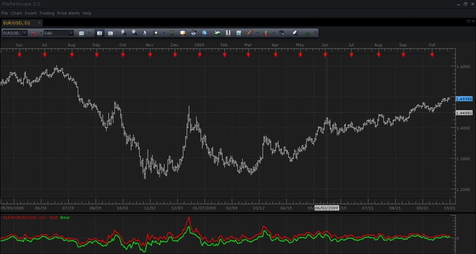

# Elder-Rays Indicator

> Source: https://fxcodebase.com/code/viewtopic.php?f=17&t=23  
> Forum: 17 · Topic 23 · 7 post(s)

---

## Elder-Rays Indicator

**admin** · Tue Oct 20, 2009 6:04 pm

**DESCRIPTION:**

The Elder-rays indicator use exponential moving average indicator(EMA), the preferable period of which is 13 as a tracing indicator. The oscillators reflect the bears' and bulls' power.

The Elder-rays indicator include the characteristics of trend following indicators and oscillators. Three charts for placing the Elder-rays are used:

- FIRST: The price chart and EMA are placed.
- SECOND & THIRD: Are Bulls' power oscillators, or just Bulls Power, and Bears power oscillator, or just Bears Power.

Elder-rays indicator is usually used as stand-alone, but it can also be used with other tools. While using Elder-rays individually, it's important to remember that the EMA slope defines the trend movement, and position should be opened in its direction.

The Elder Ray is a very precise and effective means of highlighting discrepancies between bull and bear power and helping to choose right time for the best trading opportunities. Bulls and bears power oscillators can tell you proper moment when you should be opening or closing of positions.

 

*Screenshot on MarketScope 2.0*

**HOW TO USE:**

The Elder Rays index actually consists of two indicators:

- **"Bull Power"** (Daily High – ‘n’ - period moving average) and
- **"Bear Power"** (Daily Low – ‘n’ - period moving average).

Its better to open a sell position in following conditions:

- Bulls oscillator declines leaving the Bears' discrepancy;
- Bulls oscillator remains positive, and declines step by step;
- Last bottom of the Bulls oscillator is below the previous one;
- There is a decreasing trend defined with the EMA fluctuations.

It's better to open a buy position in following conditions:

- Bears oscillator increases after the Bulls discrepancy;
- Bears oscillator is negative, but keeps growing;
- The last peak of the Bulls oscillator is above the previous one;
- There is an increasing trend defined with the EMA fluctuations.

**CALCULATIONS:**

BULL = HIGH – EMA(close, N)
BEAR = LOW – EMA(close, N)

Code: [Select all](https://fxcodebase.com/code/)
`-- Description from the http://www.investopedia.com/articles/trading/03/022603.asp

-- initializes the indicator
function Init()
    indicator:name("Elder-Ray");
    indicator:description("")
    indicator:requiredSource(core.Bar);
    indicator:type(core.Oscillator);

    indicator.parameters:addInteger("N", "Number of periods for smoothing", "", 13);
    indicator.parameters:addColor("BullC", "Color of the bull power line", "", core.rgb(255, 0, 0));
    indicator.parameters:addColor("BearC", "Color of the bear power line", "", core.rgb(0, 255, 0));
end

local source;
local EMA;
local Bull;
local Bear;

-- process parameters and prepare for calculations
function Prepare()
    source = instance.source;
    EMA = core.indicators:create("EMA", source.close, instance.parameters.N, core.rgb(0, 0, 0));
    local name = profile:id() .. "(" .. source:name() .. ", " .. instance.parameters.N .. ")";
    instance:name(name);
    Bull = instance:addStream("Bull", core.Line, name .. ".Bull", "Bull", instance.parameters.BullC, EMA.DATA:first());
    Bear = instance:addStream("Bear", core.Line, name .. ".Bear", "Bear", instance.parameters.BearC, EMA.DATA:first());
    Bull:addLevel(0);
end

-- Indicator calculation routine
function Update(period, mode)
    EMA:update(mode);

    if (period >= EMA.DATA:first()) then
        Bull[period] = source.high[period] - EMA.DATA[period];
        Bear[period] = source.low[period] - EMA.DATA[period];
    end
end`

 [elray.lua](files/24/elray.lua)

 [Adaptable Elray.lua](files/24/Adaptable%20Elray.lua)

The indicator was revised and updated

---

## Re: Elder-Rays Indicator

**Apprentice** · Thu Dec 13, 2012 5:51 am

Revision
Performance update.
Style options added.

---

## Re: Elder-Rays Indicator

**matson** · Fri Nov 01, 2013 5:29 pm

hello
can you please show the elder rays indicator as histogramms? it is better to study divergence.
Thank you
France

---

## Re: Elder-Rays Indicator

**Apprentice** · Sat Nov 02, 2013 11:30 am

Bar option added to Adaptable Elray
Also, now u can select other types of moving averages.

---

## Re: Elder-Rays Indicator

**mchurch2006** · Mon Jul 20, 2015 6:31 am

Hi,

I seem to have a small problem with this indicator operating correctly. In as much as if I'm using the indicator using 'bar' mode it doesn't display the 'bull' colouration when the indicator is below zero, it works fine the other way round, showing bear colouration when above zero! Any thoughts? I appreciate this is subtle but it would be great if the indicator worked consistently.

I've hopefully attached a picture illustrating the scenario.

Regards,

---

## Re: Elder-Rays Indicator

**Apprentice** · Tue Jul 21, 2015 4:59 am

Unfortunately there is no way to get around this problem.
If both are used, one bar will always be overwritten.
My advice, use only one Bar Style.

---

## Re: Elder-Rays Indicator

**Apprentice** · Tue Jul 04, 2017 9:48 am

The indicator was revised and updated.
