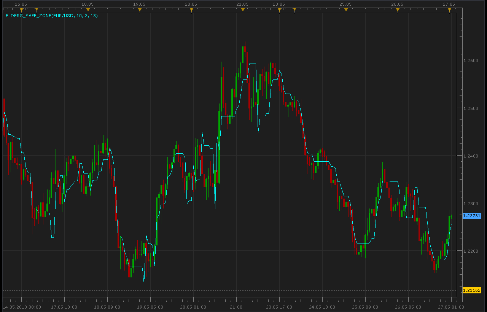

# Elders Safe Zone indicator

> Source: https://fxcodebase.com/code/viewtopic.php?f=17&t=1158  
> Forum: 17 · Topic 1158 · 2 post(s)

---

## Elders Safe Zone indicator

**Alexander.Gettinger** · Thu May 27, 2010 12:21 am

Lua mq4/MT4 version
[viewtopic.php?f=38&t=64055](https://fxcodebase.com/code/viewtopic.php?f=38&t=64055)

The indicator was revised and updated

 [Elders_Safe_Zone.lua](files/2203/Elders_Safe_Zone.lua)

---

## Re: Elders Safe Zone indicator

**Apprentice** · Wed Jan 11, 2017 5:54 am

Indicator was revised and updated.
