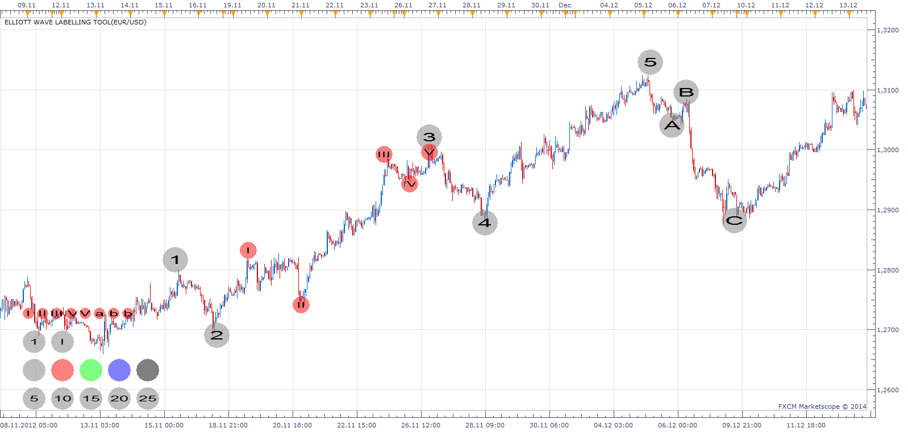
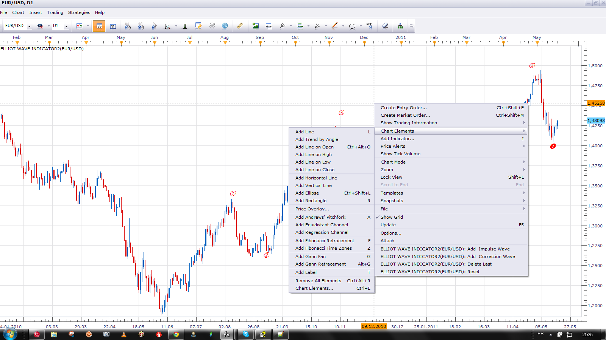

# Elliot Wave Labeling Tool

> Source: https://fxcodebase.com/code/viewtopic.php?f=17&t=4360  
> Forum: 17 · Topic 4360 · 18 post(s)

---

## Elliot Wave Labeling Tool

**Apprentice** · Thu May 19, 2011 1:09 pm

This is not an automated indicator.
You must enter a label, by your self.

Use Left Mouse Menu Options.
1.Select (to select Size/Color/Font/Wave Label)
2.Add Wave
3.Delete Wave
5. Reset.

 [Elliot Wave Labeling Tool.lua](files/10845/Elliot%20Wave%20Labeling%20Tool.lua)

 

 [Elliot Wave Labeling Tool Old.lua](files/10845/Elliot%20Wave%20Labeling%20Tool%20Old.lua)

 

Use Left Mouse Menu Options.
1.Add Impulse Wave
2.Add Correction Wave
3.Delete Last
4. Reset.

---

## Re: Elliot Wave Labeling Tool

**Apprentice** · Sun Jul 10, 2011 5:51 am

This Elliott Wave Label Tool has several different font styles and colors,
 which allows the user to label the various wave degrees without confusion.
This tool also has the facility to label expanded flats and triangles.
All labels can be placed individually and also deleted individually.
When not in use the dashboard can be hidden.

 [Elliott Wave Label Tool.lua](files/12563/Elliott%20Wave%20Label%20Tool.lua)

---

## Re: Elliot Wave Labeling Tool

**t1982t** · Tue Jul 12, 2011 9:19 am

Hello, I can see the title of the signal in my window but not the signal, the numbers

Kind Regards

---

## Re: Elliot Wave Labeling Tool

**Miguelator** · Sun Sep 08, 2013 5:53 am

Hi Apprentice

A very useful tool, I would replace 1,2,3 corrective waves A, B, C
Is this possible?

Thanks in advance

regards

---

## Re: Elliot Wave Labeling Tool

**Apprentice** · Mon Sep 09, 2013 2:22 am

Try this "Arial" Version

 [Elliot Wave Labeling Tool.lua](files/89276/Elliot%20Wave%20Labeling%20Tool.lua)

---

## Re: Elliot Wave Labeling Tool

**Miguelator** · Mon Sep 09, 2013 2:43 am

many Thanks

Works Perfectly

---

## Re: Elliot Wave Labeling Tool

**johnrichard26** · Tue Nov 05, 2013 6:23 pm

Hi
I am not able see any numbers or chara on H4 charts. Plz help

---

## Re: Elliot Wave Labeling Tool

**Apprentice** · Wed Nov 06, 2013 4:08 am

As i wrote, You must enter a label, by your self.
This is not an automated indicator.
Use left mouse button menu to add Labels.

---

## Re: Elliot Wave Labeling Tool

**Outside_The_Box** · Wed Nov 06, 2013 4:51 am

> **Miguelator wrote:**
> many Thanks
>
> Works Perfectly

Just one problem. Wave 3 is never the shortest.

---

## Re: Elliot Wave Labeling Tool

**Apprentice** · Sat Jun 14, 2014 10:56 am

Try my new improved implementation

---

## Re: Elliot Wave Labeling Tool

**Apprentice** · Tue Jul 01, 2014 1:23 am

Yet another implementation added.
See Second Post.

---

## Elliott Wave Label Tool update

**kaspo99** · Thu Jul 03, 2014 1:23 pm

Hi Apprentice
I wish to upload this modified Elliott Wave Label Tool, which has a tidier font style in Cambria.
This version also supports labels for double and triple zig zags ie w, x, y, x, z as well as labels for triangles and expanded flats.
Posted also is updated screen shot.
thanks
kaspo99

---

## Re: Elliot Wave Labeling Tool

**Silver23** · Mon Sep 12, 2016 11:48 am

Hi apprentice,

Is it possible to add to this labeling tool? All I need is labeling for the sub waves and main waves. Main waves will have the current number circled. In addition numbering between brackets like: (i) to (v). Can the a,b,c,d, and e be added? In essence the labeling used in metatrader.

---

## Re: Elliot Wave Labeling Tool

**Apprentice** · Thu Sep 15, 2016 3:20 am

Your request is added to the development list, Under Id Number 3626
 If someone is interested to do this task, please contact me.

---

## Re: Elliot Wave Labeling Tool

**Apprentice** · Mon Aug 28, 2017 3:53 am

The indicator was revised and updated.

---

## Re: Elliot Wave Labeling Tool

**bartwas1** · Mon Aug 28, 2017 6:19 am

Hi Apprentice,
I was wondering if this tool could be incorporated into a zigzag swing indicator and label swings automatically? Zigzag illustrates price movements as swings/waves and I think labelling would help with interpretations of these moves. And if even zigzag doesn't fit Elliott theory it might handy tool to assist with Elliott wave method of trading.
Kind regards
Bart.

---

## Re: Elliot Wave Labeling Tool

**Apprentice** · Mon Aug 28, 2017 7:33 am

The only problem.
We have to design, test and optimize a suitable algorithm.

---

## Re: Elliot Wave Labeling Tool

**Apprentice** · Sun Feb 04, 2018 1:46 pm

The indicator was revised and updated.
