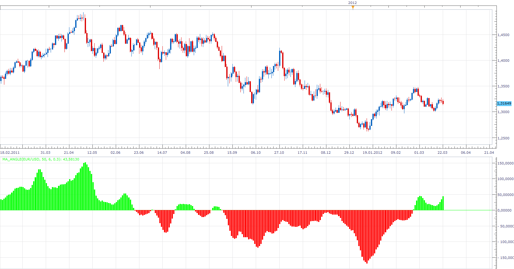
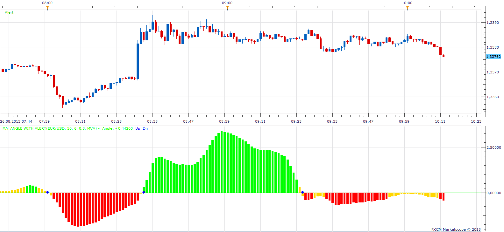

# EMA Angle

> Source: https://fxcodebase.com/code/viewtopic.php?f=17&t=1294  
> Forum: 17 · Topic 1294 · 39 post(s)

---

## EMA Angle

**Apprentice** · Wed Jun 09, 2010 3:34 pm

*EMA Angle*

Determines MA Angle (in Pips)

 [EmaAngle.lua](files/2471/EmaAngle.lua)

 [MAAngle.lua](files/2471/MAAngle.lua)

 [Tick MAAngle.lua](files/2471/Tick%20MAAngle.lua)

---

## Re: EMA Angle

**Jigit Jigit** · Sun Feb 05, 2012 2:22 am

Hi guys,
could you possibly add VAMA to this indicator?

Cheers

---

## Re: EMA Angle

**Jigit Jigit** · Sun Feb 05, 2012 2:36 am

I hoped it was as easy as replacing all "EMAs" with "VAMA" in your original code but it doesn't seem to work ("Error" message pops up).

---

## Re: EMA Angle

**Apprentice** · Sun Feb 05, 2012 3:15 am

I'll take a look when I find time.

---

## Re: EMA Angle

**timkdiamond** · Thu Mar 22, 2012 6:17 am

Hi there

Great indicator. However, what is the angle measured in? IE. what are the units of the values on the indicator ??

Thanks in advance.

T.

---

## Re: EMA Angle

**Apprentice** · Thu Mar 22, 2012 9:03 am

Nothing complicated, pips per period.
In updated algo. that I have added today.

---

## Re: EMA Angle

**Apprentice** · Thu Mar 22, 2012 9:27 am

VAMA and other moving averages added.

 [MA_Angle.lua](files/28486/MA_Angle.lua)

 

 [MA_Angle with Alert.lua](files/28486/MA_Angle%20with%20Alert.lua)

This indicator provides Audio / Email Alerts if and when MA Angle cross over/under Zero Line.

Compatibility issue fixed.
_Alert Helper is not longer needed.

---

## Re: EMA Angle

**timkdiamond** · Fri Mar 23, 2012 11:43 pm

Thanks Apprentice. You the man.

---

## Re: EMA Angle

**Alexander.Gettinger** · Tue May 08, 2012 5:22 pm

MQL4 version of indicator: [viewtopic.php?f=38&t=17982](https://fxcodebase.com/code/viewtopic.php?f=38&t=17982)

---

## Re: EMA Angle

**030985** · Thu Aug 23, 2012 3:18 am

Hello,

Thank you for your work. Maybe I did not grasp every characteristics of this indicator but would it be possible to reduce the shift to "1" if wanted ? The minimum for now is 2 and I am not sure why.
Thank you very much for reading.

Cordially,
030985

---

## Re: EMA Angle

**Apprentice** · Thu Aug 23, 2012 5:59 am

The indicator is updated, in order to use all the functionality that previously had not been available.
I have set Shift limit to zero.

---

## Re: EMA Angle

**030985** · Thu Aug 23, 2012 3:47 pm

Thank you for your prompt reply.
I downloaded again the indicator "MA_angle.lua", removed the former one, and disconnected/reconnected the platform but I am still told that I have to choose between 2 and 2000 concerning the shift. Am I doing something wrong ? Or maybe the modification has been made only for "EmaAngle.lua" ?

---

## Re: EMA Angle

**Apprentice** · Fri Aug 24, 2012 12:19 am

Hm, probably the old file is still in your browser cache.
Try to clean the cache or use other computer.

---

## Re: EMA Angle

**030985** · Fri Aug 24, 2012 8:31 am

> **Apprentice wrote:**
> Hm, probably the old file is still in your browser cache.
> Try to clean the cache or use other computer.

Hello,

I am very sorry for the bothering, but I tried to clear cache from browsers ( and java ), removed old file, I tried on another computer, and I uninstalled totally FXCM Trading Station and re-installed it, but "MA_angle.lua" still does not work and wants me to choose between "2 and 2000".
"EmaAngle.lua" is working fine, but not "MA_angle.lua", at least for me.

I guess I am doing something wrong but I don't know what.
Thank you for your help.

030985

---

## Re: EMA Angle

**Apprentice** · Fri Aug 24, 2012 8:37 am

Oops, my mistake.
I only replaced the EMA, not MA.
Corrected.

---

## Re: EMA Angle

**030985** · Fri Aug 24, 2012 9:00 am

Thank you very much, it is working fine now.

---

## Re: EMA Angle

**luigipg** · Mon Aug 26, 2013 1:43 am

Hi Apprentice, I need a signal for MA_Angle.lua when it value reaches preset treshold level. Just that. Thanks a lot also for all your work! Luigi!!!

---

## Re: EMA Angle

**Apprentice** · Mon Aug 26, 2013 2:08 am

Your request is added to the development list.

---

## Re: EMA Angle

**luigipg** · Mon Aug 26, 2013 3:12 am

> **Apprentice wrote:**
> Your request is added to the development list.

Thanks a lot! I should mean one file wich containe a signal for long (positive value) and/or a signal for sell (negative value). Thanks again!!!

---

## Re: EMA Angle

**Apprentice** · Mon Aug 26, 2013 9:16 am

Alert option is added to this indicator.

---

## Re: EMA Angle

**Apprentice** · Mon Dec 07, 2015 7:01 am

Compatibility issue fixed.
_Alert Helper is not longer needed.

---

## Re: EMA Angle

**yoelyaacov** · Fri Feb 05, 2016 6:55 am

hi apprentice,

would you add tema for thisindicator ?

thanks

---

## Re: EMA Angle

**yoelyaacov** · Fri Feb 05, 2016 7:14 am

hi apprentice,

would you add a trailing stop based on the tema angle ? i use it to close some trades with the tema 470 for examples, it s great.

---

## Re: EMA Angle

**Apprentice** · Fri Feb 05, 2016 8:04 am

MAAngle.lua Added.

About second request.
It is possible.
Post your request here.
[viewforum.php?f=27](https://fxcodebase.com/code/viewforum.php?f=27)

---

## Re: EMA Angle

**yoelyaacov** · Sat Feb 06, 2016 1:20 pm

it s great, but i meant to add tema to the emaangle with alert, with ths show alert and a sound alert...

---

## Re: EMA Angle

**yoelyaacov** · Sat Mar 05, 2016 5:35 pm

would you add an alert to maangle.lua ?

---

## Re: EMA Angle

**Apprentice** · Sun Mar 06, 2016 5:31 am

We already have MA_Angle with Alert.lua
Can you explain your request.

---

## Re: EMA Angle

**Apprentice** · Sun Jul 30, 2017 11:09 am

The indicator was revised and updated.

---

## Re: EMA Angle

**cash4u** · Sat Aug 05, 2017 5:11 am

hi apprendice,

can you create a strategy based on this indicator.

buy: ma angle cross over upper thresold
sell: ma angle cross under lower thresold

thank you.

---

## Re: EMA Angle

**Apprentice** · Sat Aug 05, 2017 5:58 am

Try this version.
[viewtopic.php?f=31&t=64964&p=113999#p113999](https://fxcodebase.com/code/viewtopic.php?f=31&t=64964&p=113999#p113999)

---

## Re: EMA Angle

**alienmole** · Thu Mar 22, 2018 6:51 am

Would it be possible please to add an SMA and the option to choose the applied price of a Median (High+Low)/2

Thanks

---

## Re: EMA Angle

**Apprentice** · Thu Mar 22, 2018 7:27 am

SMA and MVA are synonymous.
MA Angle and SMA and Median (High+Low)/2 are NOT comparable.
Tick MAAngle.lua added.
Price source option added.

---

## Re: EMA Angle

**alienmole** · Thu Mar 22, 2018 9:33 am

ok Thanks

Can I just ask is the version "EMA Angle" still an "EMA" with the option to choose Median ? if so can you add the MVA (ie SMA) aswell please

Thanks

---

## Re: EMA Angle

**Apprentice** · Thu Mar 22, 2018 4:45 pm

U can use MAAngle.lua
MAAngle.lua have MVA/SMA option.

---

## Re: EMA Angle

**alienmole** · Fri Mar 23, 2018 4:21 am

> **Apprentice wrote:**
> U can use MAAngle.lua
> MAAngle.lua have MVA/SMA option.

Sure, but theres no option to use the Median on that one for the data source

---

## Re: EMA Angle

**Apprentice** · Fri Mar 23, 2018 5:50 am

Was added, please re-download.

---

## Re: EMA Angle

**aarkay** · Wed Sep 04, 2024 10:07 pm

> **Alexander.Gettinger wrote:**
> MQL4 version of indicator: [viewtopic.php?f=38&t=17982](https://fxcodebase.com/code/viewtopic.php?f=38&t=17982)

Hi Apprentice,

There are alerts on crossovers in the TS version. Can you put those in the MQ4 version please?

Also, can another set of Arrows (with buffer codes) be put in this Indicator?

RULES:

If the MA Angle value of each Candle keeps increasing continuously for "n" number of candles, Please give a BUY ARROW.

If the MA angle value of each Candle keeps decreasing continuously for "n" number of candles, please give a SELL ARROW.

I am attaching a simple representation image.

Thanks in advance yet again !

---

## Re: EMA Angle

**Apprentice** · Sun Sep 08, 2024 3:58 pm

We have added your request to the development list.
Development reference 697

---

## Re: EMA Angle

**Apprentice** · Tue Sep 10, 2024 11:39 am

Try this version.
[https://fxcodebase.com/code/viewtopic.php?f=38&t=75198](https://fxcodebase.com/code/viewtopic.php?f=38&t=75198)
