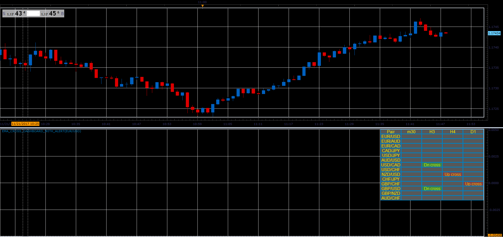

# EMA cross dashboard

> Source: https://fxcodebase.com/code/viewtopic.php?f=17&t=65383  
> Forum: 17 · Topic 65383 · 7 post(s)

---

## EMA cross dashboard

**Alexander.Gettinger** · Tue Nov 21, 2017 1:40 pm

The indicator finds the intersections of two EMAs and gives an alert.

 

Download:

 [EMA_Cross_Dashboard_With_Alert.lua](files/116148/EMA_Cross_Dashboard_With_Alert.lua)

MT4/MQ4 version
[viewtopic.php?f=38&t=65431&p=116351#p116351](https://fxcodebase.com/code/viewtopic.php?f=38&t=65431&p=116351#p116351)

---

## Re: EMA cross dashboard

**seunboi4u** · Sun Nov 26, 2017 9:20 pm

please i need this for MT4.......

---

## Re: EMA cross dashboard

**Apprentice** · Mon Nov 27, 2017 12:27 pm

Your request is added to the development list under Id Number 3962

---

## Re: EMA cross dashboard

**Apprentice** · Mon Dec 04, 2017 6:42 am

MT4/MQ4 version
[viewtopic.php?f=38&t=65431&p=116351#p116351](https://fxcodebase.com/code/viewtopic.php?f=38&t=65431&p=116351#p116351)

---

## Re: EMA cross dashboard

**seunboi4u** · Mon Dec 04, 2017 6:51 am

Thanks so much sir God bless....can it also work as SMA...Thanks

---

## Re: EMA cross dashboard

**seunboi4u** · Mon Dec 04, 2017 7:23 am

Thanks for this great link and script......please i want to to still seek for help for the EMA please can you add 1min and also can you make SMA also thanks

---

## Re: EMA cross dashboard

**Apprentice** · Tue Jul 03, 2018 7:02 am

The Indicator was revised and updated.
