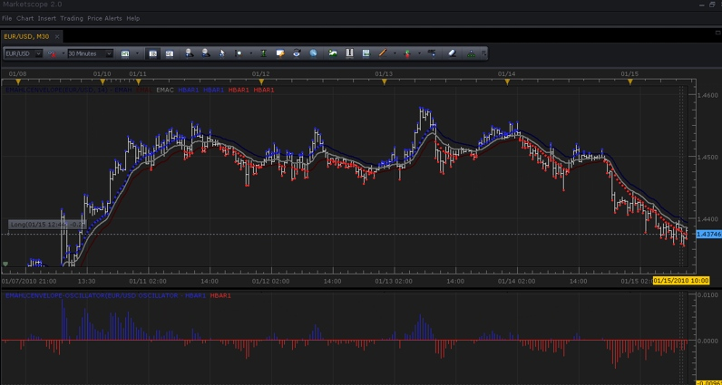
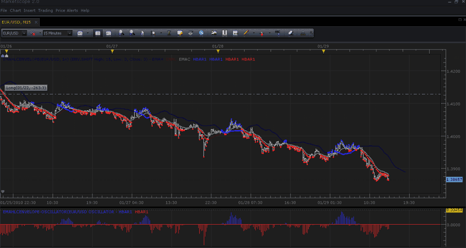

# EMA HLC Envelope With Bar Coloring and Shifting

> Source: https://fxcodebase.com/code/viewtopic.php?f=17&t=273  
> Forum: 17 · Topic 273 · 2 post(s)

---

## EMA HLC Envelope With Bar Coloring and Shifting

**TonyMod** · Tue Feb 02, 2010 1:24 pm

**EMA HLC Envelope With Bar Coloring and Shifting**

I'm posting a new EMA HLC Envelope indicator, along with Oscillator to work with it.

**Oscillator**

Oscillator accompanying EMA HLC Envelope indicator, contains histogram which displays parts where one of the envelopes is broken by corresponding price, and by how much. All positive values (blue bars), display breaking of high envelope by high price, and in turn all negative values (red bars), display breaking of low envelope by low price.

**WARNING:** Since Oscillator is a separate instance, it must contain same configuration as EMA HLC Indicator to display accurate data. By default EMA is configured for 14 periods, with 0 shifting on all 3 bands. Make sure Oscillator parameters contain same values as EMA HLC Indicator.

**Coloring**

Envelope is built out of 3 price streams: High, Low, and Close. High is marked with Dark Blue Color, Low is marked with Dark Red color, Close is marked with gray color.

**High Envelope Broken:** When High price of the period breaks high envelope, the place where envelope was broken + price that broke it, will be marked with a Blue Color.

**Low Envelope Broken:** When Low price of the period breaks low envelope, the place where envelope was broken + price that broke it, will be marked with a Red Color.

SCREENSHOT OF EMA HLC ENVELOPE (With Coloring + Oscillator)

 

*Screenshot of EMA HLC Envelope indicator and oscillator together.*

**Shifting**

Based on shifting bands idea of Alligator indicator and request of one of our members for Bollinger Bands shifting capability, i also made EMA HLC Envelope support shifting.

Each one of the bands can be shifted individually, and coloring will follow the shifted bands.

 

*Screenshot of EMA HLC Envelope Indicator and Oscillator, with top band shifted.*

DOWNLOADS:
Indicator

 [EMAHLCEnvelope.lua](files/434/EMAHLCEnvelope.lua)

Oscillator

 [EMAHLCEnvelope-Oscillator.lua](files/434/EMAHLCEnvelope-Oscillator.lua)

Please post comments and questions if you wish.

If you have problems with this indicator+oscillator or wish it customized in any way, let us know.

Meta Trader / Mq4 Version
[viewtopic.php?f=38&t=63757](https://fxcodebase.com/code/viewtopic.php?f=38&t=63757)

The indicator was revised and updated

---

## Re: EMA HLC Envelope With Bar Coloring and Shifting

**Apprentice** · Mon Dec 26, 2016 7:11 am

Indicator was revised and updated.
