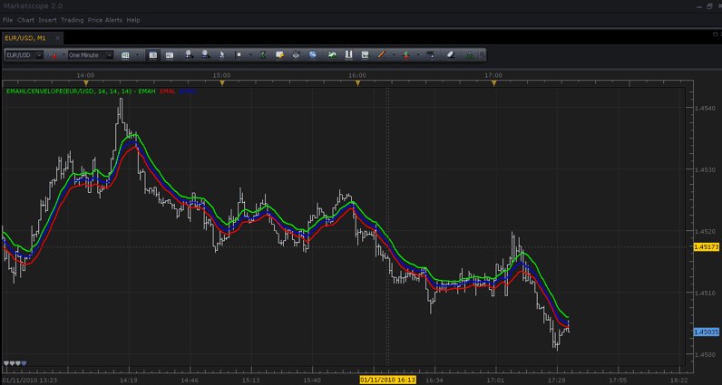

# EMA HLC Envelope

> Source: https://fxcodebase.com/code/viewtopic.php?f=17&t=238  
> Forum: 17 · Topic 238 · 2 post(s)

---

## EMA HLC Envelope

**TonyMod** · Wed Jan 13, 2010 1:47 pm

EMA High/Low/Close Envelope

**Screenshot of EMA HLC Envelope:**

 

*Screenshot of EMA HLC Envelope indicator in MarketScope*

**DOWNLOAD:**

 [EMAHLCEnvelope.lua](files/346/EMAHLCEnvelope.lua)

The indicator was revised and updated

For any questions please post to this thread/topic.

---

## Re: EMA HLC Envelope

**Apprentice** · Mon Dec 26, 2016 7:00 am

Indicator was revised and updated.
