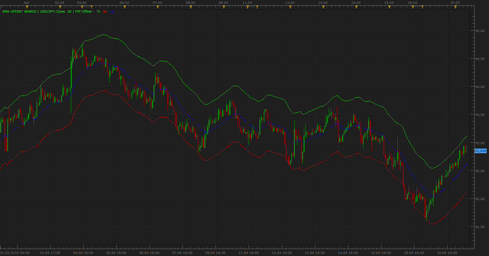

# EMA Offset Bands

> Source: https://fxcodebase.com/code/viewtopic.php?f=17&t=710  
> Forum: 17 · Topic 710 · 4 post(s)

---

## EMA Offset Bands

**Apprentice** · Tue Apr 20, 2010 7:37 am

*EMA Offset Bands*

EMA Offset Bands

MiddleLine = EMA(N)
TopLile = MiddleLine +Offset
BottomLine = MiddleLine — Offset

You can enter Offset in PiP's and the percentages, plan to add the ATR as well.

 [EMA Offset Bands.lua](files/1287/EMA%20Offset%20Bands.lua)

The indicator was revised and updated

---

## Re: EMA Offset Bands

**Apprentice** · Tue Jan 01, 2013 7:34 am

Updated.

---

## Re: EMA Offset Bands

**Alexander.Gettinger** · Mon Sep 22, 2014 9:42 am

MQL4 version of EMA Offset Bands indicator: [viewtopic.php?f=38&t=61214](https://fxcodebase.com/code/viewtopic.php?f=38&t=61214).

---

## Re: EMA Offset Bands

**Apprentice** · Sat Jun 24, 2017 5:15 am

The indicator was revised and updated.
