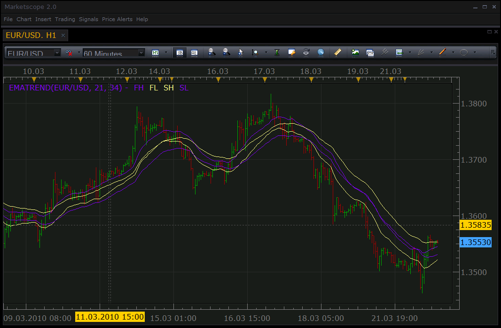

# EMA Trend Indicator

> Source: https://fxcodebase.com/code/viewtopic.php?f=17&t=508  
> Forum: 17 · Topic 508 · 5 post(s)

---

## EMA Trend Indicator

**Nikolay.Gekht** · Mon Mar 22, 2010 4:23 pm

It is just fast and slow EMAs applied on high and low prices.

 

The indicator was revised and updated

Download:

 [EMATrend.lua](files/861/EMATrend.lua)

---

## Re: EMA Trend Indicator

**cersoz** · Thu Jan 02, 2014 3:34 pm

can anyone add to this indicator line/style option?

---

## Re: EMA Trend Indicator

**Apprentice** · Fri Jan 03, 2014 1:16 pm

Please Re-Download.

---

## Re: EMA Trend Indicator

**Alexander.Gettinger** · Mon Aug 18, 2014 1:59 pm

MQL4 version of EMA Trend Indicator: [viewtopic.php?f=38&t=61048](https://fxcodebase.com/code/viewtopic.php?f=38&t=61048).

---

## Re: EMA Trend Indicator

**Apprentice** · Tue Jul 18, 2017 7:25 am

The indicator was revised and updated.
