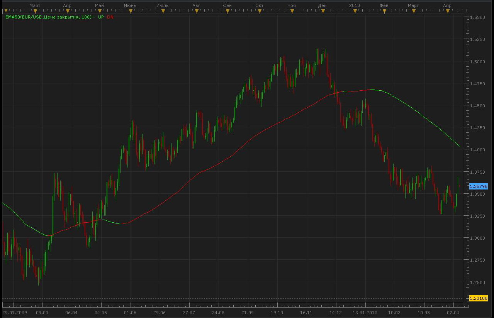

# EMA50 Indicator

> Source: https://fxcodebase.com/code/viewtopic.php?f=17&t=626  
> Forum: 17 · Topic 626 · 8 post(s)

---

## EMA50 Indicator

**Alexander.Gettinger** · Mon Apr 12, 2010 11:31 pm

> WWMMACAU wrote:
> I would like to request #4X 2010 EMA 50 Indicator from MQ4 to LUA.
>
>
> Code: [Select all](https://fxcodebase.com/code/)
> `// #4X 2010 EMA 50            \¦/
> // Knowledge of the ancients (ò ó)
> //______________________o0o___(_)___o0o_____
> //___¦Xard777¦_____¦_____¦_____¦_____¦_2010_¦
>
> #property indicator_chart_window
> //+------------------------------------------------------------------+
> #property indicator_buffers 2
> #property indicator_color1 Crimson
> #property indicator_color2 Blue
> #property indicator_width1 4
> #property indicator_width2 4
>
> double buf0[], buf1[], buf2[];
> extern int MA_Period1 = 50;
> extern int MA_Method1 = 1;
> extern int MA_Price1  = 0;
> extern int MA_Shift1  = 0;
>
> int init() {
>    IndicatorBuffers(3);
>    SetIndexBuffer(0, buf0);
>    SetIndexBuffer(1, buf1);
>    SetIndexBuffer(2, buf2);
>    SetIndexStyle(0, DRAW_LINE);
>    SetIndexStyle(1, DRAW_LINE);
>    return (0);
> }
>
> int start() {
>    for (int X4 = Bars - 10; X4 >= 0; X4--) buf2[X4] = iMA(NULL,0,MA_Period1,MA_Shift1,MA_Method1,MA_Price1,X4); //iMA(NULL, 0, PeriodX, 0, MODE_LWMA, PRICE_MEDIAN, X4);
>    for (int X8 = Bars - 10; X8 >= 0; X8--) {
>       buf0[X8] = buf2[X8]; buf1[X8] = buf2[X8];
>       if (buf2[X8] > buf2[X8 + 1]) {
>          buf0[X8] = EMPTY_VALUE; buf1[X8 + 1] = buf2[X8 + 1];
>       } else {
>          if (buf2[X8] < buf2[X8 + 1]) {
>             buf1[X8] = EMPTY_VALUE; buf0[X8 + 1] = buf2[X8 + 1];
>          }
>       }
>    }
>    return (0);
> }
> //--------------------------------------------Xard@hotmail.co.uk-----+`

 

The indicator was revised and updated

---

## Re: EMA50 Indicator

**WWMMACAU** · Tue Apr 13, 2010 5:03 pm

Thanks, Alexander.Gettinger.

---

## Re: EMA50 Indicator

**kevinb1914** · Thu Apr 15, 2010 11:30 am

Hi Alexander,

I was wondering if you could change the EMA50 that you posted on April 12? I want it changed to EMA62 and switch the colors of the line so that the Red line is now LimeGreen and the LimeGreen line is now Red.

Also, can you make a signal alert for this indicator? Everytime the color changes, I would like an alert. If the color changes to Red then a 'sell' alert will be generated. If it changes to LimeGreen, then a 'buy' alert will be generated.

Thanks for your help.

---

## Re: EMA50 Indicator

**patick** · Thu Apr 15, 2010 7:41 pm

Hopefully, Alexander doesn't mind me lending a hand. I'm an old COBOL, Basic, Pascal, programmer and I'm just getting my feet wet again after about a 20 year vacation.

You can change to any EMA period you like by editing lines 2 and 7; then edit the line color by editing lines 9 and 10.

Copy code and paste into Notepad, then save as "EMA62.lua"

Code: [Select all](https://fxcodebase.com/code/)
`function Init()
        indicator:name("EMA62");
        indicator:description("");
        indicator:requiredSource(core.Tick);
        indicator:type(core.Indicator);
       
        indicator.parameters:addInteger("MA_Period", "MA_Period", "No description", 62);

        indicator.parameters:addColor("UP_color", "Color of UP", "Color of UP", core.rgb(225, 0, 0));
        indicator.parameters:addColor("DN_color", "Color of DN", "Color of DN", core.rgb(0, 225, 0));
    end

    local MA_Period;

    local first;
    local source = nil;
    local buff0=nil;
    local buff1=nil;
    local buff2=nil;

    function Prepare()
        MA_Period = instance.parameters.MA_Period;
        source = instance.source;
        first = source:first();
        local name = profile:id() .. "(" .. source:name() .. ", " .. MA_Period .. ")";
        instance:name(name);
        buff0 = instance:addStream("UP", core.Line, name .. ".UP", "UP", instance.parameters.UP_color, first);
        buff1 = instance:addStream("DN", core.Line, name .. ".DN", "DN", instance.parameters.DN_color, first);
        buff2=instance:addInternalStream(0, 0);
    end

    function Update(period, mode)
        if (period>=first+MA_Period+1) then
         buff2[period]=core.avg(source, core.rangeTo(period, MA_Period));
         buff0[period]=buff2[period];
         buff1[period]=buff2[period];
         if (buff2[period]>=buff2[period-1]) then
          buff0[period]=nil;
          buff1[period-1]=buff2[period-1];
         elseif (buff2[period]<=buff2[period-1]) then
           buff1[period]=nil;
           buff0[period-1]=buff2[period-1];
         end
        end

    end`

---

## Re: EMA50 Indicator

**Nikolay.Gekht** · Thu Apr 15, 2010 8:01 pm

> **patick wrote:**
> I'm just getting my feet wet again after about a 20 year vacation.

Heh! Welcome back!
20 years ago... I started my professional carrier in those times.

---

## Re: EMA50 Indicator

**kevinb1914** · Fri Apr 16, 2010 9:52 am

Thank you Patick! Also, can you or Nikolay or Alexander make a signal alert for this indicator? Everytime the color changes, I would like an alert. If the color changes to Red then a 'sell' alert will be generated. If it changes to LimeGreen, then a 'buy' alert will be generated.

Thanks for your help.

kevin

---

## Re: EMA50 Indicator

**Alexander.Gettinger** · Mon Apr 26, 2010 9:49 pm

Update of indicator.

Code: [Select all](https://fxcodebase.com/code/)
`function Init()
    indicator:name("EMA50");
    indicator:description("");
    indicator:requiredSource(core.Tick);
    indicator:type(core.Indicator);
   
    indicator.parameters:addInteger("MA_Period", "MA_Period", "No description", 50);

    indicator.parameters:addColor("UP_color", "Color of UP", "Color of UP", core.rgb(0, 255, 0));
    indicator.parameters:addColor("DN_color", "Color of DN", "Color of DN", core.rgb(255, 0, 0));
end

local MA_Period;

local first;
local source = nil;
local buff0=nil;
local buff1=nil;
local buff2=nil;

function Prepare()
    MA_Period = instance.parameters.MA_Period;
    source = instance.source;
    first = source:first();
    local name = profile:id() .. "(" .. source:name() .. ", " .. MA_Period .. ")";
    instance:name(name);
    buff0 = instance:addStream("UP", core.Line, name .. ".UP", "UP", instance.parameters.UP_color, first);
    buff1 = instance:addStream("DN", core.Line, name .. ".DN", "DN", instance.parameters.DN_color, first);
    buff2=instance:addInternalStream(0, 0);
end

function Update(period, mode)
    if (period>=first+MA_Period+1) then
     buff2[period]=core.avg(source, core.rangeTo(period, MA_Period));
     if (buff2[period]>=buff2[period-1]) then
      buff1[period]=buff2[period];
      buff1[period-1]=buff2[period-1];
     elseif (buff2[period]<=buff2[period-1]) then
       buff0[period]=buff2[period];
       buff0[period-1]=buff2[period-1];
     end
    end

end`

---

## Re: EMA50 Indicator

**Apprentice** · Sun Dec 25, 2016 7:01 am

Indicator was revised and updated.
