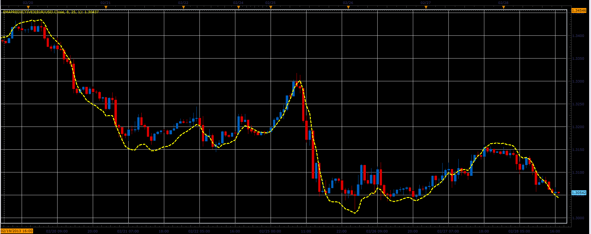

# EMAPredictive3 indicator

> Source: https://fxcodebase.com/code/viewtopic.php?f=17&t=32558  
> Forum: 17 · Topic 32558 · 2 post(s)

---

## EMAPredictive3 indicator

**Alexander.Gettinger** · Thu Feb 28, 2013 6:37 pm

This indicator is a ported MQL5 indicators from [http://www.mql5.com/ru/code/1550](http://www.mql5.com/ru/code/1550) (in Russian).

Formulas:
EMAPredictive3=EMA(Short)+slope*t, where
slope=(EMA(Short)-EMA(Long))/(t1-t3),
t1=(LongPeriod-1)/2,
t3=(ShortPeriod-1)/2,
t=ShortPeriod+ExtraTimeForward.

 

Download:

 [EMAPredictive3.lua](files/55459/EMAPredictive3.lua)

The indicator was revised and updated

---

## Re: EMAPredictive3 indicator

**Apprentice** · Mon May 01, 2017 6:44 am

Indicator was revised and updated.
