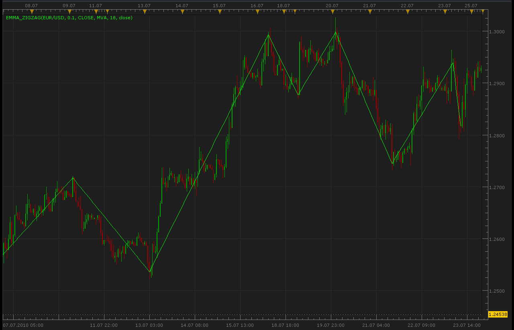

# EMMA ZigZag

> Source: https://fxcodebase.com/code/viewtopic.php?f=17&t=1611  
> Forum: 17 · Topic 1611 · 4 post(s)

---

## EMMA ZigZag

**Alexander.Gettinger** · Thu Jul 29, 2010 2:08 am

EMMA - Extremums Market Moving Average.
This indicator is an alternative ZigZag.
EMMA use deviation moving average for finding extremums.

 

The indicator was revised and updated

---

## Re: EMMA ZigZag

**lisa_baby_xx** · Mon Apr 18, 2011 5:50 am

Hi Guys,

While experimenting with some of your fantastic indicators, I got this error messege:

> An error occurred during the calculation of the indicator 'EMMA_ZIGZAG'. The error details: [string "EMMA_ZigZag.lua"]:153: Index is out of range.

I have no idea what this means. The indicator seems rather good, it uses a MA to find the highest high or the lowest low over N periods. Not bad. Oh and I am using the default settings on a 30-Minute
chart. Does this indicator 'repaint?'

See you later. XX.
lisa_baby_xx

---

## Re: EMMA ZigZag

**Apprentice** · Mon Apr 18, 2011 12:28 pm

Thanks for the Notice it.

---

## Re: EMMA ZigZag

**Apprentice** · Thu Mar 02, 2017 7:30 am

Indicator was revised and updated.
