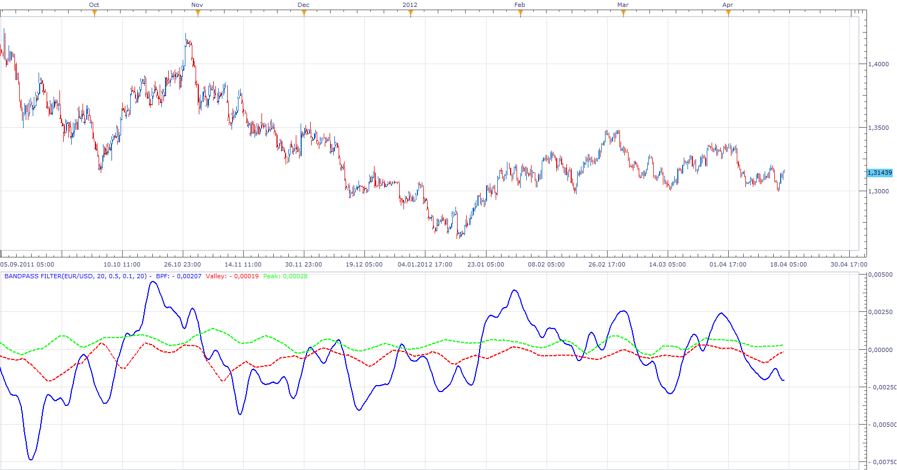
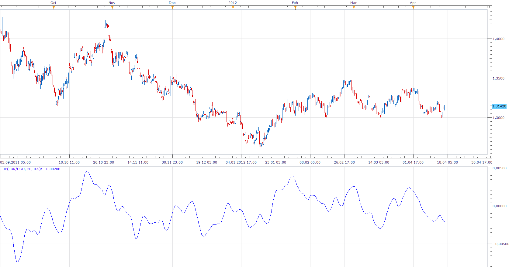

# EMPIRICAL MODE DECOMPOSITION (EMD)

> Source: https://fxcodebase.com/code/viewtopic.php?f=17&t=16189  
> Forum: 17 · Topic 16189 · 10 post(s)

---

## EMPIRICAL MODE DECOMPOSITION (EMD)

**Apprentice** · Tue Apr 17, 2012 4:57 am

 [EMD.lua](files/30220/EMD.lua)

The indicator was revised and updated

---

## Re: EMPIRICAL MODE DECOMPOSITION (EMD)

**Apprentice** · Tue Apr 17, 2012 5:03 am

Bandpass filter indicator is behind Empirical mode decomposition.

 [BP.lua](files/30223/BP.lua)

---

## Re: EMPIRICAL MODE DECOMPOSITION (EMD)

**blessing** · Tue Apr 17, 2012 7:02 am

dear programmers,

thanks for this nice indicator.

i request strategy based on this indicator:

buy:band pass filter cross over peak line
sell:band pass filter cross under valley line

---

## Re: EMPIRICAL MODE DECOMPOSITION (EMD)

**waffle** · Tue Apr 17, 2012 1:06 pm

> **Apprentice wrote:**
>
>
> EMD.png
>
>
>
>
> EMD.lua

Thanks, really appreciated!

---

## Re: EMPIRICAL MODE DECOMPOSITION (EMD)

**Blackcat2** · Tue Apr 17, 2012 3:29 pm

How to read/use this indicator?

---

## Re: EMPIRICAL MODE DECOMPOSITION (EMD)

**Apprentice** · Wed Apr 18, 2012 2:00 am

blessing
Your request is added to the Development Order.
 Blackcat2
I do not have more information on it.
Probably you use the strategy, which is described by Blessing.

---

## Re: EMPIRICAL MODE DECOMPOSITION (EMD)

**Apprentice** · Thu Apr 19, 2012 2:25 am

Requested can be found here.
[viewtopic.php?f=31&t=16366](https://fxcodebase.com/code/viewtopic.php?f=31&t=16366)

---

## Re: EMPIRICAL MODE DECOMPOSITION (EMD)

**dtb71fx** · Tue Jan 01, 2013 11:59 pm

> **Blackcat2 wrote:**
> How to read/use this indicator?

Here's a complete article that describes EMD:
[http://www.mesasoftware.com/Papers/EMPIRICAL%20MODE%20DECOMPOSITION.pdf](http://www.mesasoftware.com/Papers/EMPIRICAL%20MODE%20DECOMPOSITION.pdf)

---

## Re: EMPIRICAL MODE DECOMPOSITION (EMD)

**Blackcat2** · Sat Jan 05, 2013 3:21 am

> **dtb71fx wrote:**
>
>
> > **Blackcat2 wrote:**
> > How to read/use this indicator?
>
>
>
> Here's a complete article that describes EMD:
> [http://www.mesasoftware.com/Papers/EMPIRICAL%20MODE%20DECOMPOSITION.pdf](http://www.mesasoftware.com/Papers/EMPIRICAL%20MODE%20DECOMPOSITION.pdf)

Thanks

---

## Re: EMPIRICAL MODE DECOMPOSITION (EMD)

**Apprentice** · Tue May 02, 2017 11:45 am

Indicator was revised and updated.
