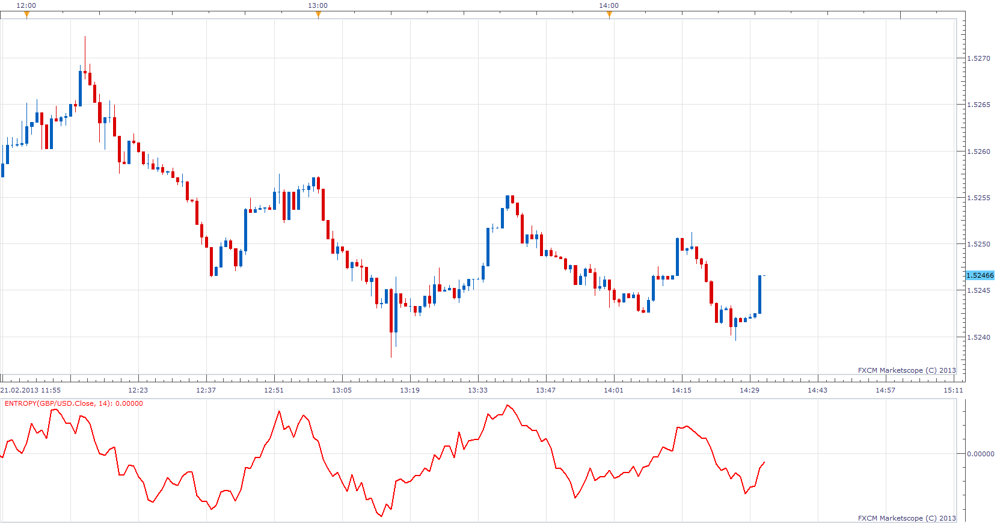

# Entropy

> Source: https://fxcodebase.com/code/viewtopic.php?f=17&t=32298  
> Forum: 17 · Topic 32298 · 5 post(s)

---

## Entropy

**Apprentice** · Thu Feb 21, 2013 3:52 pm

Written according to MQ5 original.
[http://www.mql5.com/en/code/397](http://www.mql5.com/en/code/397)

 [Entropy.lua](files/55052/Entropy.lua)

The indicator was revised and updated

---

## Re: Entropy

**supertrader123** · Thu Feb 21, 2013 7:41 pm

hi ,

can you create divergence strategy with following conditions based on this indicator:

indicator:

entropy with default parameters

buy level 0
sell level 0

1.classical bullish divergece: price highs and entropy lows and entrophy < buy level
2..reversal bullish divergece: price lows and entrophy highs and entrophy < buy level
3.classical bearish divergence: price lows and entrophy highs and entrophy > sell level
4.reversal bearish divergence: price highs and entropy lows and entrophy > sell level

If you put yes/ no options to enter trader in above 4 conditions and allow multiple yes/ no also will give additional strength

for example if we know todays trend is bullish. then if we put the strategy in m1/ m5 , and allow the strategy to trade in reversal bullish divergence only .

i think you understand my english. if any fault in language forgive me , because english is not my mother tongue.

thank you.

---

## Re: Entropy

**Apprentice** · Sat Feb 23, 2013 7:33 am

Your request is added to the development list.

---

## Re: Entropy

**Apprentice** · Wed May 03, 2017 2:07 pm

Indicator was revised and updated.

---

## Re: Entropy

**Apprentice** · Tue Jul 18, 2017 3:58 pm

Try this strategy.
[viewtopic.php?f=31&t=64931](https://fxcodebase.com/code/viewtopic.php?f=31&t=64931)
