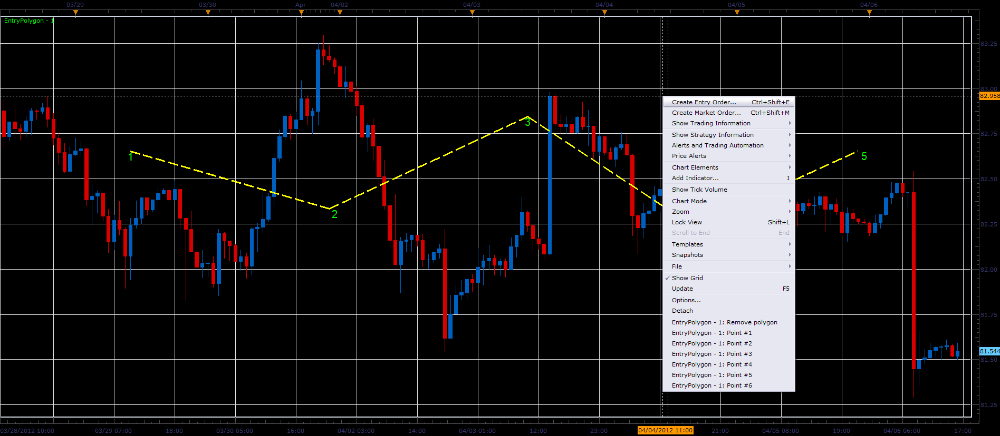

# Entry polyline

> Source: https://fxcodebase.com/code/viewtopic.php?f=17&t=15667  
> Forum: 17 · Topic 15667 · 4 post(s)

---

## Entry polyline

**Alexander.Gettinger** · Fri Apr 06, 2012 3:21 pm

The indicator helps users to draw polyline.
To draw a polyline using the commands menu.
The indicator uses a persistent storage for storing points.
The polyline will be drawn again after removal and re-adding the indicator to the chart.
Possible to use different names for different polylines.

 

Download:

 [Entry_Polyline.lua](files/29505/Entry_Polyline.lua)

The indicator was revised and updated

---

## Re: Entry polyline

**Alexander.Gettinger** · Mon Apr 16, 2012 1:31 pm

Polyline crossing alert: [viewtopic.php?f=29&t=16111](https://fxcodebase.com/code/viewtopic.php?f=29&t=16111)

---

## Re: Entry polyline

**Alexander.Gettinger** · Mon Apr 16, 2012 1:42 pm

Polyline crossing entry order: [viewtopic.php?f=31&t=16112](https://fxcodebase.com/code/viewtopic.php?f=31&t=16112)

---

## Re: Entry polyline

**Apprentice** · Mon Apr 03, 2017 6:08 am

Indicator was revised and updated.
