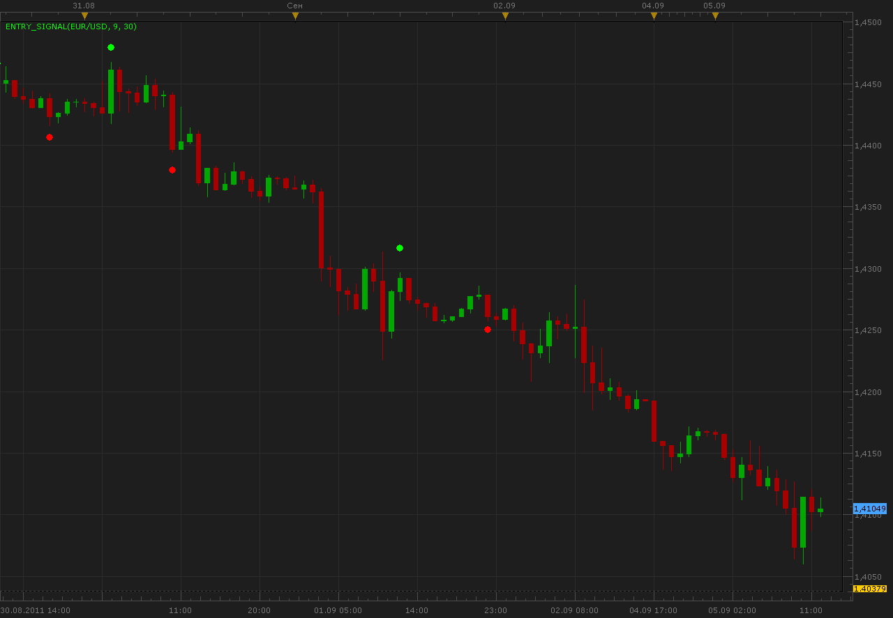

# Entry signal indicator

> Source: https://fxcodebase.com/code/viewtopic.php?f=17&t=6302  
> Forum: 17 · Topic 6302 · 4 post(s)

---

## Entry signal indicator

**Alexander.Gettinger** · Mon Sep 05, 2011 11:20 am

The indicator is written at the request: [viewtopic.php?f=27&t=5952](https://fxcodebase.com/code/viewtopic.php?f=27&t=5952)

 



Download:

 [Entry_Signal.lua](files/14542/Entry_Signal.lua)

The indicator was revised and updated

---

## Re: Entry signal indicator

**easytrading** · Sun Dec 14, 2014 5:36 pm

hello ,

could you please, tell us how this indicator works, on what bases? cause there is no info at all.

thanks.

---

## Re: Entry signal indicator

**Apprentice** · Mon Dec 15, 2014 5:28 am

The algorithm is rather complex.

This is a simplified form.

Input
Level=30
Period=9;

```lua
Range=high - low;     
 
     local Range=lwma of Range
     local MaxPrice=max high of Last Period Periods.
     local MinPrice=min low of Last Period Periods
   
     
     if Close<MinPrice+(MaxPrice-MinPrice)*Level/100 and previousTrigger ~=-1 then
      Buff=low -Range/2;
      Trigger=-1;
     end
     if Close>MaxPrice-(MaxPrice-MinPrice)*Level/100 and previousTrigger~=1 then
      Buff=high+Range/2;
     Trigger=1;
     end
```

In short if price exceeds
MinPrice + (MaxPrice-MinPrice)
MaxPrice- (MaxPrice-MinPrice)
we have a trend change.

MaxPrice is max high of Last Period Periods.
MinPrice is min low of Last Period Periods

---

## Re: Entry signal indicator

**Apprentice** · Sat Jul 01, 2017 5:24 am

The indicator was revised and updated.
