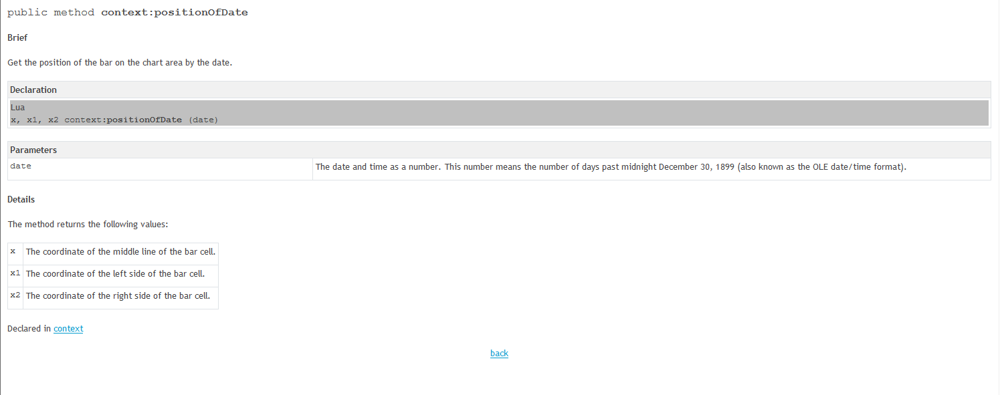

# Entry & Stop Marker

> Source: https://fxcodebase.com/code/viewtopic.php?f=17&t=69137  
> Forum: 17 · Topic 69137 · 4 post(s)

---

## Entry & Stop Marker

**Silverthorn** · Sun Nov 17, 2019 11:24 pm

Hi Apprentice.

I have written this simple indicator that will probably be useful to somebody else. It simply marks a position on the chart where you would like to enter a trade and place your stop loss. To place your entry and stop loss you use the right click menu.

The positions are stored in a database so they are displayed across all time frames for the pair.

It currently draws the lines from within the update function so it only updates at the next tick. The problem with that is that there is sometimes a lag waiting for the next tick and you can't plan trades out of trading hours because there are no ticks coming in.

If I understand the documentation correctly it should update instantly if I draw from within the draw function. I can't seem to get this to work and am struggling to debug because there is no right click available in the SDK.

Can you please help or give me an example of how to do this?

---

## Re: Entry & Stop Marker

**Silverthorn** · Tue Nov 19, 2019 2:04 am

Ok reading this about the Draw().

"Also, all context methods works in terms of pixels, not in terms of date/time and price, so every time when the chart is scrolled, zoomed, or the size of the chart window is changed, the position and size of the objects are changed accordingly."

How do I convert the Date/Time position to pixles?

---

## Re: Entry & Stop Marker

**Apprentice** · Tue Nov 19, 2019 6:42 am

---

## Re: Entry & Stop Marker

**Silverthorn** · Tue Nov 19, 2019 7:12 pm

Hi Apprentice. Thanks for the help.
After a couple of unsuccessful tries I found it easier to create a new function to draw the lines and call that from the Draw function. Working well now.

Update attached.

 [Entry&Stop Marks.lua](files/129840/EntryStop%20Marks.lua)
