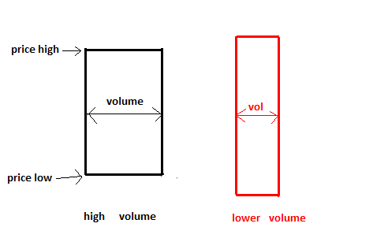

# Equi Volume View

> Source: https://fxcodebase.com/code/viewtopic.php?f=17&t=60540  
> Forum: 17 · Topic 60540 · 9 post(s)

---

## Equi Volume View

**Apprentice** · Mon Apr 14, 2014 2:35 am

Equi Volume candles will the candle width as a function of the volume.

 

 [Equi Volume View.lua](files/93509/Equi%20Volume%20View.lua)

---

## Re: Equi Volume View

**Apprentice** · Tue Apr 15, 2014 4:25 am

Performance Improvement.

---

## Re: Equi Volume View

**darrylwolfaardt** · Fri Jul 25, 2014 3:47 pm

I have tried to load this indicator and must be doing something wrong

I get a successfully imported message but cant seem to find the indicator in the list.

Could you please advise.

Thanks
Darryl

---

## Re: Equi Volume View

**Apprentice** · Sat Jul 26, 2014 3:36 am

Use File-> Create View

---

## Re: Equi Volume View

**darrylwolfaardt** · Sat Jul 26, 2014 5:56 pm

Thanks

---

## Re: Equi Volume View

**upwave** · Wed Oct 29, 2014 11:32 am

Hi, i have tested the equi volume view. This is I think a very useful tool. Thanks for developping it.

Unefortunately, I came accros a problem when testing it. The broadness of the bars seems to be altered when sliding over the time scale. Please see pictures attached.

Would you have any idea how to overcome that issue? Rgds.

---

## Re: Equi Volume View

**Apprentice** · Wed Oct 29, 2014 1:17 pm

The candle with the highest volume, will be presented with maximum Candle width.
U can use Size parameter to define normalization period.
Candle width is determined by the Ratio between current candle volume and Max volume and Last Size periods.

Furthermore, as you add more data to your chart, max width for any candle will be reduced.

In extreme cases, when the candle is only a pixel wide, some rounding errors are possible.

Will try to optimize the algorithm a bit.

---

## Re: Equi Volume View

**upwave** · Wed Oct 29, 2014 1:35 pm

Thanks Apprentice for this clear feedback. I didn't make the point that the width was calculated relatively to the bar history. Rgds.

---

## Re: Equi Volume View

**Apprentice** · Mon Feb 05, 2018 11:08 am

The indicator was revised and updated.
