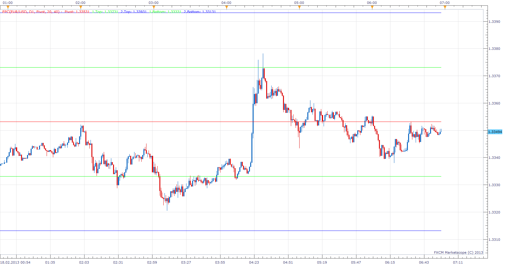

# Equidistant Pivot Channel

> Source: https://fxcodebase.com/code/viewtopic.php?f=17&t=32176  
> Forum: 17 · Topic 32176 · 10 post(s)

---

## Equidistant Pivot Channel

**Apprentice** · Mon Feb 18, 2013 8:16 am

Equidistant Pivot Channel will draw a Line X pips up / down from Pivot Line.

 [EPC.lua](files/54852/EPC.lua)

 [EPC with Alert.lua](files/54852/EPC%20with%20Alert.lua)

This indicator provides Audio / Email Alerts on Price/EPC Line Cross.

The indicator was revised and updated

---

## Re: Equidistant Pivot Channel

**Coondawg71** · Tue Jan 21, 2014 4:36 pm

Can we please request Signal Alerts added to this indicator. Signal Alert would be triggered by price touching selected levels. Please allow user to select up to five triggers.

Suggested trigger levels for default could be 25,50,100,200,500.

Thanks!

sjc

---

## Re: Equidistant Pivot Channel

**Apprentice** · Thu Feb 06, 2014 6:42 am

EPC with Alert Added.

---

## Re: Equidistant Pivot Channel

**Coondawg71** · Thu Feb 06, 2014 8:30 am

This is great! Thanks!

Can we set an actual static PRICE LEVEL within the indicator from which we can have the indicator plot the channel? The price would be set as the Pivot.

If we can set a channel from a high or a low close price, and have the channel work from there, that would be extremely useful!

Thanks,

sjc

---

## Re: Equidistant Pivot Channel

**Apprentice** · Fri Feb 07, 2014 3:12 am

Your request is added to the development list.

---

## Re: Equidistant Pivot Channel

**Apprentice** · Tue Feb 11, 2014 6:14 am

Requested can be found here.
[viewtopic.php?f=17&t=60291&p=92604#p92604](https://fxcodebase.com/code/viewtopic.php?f=17&t=60291&p=92604#p92604)

---

## Re: Equidistant Pivot Channel

**Coondawg71** · Tue Feb 11, 2014 2:14 pm

Thank you very much for creating the Arbitrary Level Equidistant Channel indicator !!! I

Can we please enhance it a little further.

a.) Can the user please have the option for Alert to be triggered upon "TOUCH" of the trigger level, not just the close past the level.

b.) Can we please add 3 more "Line Distance" options. This purpose of the indicator is to Alert upon breach of drawn Fibs.

Thanks for a great indicator!

sjc

---

## Re: Equidistant Pivot Channel

**Apprentice** · Wed Feb 12, 2014 3:38 am

Your request is added to the development list.

---

## Re: Equidistant Pivot Channel

**Apprentice** · Mon Dec 07, 2015 5:57 am

Compatibility issue fixed.
_Alert Helper is not longer needed.

---

## Re: Equidistant Pivot Channel

**Apprentice** · Fri Jul 21, 2017 8:51 am

The indicator was revised and updated.
