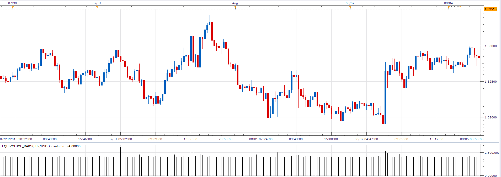

# Equivolume bars

> Source: https://fxcodebase.com/code/viewtopic.php?f=17&t=58798  
> Forum: 17 · Topic 58798 · 7 post(s)

---

## Equivolume bars

**Alexander.Gettinger** · Thu Aug 08, 2013 3:58 pm

Builds the bars with the same volume.

 

Download:

 [Equivolume_Bars.lua](files/88142/Equivolume_Bars.lua)

The indicator was revised and updated

---

## Re: Equivolume bars

**speakinmymind** · Fri Aug 09, 2013 10:04 am

I'm getting an error, and I am using the beta version of TS

---

## Re: Equivolume bars

**Alexander.Gettinger** · Fri Aug 09, 2013 1:03 pm

This indicator requires the use beta version [viewtopic.php?f=30&t=57814](http://www.fxcodebase.com/code/viewtopic.php?f=30&t=57814).

---

## Re: Equivolume bars

**Apprentice** · Mon Jun 12, 2017 5:40 am

The indicator was revised and updated.

---

## Re: Equivolume bars

**MateusTM** · Fri Aug 06, 2021 11:22 am

Hello, would it be possible to have the equivolume/Volume Bars for mt4? i've searched many sites and all i've tested doesn't work, i found a guy who posted a mq4 file that might help, i really wanted to learn mql4 but still not a good book and i don't have much programming experience, if anyone can help i appreciate it! I will send the forexfactory link

[https://www.forexfactory.com/thread/996 ... rts?page=1](https://www.forexfactory.com/thread/996625-candle-volume-bars-andor-equivolume-charts?page=1)

---

## Re: Equivolume bars

**Apprentice** · Fri Aug 06, 2021 12:05 pm

Your request is added to the development list.
Development reference 722.

---

## Re: Equivolume bars

**MateusTM** · Sat Aug 07, 2021 6:14 pm

> **Apprentice wrote:**
> Your request is added to the development list.
> Development reference 722.

Thank you so much for considering my order I will wait!
