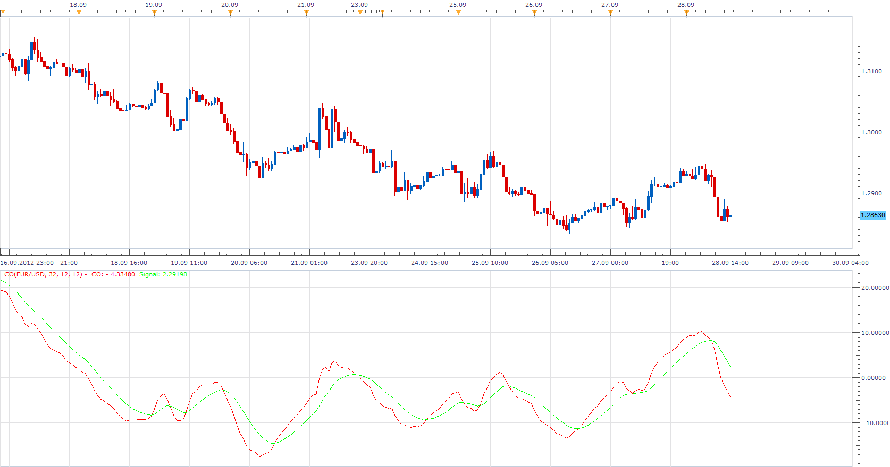

# Ergodic Candlestick Oscillator (ECO)

> Source: https://fxcodebase.com/code/viewtopic.php?f=17&t=23910  
> Forum: 17 · Topic 23910 · 2 post(s)

---

## Ergodic Candlestick Oscillator (ECO)

**Apprentice** · Fri Sep 28, 2012 1:05 pm

W. Blau`s Ergodic Candlestick Oscillator is a momentum indicator.
it is based on candlestick bars, and takes into account the size and direction of the candlestick "body".

 [ECO.lua](files/41093/ECO.lua)

---

## Re: Ergodic Candlestick Oscillator (ECO)

**Apprentice** · Wed Feb 21, 2018 8:12 am

The Indicator was revised and updated.
