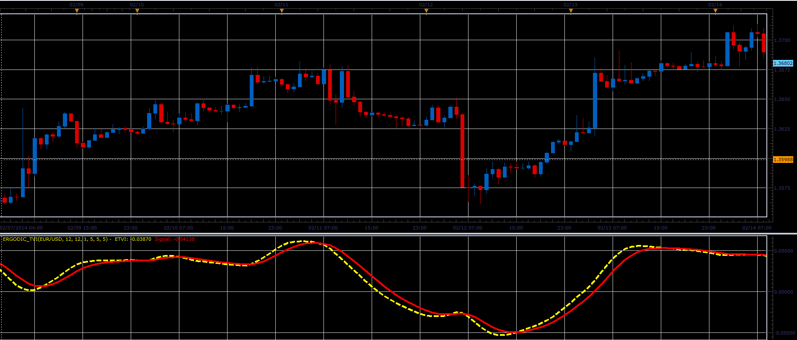

# Ergodic Tick volume indicator

> Source: https://fxcodebase.com/code/viewtopic.php?f=17&t=60362  
> Forum: 17 · Topic 60362 · 2 post(s)

---

## Ergodic Tick volume indicator

**Alexander.Gettinger** · Thu Feb 27, 2014 10:37 am

This indicator is a ported MQL5 indicator from: [http://www.mql5.com/en/code/1920](http://www.mql5.com/en/code/1920).

Formulas:
ETVI = EMA(EMA(TVI)),
Signal = EMA(ETVI), where
TVI = EMA(TV), where
TV = 100*(EMA_Up2-EMA_Dn2)/sum,
EMA_Up2 = EMA(EMA(UpTicks)),
EMA_Dn2 = EMA(EMA(DnTicks)),
UpTicks = (Volume+(Close-Open)/pipSize)/2,
DnTicks = Volume-UpTicks,
pipSize - size of 1 pip.

 

The indicator was revised and updated
Download:

 [Ergodic_TVI.lua](files/92923/Ergodic_TVI.lua)

---

## Re: Ergodic Tick volume indicator

**Apprentice** · Fri Jun 02, 2017 6:41 am

Indicator was revised and updated.
