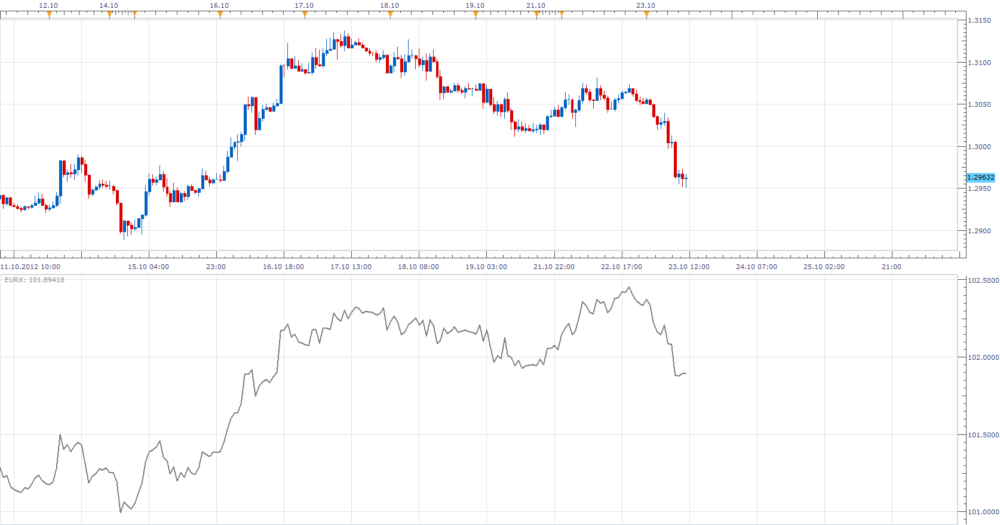

# Euro Index (EURX)

> Source: https://fxcodebase.com/code/viewtopic.php?f=17&t=24837  
> Forum: 17 · Topic 24837 · 2 post(s)

---

## Euro Index (EURX)

**Apprentice** · Tue Oct 23, 2012 10:58 am

EURX is calculation according to share of foreign trade of EU.
USA (31.55%), Great Britain (30.56%), Switzerland (11.13%), Japan (11.13%), and Sweden (7.85%).

 [EURX.lua](files/42678/EURX.lua)

 You need to be subscribed to the following currency pairs "EURUSD", "EURGBP", "EURJPY", "EURSEK", "EURCHF";

The indicator was revised and updated

---

## Re: Euro Index (EURX)

**Apprentice** · Wed May 03, 2017 1:24 pm

Indicator was revised and updated.
