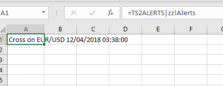
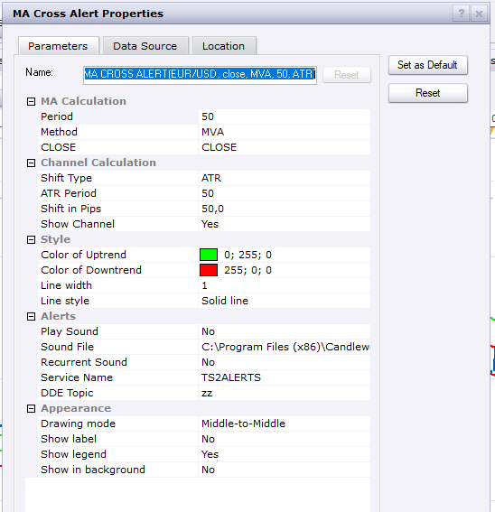

# Excel Template

> Source: https://fxcodebase.com/code/viewtopic.php?f=17&t=67053  
> Forum: 17 · Topic 67053 · 13 post(s)

---

## Excel Template

**Apprentice** · Tue Dec 04, 2018 7:05 am

 

 [Excel Template.lua](files/122509/Excel%20Template.lua)

---

## Re: Excel Template

**SANTOSH** · Mon Mar 02, 2020 10:55 pm

Hi Apprentice ,
My strategy has multiple alerts which I need to export to excel through dde .

In the current template , only one alert provision is seen .
Can you sort out a template where we can have multiple alerts in a single strategy exported to multiple excel cells.

---

## Re: Excel Template

**Apprentice** · Tue Mar 03, 2020 7:01 am

Your request is added to the development list.
Development reference 809.

---

## Re: Excel Template

**Apprentice** · Wed Mar 04, 2020 6:11 am

[Excel Template.lua](files/131693/Excel%20Template.lua)

Try this version.

---

## Re: Excel Template

**SANTOSH** · Wed Mar 04, 2020 10:03 am

Wow that was super fast .You people are awesome.

---

## Re: Excel Template

**SANTOSH** · Wed Nov 18, 2020 7:51 pm

> **Apprentice wrote:**
>
>
> Excel Template.lua
>
>
> Try this version.

Can multiple alerts be dropdown one below the other , as currently it overlaps .
Need to auto dropdown when the new alert comes up .

---

## Re: Excel Template

**Apprentice** · Thu Nov 19, 2020 2:43 pm

Your request is added to the development list.
Development reference 2330.

---

## Re: Excel Template

**Apprentice** · Fri Nov 20, 2020 4:15 am

It is NOT supported by DDE

---

## Re: Excel Template

**SANTOSH** · Sun Nov 22, 2020 4:07 pm

> **Apprentice wrote:**
> It is NOT supported by DDE

Any thing you know other than DDE that can support to get alerts in excel as the same as we get in Trade station ?

Like auto drop down of alerts when they come in a strategy ?

Regards,
Santosh

---

## Re: Excel Template

**Apprentice** · Wed Nov 25, 2020 11:38 am

I don't know any other method.
Only DDE can send something into Excel.
But it can send one value to one cell.
Or we can code n values for n cells.

---

## Re: Excel Template

**SANTOSH** · Sun Mar 14, 2021 1:26 pm

> **Apprentice wrote:**
>
>
> Excel Template.lua
>
>
> Try this version.

Dear Apprentice,
Can you make this MCP too?

Regards ,
Santosh Sahu.

---

## Re: Excel Template

**SANTOSH** · Tue May 02, 2023 1:56 am

Dear Apprentice ,
Can you make this available as a strategy file too ?
The present file is an indicator only .
It will be great help though !!

Regards ,
Santosh .

---

## Re: Excel Template

**Apprentice** · Wed May 03, 2023 7:32 pm

I'm not sure if I understand.
Can you provide strategy rules?
