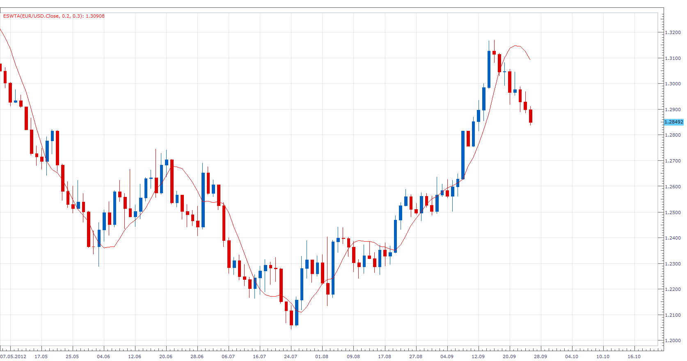

# Exponential Smoothing with Trend Adjustment

> Source: https://fxcodebase.com/code/viewtopic.php?f=17&t=23831  
> Forum: 17 · Topic 23831 · 3 post(s)

---

## Exponential Smoothing with Trend Adjustment

**Apprentice** · Wed Sep 26, 2012 9:01 am

ES[period] = Alfa* Close[period-1]+(1-Alfa)*(Forecast[period-1]+Trend[period-1]);
Trend[period]=Beta*(Forecast[period]-Forecast[period-1])+(1-Beta)*Trend[period-1];

 [EMA with Trend Adjustment.lua](files/40970/EMA%20with%20Trend%20Adjustment.lua)

The indicator was revised and updated

---

## Re: Exponential Smoothing with Trend Adjustment

**Alexander.Gettinger** · Mon Oct 27, 2014 10:56 am

MQL4 version of indicator: [viewtopic.php?f=38&t=61387](https://fxcodebase.com/code/viewtopic.php?f=38&t=61387).

---

## Re: Exponential Smoothing with Trend Adjustment

**Apprentice** · Tue Jun 27, 2017 3:28 am

The indicator was revised and updated.
